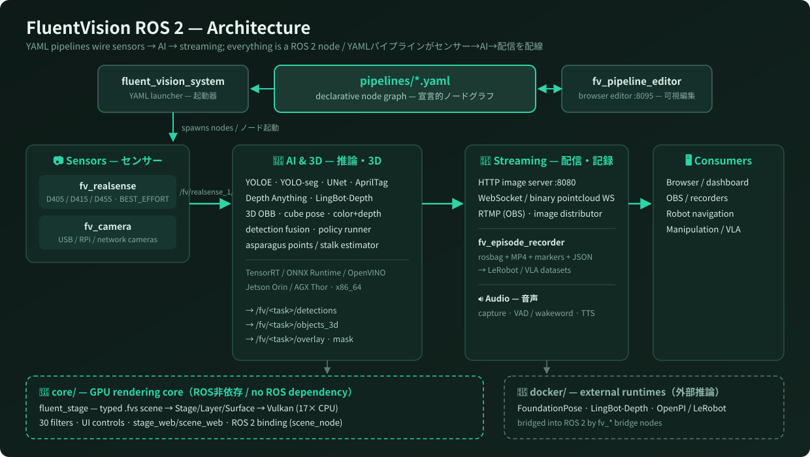

<div align="center">

# 🌿 FluentVision ROS 2

### 宣言的・YAML駆動の **視覚・認識スタック** for ROS 2
### RGB-Dカメラ・AIモデル・配信エンドポイントを、ブラウザで視覚的に配線する。

[English](README.md) · **日本語**

[](https://docs.ros.org/en/humble/)
[](#-ライセンス)
[](#-動作要件)
[](#)
[](#-コントリビュート)

<sub>RealSense · YOLOE · YOLO-seg · Depth Anything V3 · AprilTag · 3D OBB · FoundationPose ブリッジ · GPU HUD レンダリング · エピソード録画</sub>

<br/>


<sub>*実際の出力 — 本リポジトリのエンジン `fluent_stage` が13レイヤーを合成したHUD。*</sub>

</div>

---

## 🗺️ 全体像



FluentVision は、1つのリポジトリに同居する2つの顔を持ちます。

1. **ROS 2 認識スタック**（`src/`）— カメラ・AI推論・3D幾何・配信・音声・録画をカバーする40以上のパッケージ。YAMLパイプラインとブラウザの視覚エディタで配線します。
2. **GPUレンダリングコア**（`core/`）— `fluent_stage` とその前身 `fluent_scene`。ROS非依存のスタンドアロンVulkanコンポジタで、型付きYAMLシーンをロボットのHUDに変換します。型検査が**実行前に**走るため、AIが稼働中の画面を安全に編集できます。

---

## ✨ なぜ FluentVision か

実ロボットの認識スタックを組むと、たいていこうなります：絡まったlaunchファイル、ハードコードされたトピック名、プロジェクト間でコピペされるモデルロードコード、実行中に配線を確認・変更する手段はゼロ。

**FluentVision は、これを逆転させます。**

- 🧩 **パイプラインはコードではなくデータ** — カメラ → AI → 配信のグラフをYAMLで宣言。
- 🖱️ **ブラウザで編集** — ドラッグ＆ドロップで配線し、ライブフレームをプレビューして **Run**。エディタがグラフを実際のROS 2ノード群として起動します。
- 🧠 **バッテリー同梱** — 組み合わせ自由な17のAI / 3D / 深度パッケージ。
- ⚡ **リアルタイム最優先** — 既定で `BEST_EFFORT` QoS、GPU推論（TensorRT / ONNX Runtime / OpenVINO）、Jetson Orin / AGX Thor で稼働。
- 🎥 **どこへでも配信** — ブラウザ向けHTTP画像サーバー、ダッシュボード向けWebSocket、OBS向けRTMP、点群向けバイナリWS。
- 🎨 **ロボットの画面を宣言的に描く** — `fluent_stage` コアは1080pのHUDをVulkanで約5.6ms/フレームで描画（CPU合成の約17倍）。

---

## 🚀 60秒デモ

```bash
# 1. ROS 2 ワークスペースに clone
cd ~/ros2_ws/src && git clone https://github.com/takatronix/fluent_vision_ros2.git

# 2. ビルド（--symlink-install は付けないこと）
cd ~/ros2_ws && colcon build --packages-up-to fv_pipeline_editor fv_realsense fv_object_detector
source install/setup.bash

# 3. CycloneDDS 必須（FastRTPS は librealsense2 と競合します）
export RMW_IMPLEMENTATION=rmw_cyclonedds_cpp

# 4. 視覚エディタを起動
ros2 run fv_pipeline_editor editor_node
# → http://localhost:8095 を開く
```

Intel RealSense D405 / D415 / D455 を挿し、組み込みの **Object Detection** パイプラインを読み込んで（あるいは **カメラ** ノードと **検出器** ノードをキャンバスに置いて配線して）、**Run**。1分以内に、ブラウザにライブ検出結果が届きます。

> エディタはパイプラインを `~/.fluent_vision/pipelines/` に保存します。[`pipelines/`](pipelines/) 同梱のものは組み込みテンプレートとして表示されます。

---

## 🖼️ パイプラインエディタ

`fv_pipeline_editor` がポート `8095` で提供する、キャンバス + WebSocket のブラウザエディタ。

```
┌────────────────────────────────────────────────────────────────────┐
│  FluentVision Editor                                  [Save] [Run] │
├──────────────┬─────────────────────────────────────────────────────┤
│  Nodes       │   ┌─────────────┐      ┌──────────────┐             │
│  ───────     │   │ RealSense   │─▶── │ YOLOE        │──▶ overlay  │
│  📷 Camera   │   │ D405        │      │ "asparagus"  │             │
│  🧠 YOLOE    │   └─────────────┘      └──────────────┘             │
│  📐 3D Det   │          │                                          │
│  🌊 Depth    │          ▼                                          │
│  🎥 Streams  │   ┌─────────────┐                                   │
│  📼 Recorder │   │ 3D Detector │──▶  /fv/objects_3d                │
│  ...         │   └─────────────┘                                   │
├──────────────┴─────────────────────────────────────────────────────┤
│  ▶ Preview（バイナリWebSocketでライブJPEG）                        │
└────────────────────────────────────────────────────────────────────┘
```

- **Load**: 任意のパイプラインYAML（自作 or 組み込みテンプレート）をキャンバスへ。
- **Save**: グラフをYAMLへ書き戻し — 他の成果物と同じくバージョン管理できます。
- **Preview**: どの `sensor_msgs/Image` トピックも、ワンクリックでライブJPEGプレビュー。
- **Run**: エディタがグラフ内の全ノードを `ros2 run` + パラメータ渡しで起動 — launchファイル不要。

---

## 📐 パイプラインの構造

パイプラインはただのYAMLです。これは実物の [`pipelines/object_detection.yaml`](pipelines/object_detection.yaml)（抜粋）：

```yaml
name: "Object Detection"
description: "RealSense → YOLOv10 Object Detector"

system:
  camera_start_delay: 2.0

nodes:
  - id: realsense_1
    package: fv_realsense
    exec: fv_realsense_node
    node_name: realsense_1
    namespace: /fv
    parameters:
      camera_selection:
        selection_method: "auto"
      camera:
        color_width: 640
        color_height: 480
        color_fps: 15

  - id: object_detector_1
    package: fv_object_detector
    exec: fv_object_detector_node
    node_name: object_detector_1
    namespace: /fv
    parameters:
      input_image_topic: /fv/realsense_1/color/image_raw
      model:
        device: "auto"
        confidence_threshold: 0.5
      enable_tracking: true

layout:                       # キャンバス上の配置 — エディタが保持
  realsense_1: { x: 100, y: 200 }
  object_detector_1: { x: 420, y: 200 }
```

パイプラインエディタは、まさにこのフォーマットを読み・書き・可視化し・**実行**します — 隠れた状態はありません。

### エディタを使わない起動

`fluent_vision_system` はYAML駆動のランチャーですが、スキーマは別物です（ノードを `groups:` でまとめ、グループ単位のenableフラグを持つ）。サンプル設定は [`src/system/fluent_vision_system/config/`](src/system/fluent_vision_system/config/) にあります：

```bash
ros2 launch fluent_vision_system run.py \
    config:=/abs/path/to/fluent_vision_system.sample.yaml
```

初代ロボットで使っていた2カメラ固定スタックには、ハードコードされた [`launch/start_fv.sh`](launch/start_fv.sh)（`./start_fv.sh real|sim`）もあります。

> ⚠️ エディタ用 `pipelines/*.yaml`（フラットな `nodes:` リスト）とランチャー用 `groups:` 設定は**別スキーマ**です。パイプラインファイルを `run.py` に渡すと、ノードは1つも起動しません。

---

## 🎨 GPUレンダリングコア（`core/`）

スタンドアロンのCMakeプロジェクト — **コアにROS・GPU・ML依存なし**。`COLCON_IGNORE` 済みでcolconワークフローに影響しません。カメラ映像・検出ボックス・日本語テキスト・経路・ゲージ — ロボットの画面を描きます。

### fluent_stage — 現行世代

<table>
<tr>
<td width="50%"><br/><sub>30種のフィルタ、GLSLとC++の単一ソース</sub></td>
<td width="50%"><br/><sub>6種のUIコントロール — 状態=属性オーバーライド、入力=ポインタ注入のみ</sub></td>
</tr>
</table>

CALayer型の**保持レイヤーツリー + SDFレンダリング**。チェイン可能なC++ 1行でも、宣言的なYAML 1ブロックでも、同一の絵が出ます：

```cpp
Stage stage(1920, 1080);
stage.image(camera);
stage.boxes(detections).color(Color::Teal).smoothing(0.2f);
```

- **Scene文書（`.fvs`、スキーマ `fluent.scene/v1alpha2`）** — 型検査・参照解決・digestが**実行前に**全て走るため、AIが稼働中のロボット画面を安全に生成・編集できます。
- **2バックエンドでビット一致**: CPUリファレンスレンダラとVulkan（SPIR-Vはビルド時に焼き込み）。1080p HUD: **Vulkan 5.6ms/フレーム vs CPU 94.7ms（約17倍）**、リードバック込み。
- **13種のコンテンツ**（image、日本語シェーピング対応text、時間平滑化付きboxes、arc、grid、…）、**30種のフィルタ**、**暗黙アニメーション**（`Transaction`）、決定論的な時間（`render(stage, dt)`）。
- **`fvsc` CLI**: `validate` / `preview` / `fmt` / `digest` / `describe --json`。
- **`stage_web`**（ポート8790）: StageをMJPEGでブラウザに配信し、マウス/タッチをポインタ注入へ逆流 — ページ側にUIロジックはゼロ。
- **`scene_web`**（ポート8791）: `.fvs` のライブ編集 — 保存のたびに validate → compile → lint を通り、**フレーム境界で原子的に差し替え**。壊れた編集は旧画面のまま赤バナーが出ます。
- **ROS 2 バインディング**（`scene_node` + `fluent.binding/v1alpha1` 文書）: トピックを `$inputs` に配線し、`/inspect`・`/at` で内省できます。

📖 ドキュメント（開発中の正文は日本語。OSS公開時に英語READMEを用意予定）: [README](core/fluent_stage/README.md) · [5分で始める](core/fluent_stage/docs/getting-started.ja.md) · [クックブック](core/fluent_stage/docs/cookbook.ja.md) · [CHANGELOG](core/fluent_stage/CHANGELOG.md) · [設計書](docs/design/fluent_stage.ja.md)

### fluent_scene — 第一世代

ノードグラフ型の前身（スキーマ `fluent.scene/v1alpha1`）：型付きYAML → 正準IR → GPU予算プラン → 保持Vulkan合成。Jetson Thor の1080pでCPU合成の約26倍を計測。独自の `fvsc`・`fv_render`・ベンチマーク・ROS 2アダプタノードを同梱。

📖 [日本語 README](core/fluent_scene/README.md) · [English README](core/fluent_scene/README.en.md) · [アーキテクチャ仕様 (en)](docs/design/fluent_vision_architecture.md) · [ja](docs/design/fluent_vision_architecture.ja.md)

> ⚠️ **両プロジェクトとも拡張子 `.fvs` と CLI名 `fvsc` を使いますが、スキーマは非互換です**（`v1alpha1` ノードグラフ vs `v1alpha2` レイヤーツリー）。新規の開発は **fluent_stage** が対象です。

---

## 🧰 同梱パッケージ

<details open>
<summary><b>🧠 AI・推論（<code>src/ai/</code>）</b></summary>

| パッケージ | 役割 |
|---|---|
| `fv_yoloe` | YOLOE オープン語彙検出＆セグメンテーション（テキストプロンプト） |
| `fv_object_detector` | YOLO系汎用物体検出 |
| `fv_instance_seg` | YOLO-seg インスタンスセグメンテーション（TensorRT / OpenVINO） |
| `fv_object_mask_generator` | UNet セマンティックセグメンテーション（OpenVINO） |
| `fv_3d_detector` | マスク＋点群から3D OBB / 形状 / 色 / 距離 |
| `fv_color_detector` | HSV色検出＋深度距離（C++） |
| `fv_apriltag` | AprilTag検出＋キューブバンドル姿勢（pupil-apriltags） |
| `fv_depth_anything` | Depth Anything V3 単眼深度（ONNX / TensorRT） |
| `fv_depth_features` | HHAエンコーダ・法線・RGBD融合（C++） |
| `fv_lingbot_depth` | LingBot-Depth 深度リファイン＆点群生成 |
| `fv_pointcloud_pipeline` | ROI点群の抽出・フィルタリング |
| `fv_detection_fusion` | 複数ソースを `fv_msgs/DetectionArray` に集約 |
| `fv_foundationpose_bridge` | Isaac ROS FoundationPose → `Object3DArray` + TF |
| `fv_aspara_points` / `fv_stalk_estimator` | アスパラ幾何 — map座標系での点蓄積、茎長推定 |
| `fv_face_recognizer` | リアルタイム顔認識 |
| `fv_policy_runner` | トリガートピックを監視し外部ポリシーランタイム（OpenPI / LeRobot）を起動 |
| `fv_cube_detector` | *非推奨* — `fv_instance_seg` に置き換え |

> `fv_aspara_analyzer` は退役済み（ディレクトリには設定のみ残存、`COLCON_IGNORE` 済み）。

`fv_apriltag` は各IDの物理サイズ（黒枠実寸）を
[`src/ai/fv_apriltag/config/tag_registry.yaml`](src/ai/fv_apriltag/config/tag_registry.yaml)（公称 `tag_mm` × 0.8）から解決します。
正の `tag_size` パラメータは明示的な一律サイズ上書き。サイズ未登録の未知・予約IDは姿勢もTFも出しません。
印刷用タグシート・キューブキット・3Dプリントマウントは [`docs/印刷物/`](docs/印刷物/) にあります。

</details>

<details>
<summary><b>📷 センサー（<code>src/sensors/</code>）</b></summary>

- **`fv_realsense`** — Intel RealSense ドライバ（D405 / D415 / D455）。`BEST_EFFORT` QoS、表示モード切替、ピクセル→3D距離サービス、フレーム毎のデバイス時刻再アンカー。
- **`fv_camera`** — 汎用 USB / RPi / ネットワークカメラドライバ。
- **`fv_insta360_x3`** — Insta360 X3（UVCウェブカメラモード）。

</details>

<details>
<summary><b>📡 配信・録画（<code>src/streaming/</code>）</b></summary>

- `fv_episode_recorder` — rosbag + カメラMP4 + `EpisodeMarker` + サイドカーJSON。プリフライト・ロック・保持期間つき。LeRobot / Pi0.5 に馴染むレイアウト。
- `fv_image_distributor` — ブラウザ向けHTTP画像サーバー（既定ポート `8080`、`/image.jpg`）。
- `fv_websocket_server` — WebSocket画像配信（既定ポート `8765`）。
- `fv_pointcloud_ws_server` — バイナリWebSocket点群配信。
- `fv_rtmp_server` — RTMP ↔ ROS画像ブリッジ（DJI Fly等）。
- `fv_mjpeg_server` — MJPEG **取り込み**クライアント：MJPEG URL（ネットワークカメラ等）を取得し `sensor_msgs/Image` として配信。
- `fv_image_preview` — フォーカス情報・ソース統計つき軽量プレビューブリッジ。
- `fv_recorder` — シンプルな録画・再生。

</details>

<details>
<summary><b>⚙️ システム（<code>src/system/</code>）</b></summary>

- **`fv_pipeline_editor`** — 視覚パイプラインエディタ（aiohttp + canvas、ポート `8095`）。
- **`fluent_vision_system`** — YAML駆動ランチャー（`run.py`、`groups:` スキーマ）。
- **`fv_machine_calibration`** — ハンドアイ校正のデータ収集＋オフラインソルバー。

</details>

<details>
<summary><b>🔊 音声（<code>src/audio/</code>）</b></summary>

- `fv_audio`（キャプチャ）、`fv_audio_output`（ALSA再生）、`fv_audio_vad`（VAD / ウェイクワード）、`fv_tts`（Open JTalk / pyopenjtalk）、`fv_soundboard`（イベント→効果音 / TTSキュー）。

</details>

<details>
<summary><b>📨 メッセージ・ライブラリ・UI・ユーティリティ</b></summary>

- `fv_msgs`、`fv_episode_msgs` — メッセージ定義。
- `fluent_lib` — OpenCV / PCL / ROS 2 のチェイン可能API。
- `fv_image_filter` — ライブパラメータ更新対応のチェイン可能画像フィルタ。
- `fv_aspara_ui_cpp` — オーバーレイUIノード（C++）；`fv_episode_ui` — 録画エピソード閲覧用Svelte SPA。
- `fv_topic_relay` — トピックリレー。
- `src/external/` — ベンダリングした `vision_msgs` + RVizプラグイン。

</details>

---

## 🧱 動作要件

| | |
|---|---|
| ROS 2 | Humble Hawksbill |
| OS / アーキテクチャ | Linux、`x86_64` または `aarch64`（Jetson Orin / AGX Thor） |
| カメラ | Intel RealSense D405 / D415 / D455（librealsense2 ≥ 2.56） |
| GPU（任意） | NVIDIA CUDA / cuDNN / TensorRT — Depth Anything・YOLOE・FoundationPose に必要 |
| RMW | **CycloneDDS**（`rmw_cyclonedds_cpp`）— librealsense2 をロードするプロセスで FastRTPS は非対応 |
| レンダリングコア | Vulkan（任意 — CPUリファレンスバックエンドはどこでも動作）、FreeType + HarfBuzz |

---

## 🐳 外部推論ランタイム

重量級バックエンドは専用コンテナ（[`docker/`](docker/) 参照）で動き、ROS 2 へブリッジされます：

| コンテナ | ブリッジ | エントリポイント |
|---|---|---|
| `foundationpose_runtime` | `fv_foundationpose_bridge` | [`pipelines/foundationpose_bridge.yaml`](pipelines/foundationpose_bridge.yaml) |
| `lingbot_depth_worker` | `fv_lingbot_depth` | [`pipelines/lingbot_depth_http.yaml`](pipelines/lingbot_depth_http.yaml) |
| `openpi_runtime` | `fv_policy_runner` | [`pipelines/openpi_policy_runner.yaml`](pipelines/openpi_policy_runner.yaml) |
| `fv_lerobot_policy_runtime` | `fv_policy_runner` | [`src/system/fluent_vision_system/config/fv_policy_runner_pi05_morikawa.yaml`](src/system/fluent_vision_system/config/fv_policy_runner_pi05_morikawa.yaml)（パラメータファイル） |

---

## 🔌 トピック・サービス規約

トピックは `/fv` 名前空間の下で**ノード名**スコープです（マルチカメラ化以降の既定）：

```
/fv/realsense_1/color/image_raw
/fv/realsense_1/depth/image_rect_raw
/fv/realsense_1/depth/color/points
/fv/realsense_2/...
```

> 旧来の機種別名（`/fv/d405/...`、`/fv/d415/...`）は `launch/start_fv.sh` が使う [`scripts/fv_realsense_d405.yaml`](scripts/) 系の上書きファイルに残っています — これは明示的な絶対名上書きで、既定ではありません。

AI出力は `/fv/<task>/...` に従います：

```
/fv/<task>/detections     # fv_msgs/DetectionArray
/fv/<task>/objects_3d     # fv_msgs/Object3DArray
/fv/<task>/mask           # sensor_msgs/Image
/fv/<task>/overlay        # sensor_msgs/Image（UI用）
```

> ⚠️ `fv_realsense` は既定で **`BEST_EFFORT`** QoSで配信します。購読側も合わせること — `RELIABLE` 購読は何も受信できず、しかも無音で失敗します。

`fv_realsense` のサービスは**ノードプライベート**（`~/…` → `/fv/<node_name>/…`）で、`services.*` パラメータで個別にON/OFFできます：

| サービス | 用途 | 既定 |
|---|---|---|
| `~/get_distance` | ピクセル座標 → 3D距離 | コード上は有効、`default_config.yaml` では無効 |
| `~/get_camera_info` | カメラ仕様・設定 | 同上 |
| `~/set_mode` | 表示モード（0: なし、1: カーソル、2: カーソル+座標+距離） | **無効** |

> 旧 `get_point_cloud` サービスは削除済み — 点群トピックを使ってください。

---

## 🛠️ 開発

```bash
# 生きているトピックは？
ros2 topic list | grep ^/fv
ros2 topic hz   /fv/realsense_1/color/image_raw

# 接続中のRealSenseデバイスは？
python3 scripts/check_camera_serials.py

# エピソード録画（rosbag + MP4 + マーカー）
ros2 run fv_episode_recorder recorder_node --ros-args -p output_dir:=/data/episodes

# ノードの中身を見る
ros2 node info /fv/realsense_1
```

ビルドの掟（大事なので再掲）：

> ⚠️ **`--symlink-install` を付けないこと。** aarch64 / Tegra ビルドで `install/` が壊れる事象が確認されています。既定のコピー型ビルド（`colcon build --packages-select <pkg>`）を使ってください。

その他のドキュメント：

- [`docs/design/`](docs/design/) — アーキテクチャ・設計仕様（英語 / 日本語）。
- [`docs/印刷物/`](docs/印刷物/) — 印刷用AprilTagシート・キューブキット・3Dプリントマウント。
- [`rtabmap/`](rtabmap/) — RTAB-Map SLAM 設定＆スクリプト（日本語）。
- [`CPP_CODING_RULES.md`](CPP_CODING_RULES.md) — C++規約（日本語）；[`CLAUDECODE_RULES.md`](CLAUDECODE_RULES.md) — AIエージェント運用ルール（日本語）。

---

## 🗺️ ロードマップ

- [ ] エディタ内ワンクリック・パイプラインテンプレート
- [ ] ライブパラメータ編集ペイン（`param_descriptors` からスライダー / ドロップダウン生成）
- [ ] パイプラインを `launch.py` にコンパイルするヘッドレスモード
- [ ] `fluent_stage` 英語ドキュメント（L3のROS 2バインディング＋インスペクタは実装済み）
- [ ] 公開モデルズー・マニフェスト

アイデア歓迎です。[Issue をどうぞ。](https://github.com/takatronix/fluent_vision_ros2/issues)

---

## 🤝 コントリビュート

PR・Issue、大歓迎です — バグ報告、新しいAIノード、パイプライン例、ドキュメント、なんでも。

1. 大きめの変更は、まずIssueでスコープを相談してください。
2. 既存のconventional-commitスタイル（`feat(scope): ...`、`fix(scope): ...`、`docs: ...` 等）に従ってください。
3. PR前に `colcon build --packages-select <changed>` とパッケージローカルのテストを実行してください。
4. **無音のフォールバック禁止** — TF・タイムスタンプ・センサーデータの欠落を古い値やゼロで誤魔化さないこと。フェイルクローズして警告を出す。

コーディング規約は [`CLAUDECODE_RULES.md`](CLAUDECODE_RULES.md) と [`CPP_CODING_RULES.md`](CPP_CODING_RULES.md)。パッケージ個別の設計メモは各パッケージ内（例: [`src/audio/fv_audio/DESIGN.md`](src/audio/fv_audio/DESIGN.md)）。

---

## 📜 ライセンス

[MIT License](LICENSE)。一部パッケージは個別にApache-2.0です — 正確な情報は各 `package.xml` を参照してください。

---

## 👤 作者

**Takashi Otsuka** — [@takatronix](https://github.com/takatronix)

FluentVision が役に立ったら、GitHubの⭐が何よりの励みになります。
