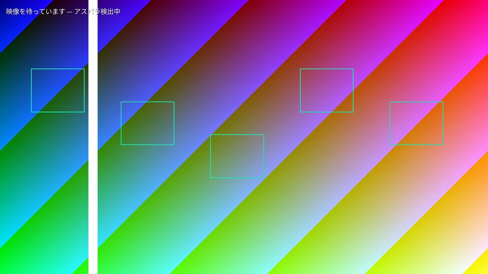

# Fluent Scene core（ROS 非依存 `.fvs` パーサー / バリデーター / 正準 IR）

設計書 [docs/design/fluent_vision_architecture.ja.md](../../docs/design/fluent_vision_architecture.ja.md)
第 14.2 節「次の実行可能スライス」の実装です。**ROS 2・学習フレームワーク・GPU に一切依存しません**
（`COLCON_IGNORE` により colcon ワークスペースからも除外されています）。

This is the MVP vertical slice from
[docs/design/fluent_vision_architecture.md](../../docs/design/fluent_vision_architecture.md)
section 14.2: a ROS-free `.fvs` parser, schema/type validator, deterministic
canonical typed IR with a SHA-256 digest, structured diagnostics, and a CLI —
plus roadmap stages 1 (resource/pass planner) and 2 (retained Vulkan renderer).



## ビルドとテスト / Build & test

```bash
cd core/fluent_scene
cmake -B build -S . -DCMAKE_BUILD_TYPE=Release
cmake --build build -j
ctest --test-dir build --output-on-failure
```

## CLI

```bash
# パースのみ（有界 YAML サブセット検査）
./build/fvsc parse <file>

# パース + スキーマ/型検証 + 正準 IR（成功時に digest を表示）
./build/fvsc validate examples/camera_detection_hud.fvs
./build/fvsc validate <file> --ir -                  # 正準 IR JSON を stdout へ
./build/fvsc validate <file> --diagnostics-json      # 診断を構造化 JSON で出力

# 検証 + backend 非依存 resource/pass plan（Stage 1。plan digest も表示）
./build/fvsc compile examples/camera_detection_hud.fvs
./build/fvsc compile <file> --plan -                 # plan JSON を stdout へ

# Stage 2: 保持型レンダラーで実描画（ヘッドレス・合成入力・レイテンシ計測）
./build/fv_render examples/camera_detection_hud.fvs --frames 120 --out hud.ppm
./build/fv_render <file> --backend both              # Vulkan と CPU の実測比較

# Stage 3: runtime binding 経由の E2E（push → snapshot → 描画。fallback が実際に出る）
./build/fv_render examples/camera_detection_hud.fvs --bindings --out hud.ppm

# Stage 4: ROS 2 アダプター（要 rclcpp。ビルドは source /opt/ros/<distro>/setup.bash 後に
# cmake -B build -S . -DCMAKE_PREFIX_PATH=/opt/ros/<distro> && cmake --build build）
./build/fv_scene_node --scene examples/camera_detection_hud.fvs \
    --binding examples/camera_detection_hud_ros2.binding.yaml --rate 15
```

終了コード: `0` = エラーなし / `1` = エラー診断あり / `2` = 使い方・I/O エラー。

```bash
# レイテンシ計測（parse / validate+IR+digest の per-iteration 統計）
./build/fvs_bench examples/camera_detection_hud.fvs 2000
```

参考実測 (Jetson tegra / NVIDIA Thor, aarch64, GCC 13 -O3, 2026-08-13):

- シーンコンパイル（構造編集時のみ走る経路）: §11の例 (2.9KB) で total 平均 ~153µs
  (parse ~41µs + validate ~73µs + plan ~40µs)。61ノードでも ~1.25ms。
- フレーム描画（1920×1080、カメラ+ボックス5+日本語テキスト、120フレーム）:
  | backend | frame mean | p99 | 備考 |
  |---|---|---|---|
  | Vulkan | **1.67ms** (GPU実行 0.37ms) | 3.2ms | 同期待ちを含む保守的な計測 |
  | CPU (スカラー1スレッド) | **43.2ms** | 44.0ms | 30fps を維持できない |

  同一シーン・同一入力で **約26倍差**（GPU実行時間だけなら ~117倍）。ピクセル一致は
  平均差 <1/255。CPU 側は素朴なリファレンス実装であり最適化版 (NEON/多スレッド) では
  縮まるが、傾向を変えるほどではない。

## 実装済みの契約 / Implemented contracts

- **有界 YAML サブセットパーサー**: 重複キー拒否、source span、anchor・alias・タグ・
  ブロックスカラー・複数文書・タブインデント禁止、入力サイズ/深さ/ノード数/文字列長の静的上限。
- **スキーマ/型バリデーター** (`fluent.scene/v1alpha1` のみ、識別子を厳密照合):
  プリミティブ・struct（閉じたフィールド・循環検出）・有界 `sequence<T, N>`・
  `optional<T>`・inputs/params/resources/nodes/outputs/budgets/fallbacks・
  `$inputs/$params/$resources/$nodes/$runtime` 参照解決・組合せ循環の拒否・
  bounds/overflow ルール・容量上限・`builtin://` スキーム allowlist。
- **正準 typed IR + digest**: 名前順の正規化とノードのトポロジカル順序（同順位は id 辞書順）
  により、マッピング順・コメント・ノード列挙順に依存しない byte-identical な JSON と
  `sha256:` digest を出力。
- **構造化診断**: 安定コード（`parse.duplicate_key` など）・severity・phase・span・
  文脈 key/value・正準順序。golden テストで固定。
- **MVP ノードレジストリ**（宣言的シグネチャ）:
  `visual.image2d` / `visual.boxes2d` / `text.dynamic` / `composite.layers`。
- **Stage 4: 分離 binding schema + ROS 2 アダプター**:
  [binding_config.hpp](include/fluent_scene/binding_config.hpp)（ROS 非依存）が §12 の
  `fluent.binding/v1alpha1` 文書をシーン契約に対して検証（未知入力/未登録 converter/
  型不整合/シーン名不一致は activation 前に拒否、§12 の要求どおり）し、同期 tolerance と
  queue_capacity を BindingTableOptions へ写像。
  [adapters/ros2/fv_scene_node.cpp](adapters/ros2/fv_scene_node.cpp) は transport のみを所有:
  binding 文書のトピックを購読 → 型付き値へ変換（Image rgb8/bgr8/rgba8/bgra8/mono8、
  Detection2DArray、String、CameraInfo）→ BindingTable へ push、タイマーで snapshot →
  保持型描画 → 合成画像を sink トピックへ publish。core/レンダラーは ROS を一切 link しない。
  隔離 ROS_DOMAIN_ID での E2E 動作確認済み（トピック経由の日本語テキストが合成に出る）。
  注意: std_msgs/String はヘッダーが無いため受信時刻で stamp する。depth converter は
  検証のみ（未実装、宣言 fallback が効く）。
- **Stage 3: runtime binding + snapshot scheduler**
  ([binding.hpp](include/fluent_scene/binding.hpp)、ROS 非依存・時刻は呼び出し側注入で決定的):
  型付き値+メタデータ(timestamp/clock/frame/sequence 必須)を有界キューへ push し、
  フレーム境界で不変スナップショットを1つ選択（§6.4）。`latest`/`fifo`/`matched` の
  各ポリシー、synchronization_group の近似マッチング（tolerance、required メンバーのみ
  必須・optional はデータがある時だけ参加）、鮮度上限（stale→宣言 fallback）、
  宣言 fallback（typed default / output_unavailable / hide）、未宣言の required 欠落
  → frame unhealthy、mid-frame 到着は次フレーム扱い。契約違反 push は bind-phase 診断。
  スナップショットは `toFrameInputs()` で Stage 2 レンダラーに直結。
- **Stage 2: 保持型レンダラー**（Vulkan バックエンド + CPU リファレンス、どちらも同じ狭い
  `Renderer` インターフェース [renderer.hpp](include/fluent_scene/render/renderer.hpp) の実装）:
  ヘッドレス offscreen 描画（WSI 不要、§15 の output-surface 未決定を保留のまま）。
  パイプラインは loadScene で3本だけ事前構築し、フレーム毎の shader compile はゼロ
  （カウンターで証明・テスト済み）。日本語は FreeType+HarfBuzz でシェーピングし
  R8 グリフアトラスへ（欠落グリフは決定的代替+カウンター）。フォント等の asset URI 解決は
  ホスト側 options が持ち、シーンからは指定不可（§13）。detections の
  `drop_lowest_score`/`drop_oldest`、テキストの `truncate_end` を実装。
  制限: nested composite 未対応、`show_label` のラベル文字は未描画、ウィンドウ表示・
  ゼロコピー取り込みは未実装（Stage 4以降）。
  依存 (Vulkan / freetype2+harfbuzz / glslc) が無い環境ではレンダラーだけ自動で外れ、
  core は常にビルド可能。
- **Stage 1: backend 非依存 resource/pass plan + lifetime planner** (`fluent.plan/v1alpha1`):
  正準 IR を upload/render パス列と資源台帳（image/buffer/font_atlas/staging_pool、
  worst-case サイズ、first_use/last_use、exported/aliasable）へ lower し、
  `max_gpu_bytes` / `max_upload_bytes_per_frame` の**予算超過を compile 段階で決定的に拒否**
  (`compile.budget_exceeded`)。出力に寄与しないノードは `compile.dead_node` (info) で除外。
  サイズ算定式は [planner.hpp](include/fluent_scene/planner.hpp) に明記
  （画像は budgets.max_width×max_height の worst case、frames_in_flight 多重化は
  Stage 2 のバックエンド方針に委ねる）。per-frame upload 予算には `update: per_frame`
  の入力だけを計上する。

## テスト構成 / Test layout

- `examples/` — 設計書 §11（Scene）と §12（Binding、パースのみ）の忠実な写し。
- `tests/fixtures/` — 決定性検証用（並べ替え・コメント付き）と negative fixtures
  （重複キー・未知参照・型不一致・グラフ循環・bounds 欠落・容量超過・alias・タブ・未対応 schema・
  GPU/upload 予算超過）、および描画テスト用シーン (`render_scene.fvs`, 640×360)。
- `tests/golden/` — 正準 IR・digest・診断・plan・描画画像の golden。
  再生成は `./build/fvs_tests . --regen` と `./build/fvs_render_tests . --regen`。
  描画テストは Vulkan デバイスが無い環境では skip (exit 77) になる。

## 対応GPU / Supported GPUs

Vulkan バックエンドは NVIDIA (Jetson 含む・2012年以降) / AMD / Intel iGPU・Arc /
ラズパイ4以降でネイティブ動作。デバイス選択は dGPU 優先（Intel+NVIDIA 構成では NVIDIA を
自動選択）。Mac は MoltenVK (Vulkan→Metal) 経由で、ヘッドレス構成なので互換性は高い。

## 未実装（今後のロードマップ） / Not yet implemented

設計書 §14.3 の Stage 5 以降が未着手: 点群/3D モデル/照明/影/有界エフェクト (Stage 5)、
MCP ライフサイクル（隔離 preview・原子的 activation・audit・rollback、Stage 6）、
その他 consumer/学習FW アダプター (Stage 7)。ウィンドウ表示・NVDEC/カメラの
ゼロコピー取り込み・frames-in-flight 多重化・depth 描画も §15 の未決定事項どおり
今後の計測対象。実機の実トピック（D555 等）への接続は直購読の帯域制約
（rmem/ユニキャスト掛け算）を踏まえ relay 経由で設計してから行うこと。
