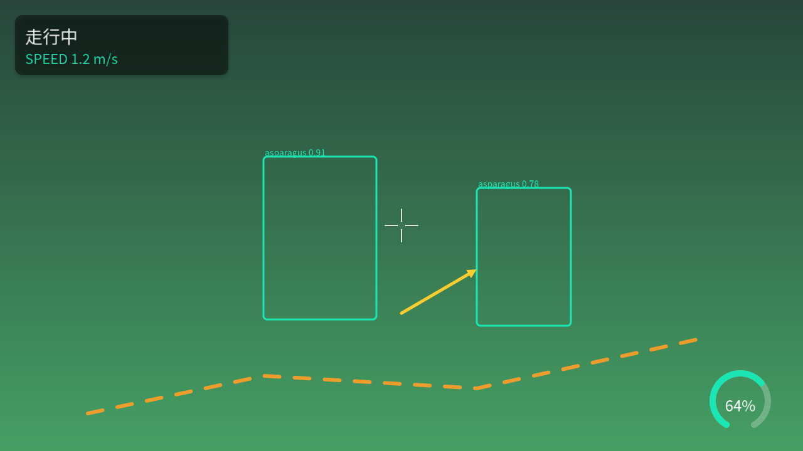

# fluent_stage



**ロボットの画面を、人間は1行で、AIは安全に。** fluent_stage は CALayer 型の
保持レイヤーツリーと SDF レンダリングによる 2D 合成ライブラリです。
カメラ映像・検出結果・経路・HUD を、論理座標系でリアルタイムに描きます。

```cpp
Stage stage(1920, 1080);
stage.image(camera);
stage.boxes(detections).color(Color::Teal).smoothing(0.2f);
stage.group("hud").position(24, 24).shadow()
     .rect({0, 0, 340, 96}).cornerRadius(12).color({0, 0, 0, 0.45f});
```

同じ画面は宣言文書（Scene / YAML, Phase L2）でも書けるようになります —
型検査・digest・予算ゲートを通るため、**AI が実行中の画面を安全に生成・
編集**できます:

```yaml
layers:
  - content: { image: { source: $inputs.camera } }
  - content: { boxes: { source: $inputs.detections, smoothing: 0.2 } }
  - id: hud
    position: [24, 24]
    shadow: {}
    sublayers:
      - content: { rect: { size: [340, 96], corner_radius: 12,
                           color: [0, 0, 0, 0.45] } }
```

## ブラウザで触る

```bash
./build/stage_web            # → http://<robot>:8790/ を開く
```

Stage の映像を MJPEG でブラウザに配信し、マウス/タッチを §10-3 のポインタ
注入へ逆流させる自己完結アプリ（`tools/stage_web.cpp`、依存は libjpeg のみ）。
ボタン・スイッチ・スライダー・プルダウン・波紋がブラウザから実際に操作
できます。ページ側に UI ロジックはゼロ — 絵も状態遷移も全部ロボット側です。

## 5分で始める

```bash
sudo apt install libfreetype-dev libharfbuzz-dev
cmake -S . -B build && cmake --build build -j
ctest --test-dir build          # 単体 + golden画像 + 全example
./build/hud_basic               # 冒頭の画像を実際に描く
```

チュートリアル: [docs/getting-started.ja.md](docs/getting-started.ja.md) /
やりたいこと別: [docs/cookbook.ja.md](docs/cookbook.ja.md)

## なにができるか

- **content 13種** — image(部分切り出し対応) / text(日本語・HarfBuzz) /
  line / polyline / polygon / rect / circle / circles / arc / arrow /
  crosshair / grid / boxes(ラベル+時間平滑化)。全て SDF、AA付き、
  どの出力解像度でもベクタ品質
- **CALayer 準拠の属性** — frame / position / anchor / rotation / scale /
  opacity / shadow / border / background / cornerRadius / masksToBounds /
  blend。左上原点・+y下の**1座標系のみ**（反転スイッチは存在しない）
- **フィルタ 29種** — blur / bilateral / color_transform / toon / halftone …
  任意のレイヤーにもグループ（合成後の1枚）にも掛かる。本体は GLSL∩C++ の
  単一ソース（[filters_shared.h](include/fluent_stage/shared/filters_shared.h) +
  [filters_def.h](include/fluent_stage/shared/filters_def.h)）で、
  CPU / GPU / 型付きAPI / カタログが一箇所から導出される

  

- **implicit animation** — 属性を変えるだけで滑らかに動く
  （`Transaction t(0.3f, Ease::InOut)`）。時間は `render(stage, dt)` の
  dt でしか進まないため、**t=0.15s の画面をバイト単位で再現**できる
- **保持型** — 毎フレームは変更データの差し替えだけ
  （`setImage / setText / setBoxes / opacity()`）
- **UIコントロール** — `ui::Button` / `ui::Switch` / `ui::Slider` /
  `ui::Segmented` / `ui::Gauge` / `ui::Dropdown`（すべてプレハブ+状態=
  属性上書き。新しい描画機構はゼロ）。入力は `stage.pointerDown/Move/Up`
  への注入だけ — Webビューアのクリックもタッチも VR レイも同じ3呼び出しに
  正規化される

  

## AI と作る前提の設計

Scene 文書（L2）は AI が書き手になるための契約を持ちます: 実行前に全て拒否
する型検査、並べ替え不変 digest、GPU 予算ゲート、`describe --json` による
能力の自己記述、コントラスト比などを警告するデザインリンター。詳細は
[設計書 §13](../../docs/design/fluent_stage.ja.md)。

## 位置づけとフェーズ

fluent_vision の実行層です。**Scene（宣言/.fvs）→ Stage（実行時ツリー/本
ライブラリ）→ Surface（ピクセル）**。

| Phase | 範囲 | 状態 |
|---|---|---|
| L0 | Stage API + CPUリファレンス + Transaction + golden | **完了** |
| L1 | Vulkan バックエンド（CPU と同一出力） | **完了** — 全goldenをGPUで通過、1080pで 5.6ms/frame（CPU比 ~17倍、読み戻し込み） |
| L2 | Scene v1alpha2（YAML→Stage）+ describe --json + リンター | 未着手 |
| L3 | ROS binding / インスペクター | 未着手 |
| L4 | UI コントロール（ポインタ注入 + 6コントロール先行実装済） | ほぼ完了 |

バックエンドは差し替え式です — `CpuRenderer`（リファレンス・どこでも動く）と
`VulkanRenderer`（本番。シェーダーはビルド時に SPIR-V 化され実行時コンパイル
ゼロ）。同一ツリーから同一の絵が出ることを golden テストが両方に対して
保証します:

```cpp
std::unique_ptr<Renderer> renderer;
try {
    renderer = std::make_unique<VulkanRenderer>();
} catch (const std::exception&) {
    renderer = std::make_unique<CpuRenderer>();   // GPUが無い環境へのフォールバック
}
```

既知の L0 制限は [cookbook 末尾](docs/cookbook.ja.md#既知の-l0-制限正直リスト)に
明記しています。

## ドキュメント

- [getting-started.ja.md](docs/getting-started.ja.md) — 5分チュートリアル
- [cookbook.ja.md](docs/cookbook.ja.md) — レシピ集
- [docs/api/README.ja.md](docs/api/README.ja.md) — API リファレンス（ヘッダが
  一次ソース、全公開APIに Doxygen コメント）
- [設計書（なぜこうなっているか）](../../docs/design/fluent_stage.ja.md)
- [CHANGELOG.md](CHANGELOG.md)

開発中の正文は日本語です。OSS 公開時に英語 README を正面にします（§12-4）。
