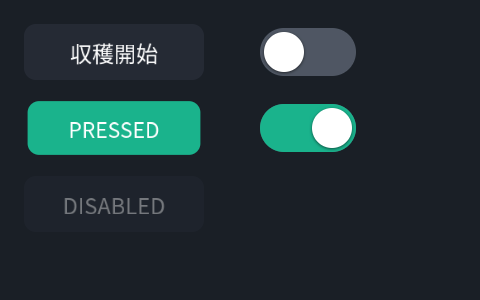
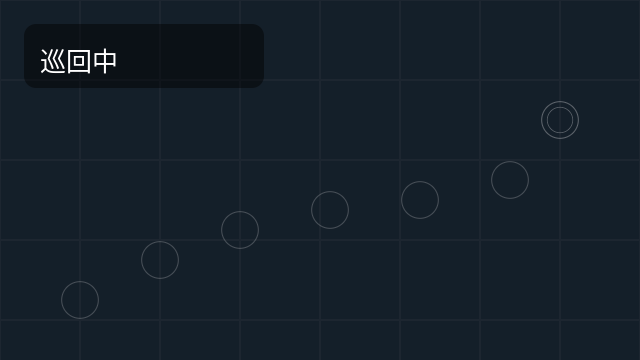

# Cookbook — やりたいこと別レシピ

全レシピは `Stage stage(1280, 720);` と `CpuRenderer renderer;` がある前提の
断片です。動く全体像は [examples/](../examples/) にあります
（すべてビルド・実行可能、CIで常時実行）。

## カメラ映像を全面に + PiP

```cpp
ImageView main_cam{1280, 720, main_pixels, 0};   // 借用: renderまで有効
ImageView rear_cam{640, 480, rear_pixels, 0};

stage.image(main_cam, Fit::Cover);                          // 全面
auto& pip = stage.image(rear_cam).frame({1000, 40, 240, 180})
                 .cornerRadius(10).border(2, Color::White).shadow();
// 毎フレームは差し替えだけ:
pip.setImage(rear_cam);
```

ポイント: `image()` は**ピクセルをコピーしません**。`ImageView` の指す
メモリは次の `render()` まで有効に保つこと。

## 画像の一部だけ切り出して貼る（部分コピー&ペースト）

```cpp
stage.image(cam).sourceRect({640, 200, 320, 240})   // 元画像のこの領域を
     .frame({40, 40, 640, 480});                    // ここへ拡大して貼る
```

`sourceRect` は**元画像のピクセル座標**です（0–1正規化ではない）。
同じソースを複数レイヤーで別々の `sourceRect` 参照してかまいません
（転送は1回、切り出しはサンプリングで行われます）。

## 経路（軌跡・計画パス）の表示

```cpp
auto& route = stage.polyline(path_points)
                   .thickness(6).dash(18)
                   .color(Color::Orange.faded(0.9f));
// 経路が更新されたら:
route.setPoints(new_points);
```

## HUD パネル（半透明の角丸 + テキスト）

```cpp
auto& hud = stage.group("hud").position(24, 24).opacity(0.9f).shadow();
hud.rect({0, 0, 340, 96}).cornerRadius(12).color({0, 0, 0, 0.45f});
hud.text("走行中", {16, 12}).size(28);
hud.text("SPEED 1.2 m/s", {16, 52}).size(22).color(Color::Teal);
```

ポイント: 裸の `group()` の `position` は**原点の移動**です（子は (0,0)
基準で書ける）。グループを中心回転・クリップ・背景付きにしたいときは
`bounds()` か `frame()` を明示してください。

## 影付きテキスト

```cpp
stage.text("収穫完了", {40, 40}).size(48).shadow(2, 3, 6);
```

影はレイヤーのシルエット（α）から生成されるので、テキストにも枠線にも
画像にもグループ全体にも同じ書き方で掛かります。

## 検出ボックス（ラベル + 時間平滑化）

```cpp
auto& det = stage.boxes({}).color(Color::Teal)
                 .cornerRadius(6).smoothing(0.2f);
// 認識結果が来るたび:
det.setBoxes(latest);     // Box{rect, score, label, id}
```

`smoothing` は時定数（秒）。`id` が入っていれば同一トラックへ、無ければ
最近傍で対応付けます。新規は目標位置に即出現、消失は即消滅（残像なし）。

## フィルタチェーン

```cpp
stage.image(cam).bilateral(4).contrast(1.2f);              // よく使う形
stage.image(cam).filter(Bilateral().radius(4).sigma_color(0.2f))
                .filter(ColorTransform().saturation(0.5f)); // 全種は型付き
```

長さ系パラメータ（`blur(4)` など）は論理単位です。元画像が VGA でも 4K
でも画面上で同じ見た目になります。グループに掛ければ合成後の1枚に
掛かります（グループぼかし）。

## メーター / ゲージ

```cpp
stage.arc({1180, 640}, 44, 120, 420).thickness(10).color({1, 1, 1, 0.25f});
auto& value_arc = stage.arc({1180, 640}, 44, 120, 120 + 3.0f * percent)
                       .thickness(10).color(Color::Teal);
stage.text("64%", {1180, 628}).size(24).align(Align::Center);

// 針: 下端中央を軸に回す
stage.rect({0, 0, 6, 90}).anchor(0.5f, 1.0f)
     .position(1180, 640).rotation(needle_deg).color(Color::Orange);
```

角度は度、0° = +x、画面上で時計回りです。

## 属性を変えるだけで滑らかに動かす

```cpp
{
    Transaction t(0.3f, Ease::InOut);
    stage.find("hud")->opacity(0.0f).position(24, -120);
}
// スコープ外の変更は即時。進行中の再変更は現在値から繋がる（ジャンプしない）。
```

## ボタンとスイッチ（UIコントロール）

```cpp
ui::Button start(stage.root(), {24, 900, 220, 64}, "収穫開始");
start.onTap([&] { robot.startHarvest(); });

ui::Switch light(stage.root(), {270, 908, 96, 48});
light.onChange([&](bool on) { robot.setLight(on); });

// 入力側の統合はこれだけ（Web/タッチ/VRすべて同じ3呼び出しに正規化）:
stage.pointerDown(pos);   // → pointerMove(pos) → pointerUp(pos)
```



コントロールは**新しい描画機構ではなくレイヤーのプレハブ**です（§10）。
状態=属性上書き（pressed → scale 0.96 + アクセント背景）で、遷移は
Transaction 経由なので自動で滑らかに動きます。見た目は `ButtonStyle` /
`SwitchStyle` で差し替え、配置は `control.layer()` を普通のレイヤーとして
操作。`enabled(false)` はポインタを**下のレイヤーへ素通し**します。

寿命の掟: コントロールのオブジェクトが挙動を持ち、レイヤーはStageが持ち
ます。反応させたい間はオブジェクトを生かしておくこと（破棄すると見た目は
残り、反応だけ消える）。見た目ごと消すのは `remove()`。

## スライダー・切替・ゲージ・プルダウン

```cpp
ui::Slider speed(stage.root(), {24, 44, 240, 28}, 0.35f);
speed.onChange([&](float v) { robot.setSpeedLimit(v); });   // ドラッグ中も連続で届く

ui::Segmented mode(stage.root(), {24, 96, 280, 42}, {"手動", "巡回", "追従"});
mode.onChange([&](int i) { robot.setMode(i); });

ui::Gauge battery(stage.root(), {560, 80}, 48);
battery.setValue(telemetry.battery01);   // 表示専用・即時反映

ui::Dropdown profile(stage.root(), {24, 168, 220, 46},
                     {"標準", "低速", "高速", "点検"});
profile.onChange([&](int i) { robot.setProfile(i); });
```


- **Slider** はドラッグ中ポインタに直結（遅延なし）、`setValue()` は
  アニメして到達。**Segmented** は2〜5択の排他選択 — 常に全択が見えるので
  タッチ/VRではプルダウンより誤操作が少ない
- **Dropdown** のポップアップは root 末尾のグループ（ツリー順=重なり順）+
  全面透明スクリム（外側タップで閉じる）。下に入りきらない時は上に開く。
  `max_visible`（既定8行）を超えるリストは**ドラッグでスクロール**
  （約6単位動いたらタップではなくドラッグと判定）。開いた時は選択行が
  見える位置までスクロール済み
- **Gauge** は表示専用。値の平滑化はテレメトリ側の仕事（ジャンプする
  ソースなら EMA を挟んでから `setValue`）

## ポインタの波紋（ホバーの水面エフェクト）

```cpp
fx::Ripple ripple(stage.root());   // UIより後に作る（リングが最前面に乗る）

// 入力経路から（Webビューアのmousemove / タッチ / VRレイ）:
ripple.pointerMoved(pos);          // 動いた軌跡に波紋（間隔は自動間引き）
ripple.splash(pos);                // タップは強め二重リング

// フレームループ（renderと同じdtを渡す = すべて決定的）:
ripple.tick(dt);
renderer.render(stage, dt);
```



実体は円レイヤーの拡大+フェード（Transaction）だけで、`max_rings`（既定
24）で有界。下の映像そのものを歪ませる屈折波紋は L1 の GPU フィルタ
（filters_shared.h に ripple 関数を1つ足す）で計画済み。

## どのレイヤーが押されたか（hit-test）

```cpp
if (Layer* hit = stage.hitTest({tap_x, tap_y})) {
    if (hit->id() == "start_button_bg") { /* ... */ }
}
```

判定は CALayer と同じ規則（ツリーの上から、transform考慮、hidden除外）。
ポインタ注入とUIコントロール（button/switch）は Phase L4 で載ります。

## 解像度を変えて出力する

```cpp
const Surface& preview = renderer.render(stage, 640, 360, dt);   // 同じ木
const Surface& full    = renderer.render(stage, 3840, 2160, dt); // 同じ木
```

描画は全て SDF なので、拡大してもビットマップ的な劣化はありません
（テキストのみアトラス拡大、SDF テキストは将来）。アスペクトが違うときの
方針は `stage.fit(Fit::Contain / Cover / Fill)`。

## 既知の L0 制限（正直リスト）

- `dash()` が効くのは line / polyline / polygon枠線。arc の破線は未対応
- arc の `Cap::Butt` は未対応（丸キャップで描画）
- テキストは1行のみ（折返し・`\n` 未対応）。ビットマップアトラス方式のため
  極端な拡大では甘くなる
- フィルタの色は sRGB 空間で計算（リニア化は L1 検討）
- 裸のグループに `masksToBounds` / `background` を付けても bounds がゼロの
  ため何も起きない — `bounds()` を明示すること
- レイヤー単位のホバー状態（ボタンのhover強調等）は未実装 — ポインタ注入
  は capture 中の Move のみルーティングする（波紋のような画面エフェクトは
  fx::Ripple に位置を直接流すので影響なし）
- 屈折式の水面波紋（映像を歪ませる方）は L1 の GPU フィルタで対応予定
