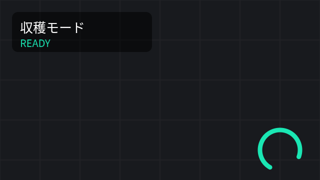
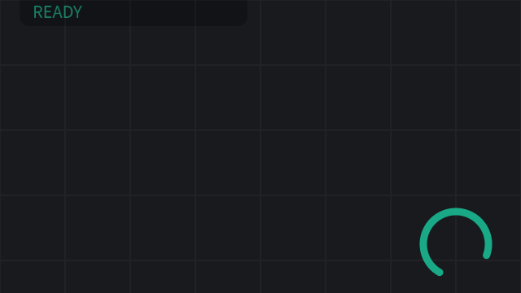
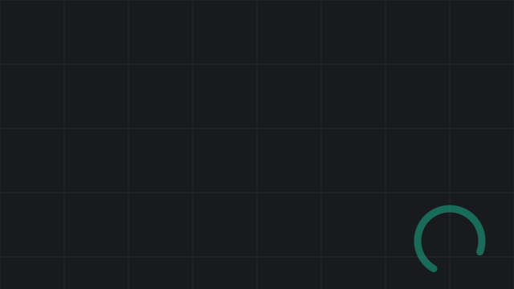

# はじめる — 5分で最初の絵を出す

fluent_stage は、ロボットのカメラ映像と情報を**美しく・リアルタイムに・宣言的に**
描くための 2D レイヤーライブラリです。iOS の CALayer と同じメンタルモデル
（レイヤーツリー + 属性 + implicit animation）を、C++ で1行から書けます。

概念の全体像は [設計書](../../../docs/design/fluent_stage.ja.md) を、
やりたいこと別のコードは [cookbook](cookbook.ja.md) を見てください。

## 1. 依存とビルド

必要なのは C++17 コンパイラ、CMake 3.16+、freetype2、harfbuzz だけです
（Ubuntu: `sudo apt install libfreetype-dev libharfbuzz-dev`）。

```bash
cd core/fluent_stage
cmake -S . -B build && cmake --build build -j
ctest --test-dir build        # stage_tests + golden_tests + 全example
```

## 2. 最初のプログラム

```cpp
#include <fluent_stage/fluent_stage.hpp>
using namespace fluent_stage;

int main() {
    Stage stage(1280, 720);                       // 論理座標系を宣言

    stage.rect({40, 40, 360, 110})                // 1行で描ける
         .cornerRadius(14)
         .color({0, 0, 0, 0.5f})
         .shadow();                               // 装飾はチェーンで任意

    stage.text("こんにちは、Stage", {60, 62}).size(36);

    CpuRenderer renderer;
    const Surface& frame = renderer.render(stage, 0.0f);   // dt注入
    // frame.pixels = RGBA8(straightアルファ)。次のrenderまで有効。
}
```

ビルド（ライブラリをビルド済みなら g++ 直リンクが最短）:

```bash
g++ -std=c++17 first.cpp -Icore/fluent_stage/include \
    core/fluent_stage/build/libfluent_stage.a \
    $(pkg-config --libs freetype2 harfbuzz) -o first
```

CMake プロジェクトなら `add_subdirectory(core/fluent_stage)` して
`target_link_libraries(app PRIVATE fluent_stage)`。

## 3. 3つの約束ごと

1. **座標は左上原点・+y下・論理単位のみ**。太さも角丸もフォントもぼかし半径も
   全部同じ単位。出力解像度はレンダー時に指定し、SDF なのでどの解像度でも
   ベクタ品質（`renderer.render(stage, 3840, 2160, dt)`）。
2. **描いたものはレイヤー**。全描画呼び出しは `Layer&` を返し、保持される。
   毎フレーム作り直さず、変わったものだけ `setImage / setText / setBoxes /
   opacity()` で更新する。
3. **時間は dt でしか進まない**。`render(stage, dt)` が唯一の時計。実時間を
   渡せばライブに動き、固定 dt を渡せば同じ絵がバイト単位で再現される
   （テスト・AI検証の基盤）。

## 4. 動かす — Transaction

属性を変えるだけで滑らかに動きます（iOS の implicit animation と同型）:

```cpp
auto& hud = stage.group("hud").position(24, 24);
hud.rect({0, 0, 280, 80}).cornerRadius(12).color({0, 0, 0, 0.5f});

{
    Transaction t(0.3f, Ease::InOut);        // このスコープ内の変更は補間
    stage.find("hud")->opacity(0.0f).position(24, -120);
}
renderer.render(stage, dt);                  // 毎フレーム進める
```

| t = 0.00 | t = 0.15 | t = 0.30 |
|---|---|---|
|  |  |  |

## 5. 同じ画面を YAML で — Scene 文書 (.fvs)

ビルドせずに画面を書き替えたいとき（現場調整・遠隔更新・AI 生成）は、
同じ画面を **Scene 文書**として宣言できます。C++ と**完全に同じ絵**が
出ることが契約です（scene_tests がピクセル一致で検証しています）。

```yaml
# hud.fvs
schema: fluent.scene/v1alpha2
inputs:
  camera: { type: image.rgba8, update: per_frame }
layers:
  - content: { image: { source: $inputs.camera } }
  - id: hud
    position: [24, 24]
    opacity: 0.9
    shadow: {}
    sublayers:
      - content: { rect: { size: [340, 96], corner_radius: 12,
                           color: [0, 0, 0, 0.45] } }
      - content: { text: { text: "走行中", position: [16, 12], size: 28 } }
```

検証・プレビューは `fvsc` CLI:

```bash
./build/fvsc validate hud.fvs        # 型検査 + デザインリンター + digest
./build/fvsc preview  hud.fvs -o out.ppm --size 960x540
./build/fvsc fmt      hud.fvs        # 正準フォーマット（並べ替え・空白を正規化）
./build/fvsc describe --json         # このビルドが理解する全語彙（AI 向けカタログ）
```

C++ からは `parseScene` → `compile` で同じ Stage が得られ、宣言した
`$inputs` / `$params` を型安全に流し込めます:

```cpp
#include <fluent_stage/scene/compiler.hpp>
#include <fluent_stage/scene/document.hpp>
namespace fs = fluent_stage::scene;

auto parsed = fs::parseScene(yaml_text);      // 誤りは全部ここで拒否
auto compiled = fs::compile(parsed.doc);       // → Stage（同じ描画コード）
compiled.scene->setImage("camera", camera);    // 宣言済み入力へ型チェック付きで
renderer.render(compiled.scene->stage(), dt);
```

まだデータが来ていない image 入力は「$inputs.名前」と格子を描いた
プレースホルダーパネルになります（`fallback: hide | hold` で変更可）。

## 6. 次へ

- [cookbook.ja.md](cookbook.ja.md) — PiP、経路、HUD、ゲージ、フィルタ、検出枠…
- [examples/](../examples/) — 全てビルド・実行可能（CIで常時実行）
- [設計書 fluent_stage.ja.md](../../../docs/design/fluent_stage.ja.md) — なぜこうなっているか
- API リファレンス — ヘッダが一次ソース（全公開APIに Doxygen コメント）。
  [docs/api/README.ja.md](api/README.ja.md) 参照
