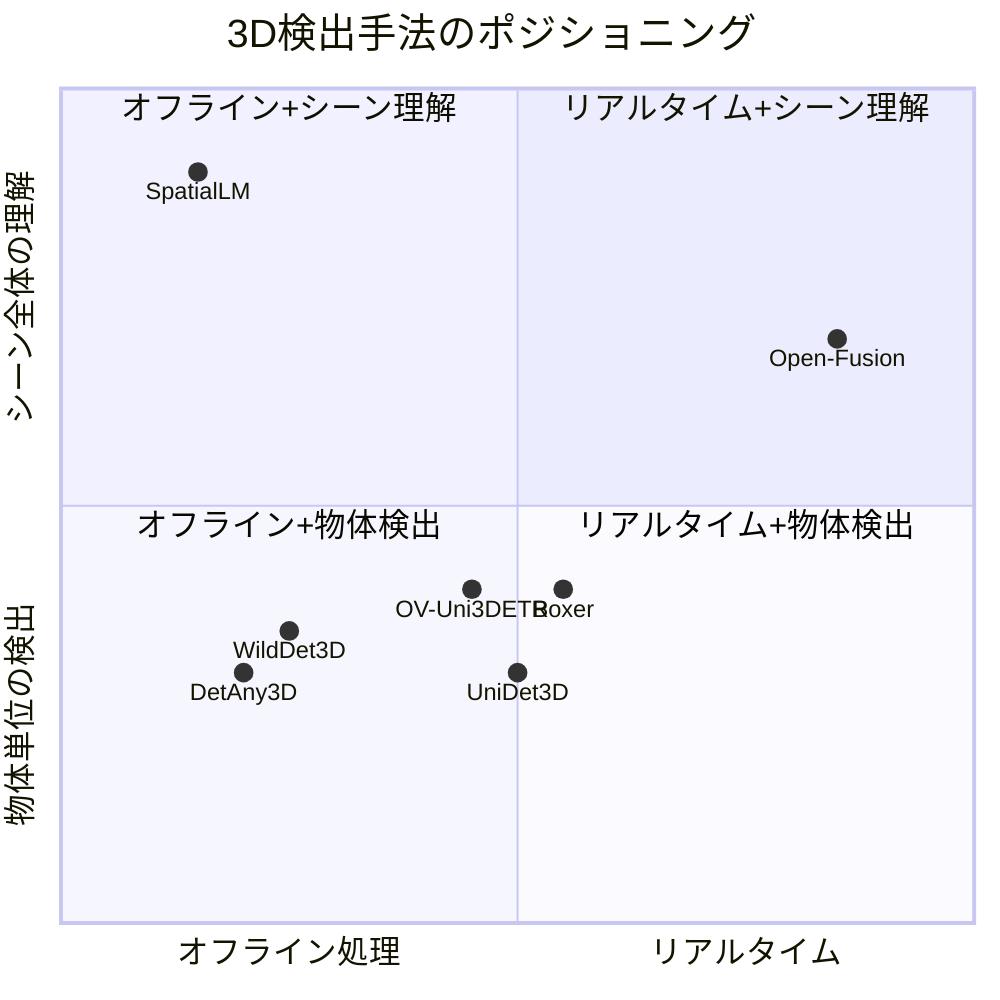
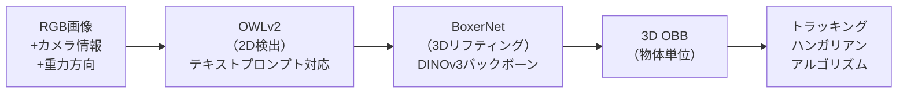
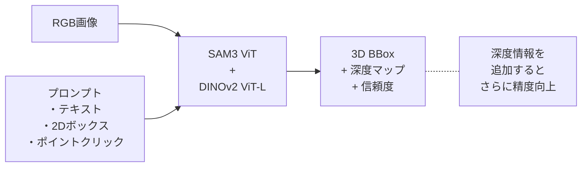
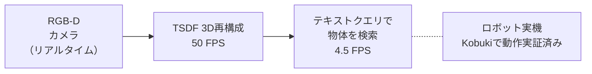
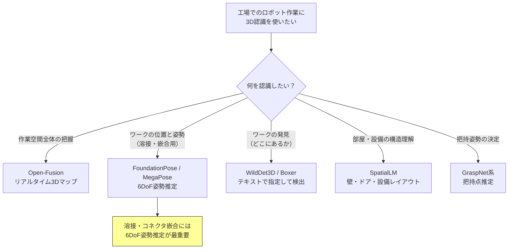

# 3D物体検出 技術比較レポート

## 1. このレポートの目的

SpatialLM は部屋の3D構造を丸ごと理解できるAIだが、**リアルタイム処理には向かない**ことがわかった。

そこで、SpatialLM 以外の3D物体検出技術も調査した。

**想定用途:** 工場での溶接作業やコネクタ嵌合など、細かい作業をロボットで行うための3D認識技術の選定。

---

## 2. 比較対象の一覧

| 手法 | 開発元 | 発表時期 | 6DoF姿勢 | コード公開 | モデル公開 | 学習コード | ライセンス | 実用性 |
| --- | --- | --- | --- | --- | --- | --- | --- | --- |
| **SpatialLM** | Manycore Tech / HKUST | 2025年6月 | **非対応**（3D BBox + yawのみ） | あり | あり | あり | Llama 3.2 License + **CC-BY-NC-4.0**（点群エンコーダ） | **すぐ試せる（エンコーダは非商用）** |
| **Boxer** | Meta | 2026年 | **非対応**（3D OBBのみ） | あり | あり | **なし** | **CC-BY-NC（非商用）** | 推論のみ、**商用不可** |
| **WildDet3D** | Allen AI | 2025年 | **非対応**（3D BBoxのみ） | あり | あり | あり | SAM License | **すぐ試せる** |
| **Open-Fusion** | アーカンソー大 | 2024年 | **非対応**（セマンティックマップ） | あり | あり | あり | **Apache 2.0（商用OK）** | **すぐ試せる、商用も可** |
| **DetAny3D** | 上海AI Lab | 2025年 | **非対応**（3D BBoxのみ） | あり | あり | 未確認 | **Apache 2.0（商用OK）** | 試せる |
| **OV-Uni3DETR** | 清華大/Apple | 2024年 | **非対応**（3D BBoxのみ） | あり | あり | あり | **Apache 2.0（商用OK）** | 試せる |
| **UniDet3D** | Samsung AI | 2025年 | **非対応**（3D BBoxのみ） | あり | あり | あり | **Apache 2.0（商用OK）** | **すぐ試せる、商用も可** |
| [**FoundationPose**](https://github.com/NVlabs/FoundationPose) | NVIDIA | 2024年 | **対応（6DoF）** | あり | あり | あり | **NVIDIA Source Code License（非商用のみ）** | **すぐ試せる（商用不可）** |
| [**MegaPose**](https://github.com/megapose6d/megapose6d) | Inria / NVIDIA 他 | 2022年 | **対応（6DoF）** | あり | あり | あり | Apache 2.0 | **すぐ試せる、商用も可** |

> **ライセンスまとめ:**
> - **商用利用が明確にOK:** Open-Fusion, DetAny3D, OV-Uni3DETR, UniDet3D（すべてApache 2.0）、MegaPose（Apache 2.0）
> - **条件付き/非商用要素あり:** SpatialLM（Llama 3.2ライセンス + 点群エンコーダがCC-BY-NC-4.0で非商用）、WildDet3D（SAM License、軍事利用禁止）
> - **商用不可:** Boxer（CC-BY-NC）、FoundationPose（NVIDIA Source Code License、非商用のみ）

---

## 3. 各手法の解説

### 3.1 Boxer（Meta / Facebook Research, 2026）

- [プロジェクトページ](https://facebookresearch.github.io/boxer/) / [GitHub](https://github.com/facebookresearch/boxer) / [論文](https://arxiv.org/abs/2604.05212)

**ひとことで言うと:** 2D検出結果を3Dに「持ち上げる」システム

| 項目 | 内容 |
| --- | --- |
| **入力** | RGB画像 + カメラ内部パラメータ + 重力方向（+ 任意で深度） |
| **出力** | グローバル座標系での3D向き付きバウンディングボックス（OBB） |
| **速度** | 90枚をCUDAで15秒未満（FPS公式値なし） |
| **オープンワールド** | テキストプロンプトで任意物体を指定可能 |
| **オープンソース** | コード公開、モデル公開（**CC-BY-NC: 非商用のみ**） |
| **学習コード** | 非公開（推論のみ） |

**強み:**

- テキストで「探したい物」を指定できるオープンワールド検出
- 複数データソース（ScanNet, SUN-RGBD等）対応
- オンライントラッキング機能あり
- インタラクティブ可視化ツール付属

**弱み:**

- カメラ内部パラメータと重力方向が必須（任意のRGB画像だけでは不可）
- 定量ベンチマーク（mAP等）が未公開
- 非商用ライセンス
- 学習コード非公開

---

### 3.2 WildDet3D（Allen AI, 2025）

- [GitHub](https://github.com/allenai/WildDet3D) / [デモ](https://huggingface.co/spaces/allenai/WildDet3D) / [ブログ](https://allenai.org/blog/wilddet3d)

**ひとことで言うと:** 単一のRGB画像から、テキスト/ボックス/クリックで指定した物体の3D位置を推定

| 項目 | 内容 |
| --- | --- |
| **入力** | 単一RGB画像（+ 任意でカメラ情報、深度） |
| **出力** | 2D/3Dバウンディングボックス + 深度マップ + 信頼度 |
| **対応カテゴリ** | 13,499カテゴリ（ゼロショットで未知物体にも対応） |
| **速度** | リアルタイム不可（サーバー推論が前提） |
| **オープンソース** | コード・モデル・データセット全て公開 |
| **モデルサイズ** | 約12億パラメータ |

**精度（ベンチマーク）:**

| ベンチマーク | 指標 | WildDet3D | 先行研究 |
| --- | --- | ---: | ---: |
| Omni3D（テキスト） | AP | **34.2** | 28.4 |
| Omni3D（+深度） | AP | **41.6** | - |
| Argoverse 2（ゼロショット） | ODS | **40.3** | 20.0 |
| ScanNet（ゼロショット） | ODS | **48.9** | 31.5 |

**強み:**

- 単一RGB画像だけで3D検出できる（深度カメラ不要で始められる）
- テキスト・ボックス・クリックの3種類のプロンプト対応
- ゼロショット汎化が非常に強い
- データセットも含めて完全オープン
- iOSアプリでのデモあり

**弱み:**

- リアルタイム処理は不可
- 深度情報なしだと精度が大幅に下がる
- モデルが大きくエッジデバイスでの実行は困難

---

### 3.3 Open-Fusion（ICRA 2024）

- [GitHub](https://github.com/UARK-AICV/OpenFusion)

**ひとことで言うと:** RGB-Dカメラからリアルタイムで3Dマップを作りつつ、テキストで物体検索できる

| 項目 | 内容 |
| --- | --- |
| **入力** | RGB-Dストリーム |
| **出力** | 3Dセマンティックマップ + テキストクエリ対応 |
| **速度** | **3D再構成 50FPS / セマンティック処理 4.5FPS** |
| **オープンソース** | あり |

**強み:** リアルタイム性が突出（ConceptFusionの約30倍速）、ロボット実機で実証済み
**弱み:** 物体単位の3Dボックス出力ではなくボクセルマップ

---

### 3.4 その他の注目手法

#### DetAny3D（ICCV 2025）

- 単眼RGBから任意カメラ設定で3D検出する基盤モデル
- 2D基盤モデルの知識を3Dに転移
- [GitHub](https://github.com/OpenDriveLab/DetAny3D)

#### OV-Uni3DETR（ECCV 2024）

- 屋内外統一のオープンボキャブラリ3D検出Transformer
- 点群 / RGB / マルチモーダル入力に対応
- テスト時にモダリティ切替可能
- [GitHub](https://github.com/zhenyuw16/Uni3DETR)

#### UniDet3D（AAAI 2025）

- 複数屋内データセットで統一学習する3D物体検出
- 点群入力、ARKitScenesで+19.4 mAP25の大幅改善
- [GitHub](https://github.com/filapro/unidet3d)

#### OpenScene（CVPR 2023）

- CLIP特徴を3D点群に投影、テキストで任意クラスの3Dシーン検索
- オフライン処理向け
- [GitHub](https://github.com/pengsongyou/openscene)

---

## 4. 全体比較表

### 4.1 基本スペック比較

| 手法 | 入力 | 出力 | オープンワールド | ライセンス |
| --- | --- | --- | --- | --- |
| **SpatialLM** | 点群 | 壁/窓/物体テキスト | 限定的（59カテゴリ） | - |
| **Boxer** | RGB+カメラ情報+重力 | 3D OBB | テキスト指定 | CC-BY-NC（非商用） |
| **WildDet3D** | 単一RGB(+深度任意) | 3D BBox+深度 | テキスト/ボックス/クリック（13,499カテゴリ） | オープン |
| **Open-Fusion** | RGB-Dストリーム | 3Dセマンティックマップ | テキストクエリ | オープン |
| **DetAny3D** | 単一RGB | 3D BBox | 任意カメラ対応 | オープン |
| **OV-Uni3DETR** | 点群/RGB | 3D検出 | オープンボキャブラリ | オープン |
| **UniDet3D** | 点群 | 3D BBox | 限定的 | オープン |

### 4.2 速度比較

| 手法 | 速度 | リアルタイム | 備考 |
| --- | --- | --- | --- |
| **SpatialLM** | 1シーン数秒〜 | **不可** | LLM自己回帰生成のため本質的に遅い |
| **Boxer** | 90枚/15秒（CUDA） ≈ 6FPS | **準リアルタイム** | オンライントラッキングモードあり |
| **WildDet3D** | 未公開（サーバー推論前提） | **不可** | 12億パラメータで推論重い |
| **Open-Fusion** | 3D再構成50FPS / セマンティック4.5FPS | **可能** | ConceptFusionの30倍速 |
| **DetAny3D** | 未公開 | **不可** | 基盤モデルで推論重め |
| **OV-Uni3DETR** | 中程度（Transformerベース） | **条件付き** | モダリティにより変動 |
| **UniDet3D** | 中程度（Transformerベース） | **条件付き** | 屋内データ特化で効率的 |

### 4.3 精度比較

| 手法 | ベンチマーク | 指標 | スコア | 備考 |
| --- | --- | --- | ---: | --- |
| **SpatialLM** | Structured3D（レイアウト） | F1@0.25 | 94.3 | レイアウト推定では最強 |
| **SpatialLM** | ScanNet（物体） | F1@0.25 | 65.6 | 専用検出器と同等 |
| **WildDet3D** | Omni3D（テキスト） | AP | 34.2 | 先行研究+5.8pt |
| **WildDet3D** | ScanNet（ゼロショット） | ODS | 48.9 | 先行研究+17.4pt |
| **WildDet3D** | Omni3D（+深度） | AP | 41.6 | 深度追加で大幅改善 |
| **UniDet3D** | ARKitScenes | mAP@0.25 | +19.4 | 先行研究比の改善幅 |
| **Boxer** | 未公開 | - | - | 定量ベンチマーク未掲載 |
| **Open-Fusion** | - | - | - | 速度重視、精度は参考値 |

### 4.4 必要環境比較

| 手法 | GPU VRAM | 推奨GPU | OS | 追加要件 |
| --- | --- | --- | --- | --- |
| **SpatialLM** | 16GB以上（推論）/ 60GB（学習） | RTX 4090 / A100 | Ubuntu 22.04 | CUDA 12.4, flash-attn, spconv, torch-scatter |
| **Boxer** | 未公開（bfloat16対応推奨） | CUDA対応 or Mac MPS | Linux / macOS | PyTorch 2.0+, Python 3.12+ |
| **WildDet3D** | 推定16GB以上（12億パラメータ） | A100 / RTX 4090 | Linux | SAM3, DINOv2 |
| **Open-Fusion** | 未公開 | CUDA対応 | Linux | RGB-Dカメラ必須 |
| **DetAny3D** | 未公開 | CUDA対応 | Linux | - |
| **OV-Uni3DETR** | 推定16GB以上 | CUDA対応 | Linux | 点群前処理環境 |
| **UniDet3D** | 推定16GB以上 | CUDA対応 | Linux | 点群前処理環境 |

---

## 5. 用途別おすすめ

| やりたいこと | 推奨手法 | 理由 |
| --- | --- | --- |
| **部屋の構造を丸ごと理解したい** | SpatialLM | 壁・ドア・窓も含めて出力できる唯一の手法 |
| **リアルタイムで3Dマップを作りたい** | Open-Fusion | 50FPS、ロボット実機で実証済み |
| **単一画像から手軽に3D検出したい** | WildDet3D / DetAny3D | 深度カメラ不要で始められる |
| **テキストで探す物を指定したい** | Boxer / WildDet3D | Boxerはトラッキング付き、WildDet3Dはプロンプト方式が豊富 |
| **屋内の物体検出を高精度にやりたい** | UniDet3D / OV-Uni3DETR | UniDet3Dは屋内特化、OV-Uni3DETRはオープンボキャブラリ |
| **溶接・コネクタ嵌合の精密作業** | FoundationPose / MegaPose | 6DoF姿勢推定がミリ単位の精度で得られる（※FoundationPoseは非商用ライセンス） |
| **商用利用したい** | Open-Fusion / UniDet3D / DetAny3D / MegaPose | すべてApache 2.0。Boxer・FoundationPoseは非商用なので不可 |

---

## 6. 工場作業（溶接・コネクタ嵌合）への適用考察

### 6.1 求められる要件

工場での溶接作業やコネクタ嵌合に必要な3D認識の特性：

| 要件 | 内容 |
| --- | --- |
| 高精度な位置推定 | ミリメートル単位の精度が必要 |
| 6DoF姿勢推定 | 位置（x,y,z）+ 回転（roll,pitch,yaw）の正確な把握 |
| 小物体への対応 | 数cm以下のパーツ（コネクタ等）を認識 |
| 金属・光沢面への対応 | 深度データが欠けやすい素材への耐性 |
| リアルタイム性 | ロボットのフィードバック制御に間に合う速度 |
| 既知形状の精密マッチング | CADモデルとの照合による精密位置決め |

### 6.2 各手法の工場作業適性

| 手法 | 工場適性 | 理由 |
| --- | --- | --- |
| SpatialLM | ★☆☆☆☆ | シーン構造向け、精密作業に不向き |
| Boxer | ★★★☆☆ | テキスト指定可だがボックス精度止まり |
| WildDet3D | ★★☆☆☆ | ゼロショット検出は強力だがボックス精度止まりで精密作業には不向き |
| Open-Fusion | ★★★☆☆ | リアルタイム3Dマップだがボクセル出力のため精密位置決めには不向き |
| UniDet3D | ★★★☆☆ | 屋内物体検出は高精度 |
| [**FoundationPose**](https://github.com/NVlabs/FoundationPose)（NVIDIA） | **★★★★★** | **6DoF姿勢推定、溶接・嵌合に最適** |
| [**MegaPose**](https://github.com/megapose6d/megapose6d)（Inria/Meta） | **★★★★★** | **CADベースの6DoF姿勢推定** |

**重要な結論: 今回比較した汎用3D検出手法は、いずれも工場の精密作業には直接向かない。**

理由：
- 汎用3D検出は「バウンディングボックス（箱）」レベルの精度。嵌合に必要な**ミリ単位の姿勢精度**は出ない
- 溶接経路やコネクタのピン配置のような**細部の幾何学**は認識対象外
- 金属光沢・反射による深度欠損への対策が不足

### 6.3 工場作業に本当に必要な技術

**推奨パイプライン:**

| ステップ | 技術 | 役割 |
| --- | --- | --- |
| 1. 物体検出 | YOLO / SAM等 | ワークの2D位置を特定 |
| 2. 姿勢推定 | FoundationPose / MegaPose | 6DoF（位置+回転）をミリ単位で推定 |
| 3. 精密位置決め | CADマッチング | CADモデルと照合して最終位置を確定 |
| 4. ロボット制御 | 力覚フィードバック | 嵌合・溶接の実行 |

**補助的に使える技術:**

| 技術 | 補助的な役割 |
| --- | --- |
| Open-Fusion | ワークスペース全体の3Dマップ把握 |
| WildDet3D | 初期の物体発見・粗い位置推定 |

| 技術 | 役割 | 工場適性 |
| --- | --- | --- |
| **FoundationPose** | 既知/未知物体の6DoF姿勢推定 | **★★★★★** |
| **MegaPose** | CADモデルベースの6DoF姿勢推定 | **★★★★★** |
| **SAM2 + 深度** | セグメンテーション + 点群からの位置推定 | **★★★★☆** |
| **GraspNet** | ロボット把持姿勢の推定 | **★★★★☆** |
| **Open-Fusion** | ワークスペース全体の3Dマップ | **★★★☆☆**（補助） |
| **WildDet3D** | 初期の物体発見・粗い位置推定 | **★★☆☆☆**（補助） |

---

## 7. まとめ

---

## 参考リンク一覧

- [SpatialLM](https://manycore-research.github.io/SpatialLM/)
- [Boxer (Meta)](https://facebookresearch.github.io/boxer/)
- [WildDet3D (Allen AI)](https://github.com/allenai/WildDet3D)
- [Open-Fusion](https://github.com/UARK-AICV/OpenFusion)
- [DetAny3D](https://github.com/OpenDriveLab/DetAny3D)
- [OV-Uni3DETR](https://github.com/zhenyuw16/Uni3DETR)
- [UniDet3D](https://github.com/filapro/unidet3d)
- [OpenScene](https://github.com/pengsongyou/openscene)
- [FoundationPose (NVIDIA)](https://github.com/NVlabs/FoundationPose)
