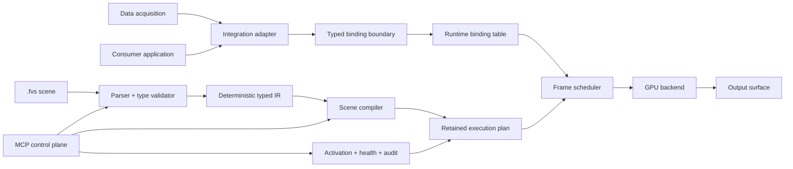

# Fluent Vision アーキテクチャおよび Fluent Scene 仕様

[English](fluent_vision_architecture.md)

## 1. 目的とステータス

本文書は、Fluent Vision と Fluent Scene（`.fvs`）形式について、プロジェクトに
依存しない目標アーキテクチャを定義する。アーキテクチャ決定記録であると同時に実装仕様でも
ある。記載した全コンポーネントがすでに存在するという意味ではない。

本文書では、次のラベルを規範的に用いる。

| ラベル | 意味 |
|---|---|
| **決定** | 確定したプロダクト方針。実装はこれを維持しなければならない。 |
| **現状の事実** | 執筆時点の本リポジトリで確認した事実。 |
| **推奨** | 実装または計測による確認を待つ設計案。 |
| **未決定事項** | 互換性を約束する前に、根拠をもって解決すべき選択肢。 |

**しなければならない**、**してはならない**、**することが望ましい**、**してよい**は、
通常の規範的な意味で用いる。推奨は採用後に拘束力を持つが、以下のプロダクト決定はすでに
拘束力を持つ。

## 2. 確定したプロダクト決定

1. **決定 — 再利用可能なコア。** Fluent Vision は、フレームワーク非依存の保持型 GPU
   ビジュアルランタイムである。コアは ROS 2 や学習フレームワークに依存してはならない。
2. **決定 — 境界に置くアダプター。** ロボティクス、学習フレームワーク、
   physical-AI、利用アプリケーションとの統合はアダプターである。アダプターは転送方式と
   データ型を変換してよいが、シーンの意味論や描画を所有してはならない。
3. **決定 — 取得処理の分離。** カメラとセンサーの取得、デコード、同期、転送は
   レンダラーの外部に置き、型付きランタイムバインディングへデータを供給する。
4. **決定 — 保持型実行。** GPU リソースと実行プランはフレーム間で保持する。
   構造編集時に検証・コンパイルし、通常フレームではテクスチャ、バッファ、小さな
   パラメータブロックを更新する。シェーダーの再コンパイルをフレームごとに行ってはならない。
5. **決定 — 宣言的シーン言語。** Fluent Scene は YAML 風の宣言的な型付き
   ビジュアルデータフロー形式である。汎用スクリプト言語、マクロ機構、コマンド列、GPU
   アセンブリではない。
6. **決定 — 有界な動作。** ランタイム割り当て、分岐、反復、フィードバック、動的ノード数は
   静的に上限を持ち、過負荷時の動作は決定的でなければならない。
7. **決定 — 安全なライフサイクル。** シーン変更は、情報取得、型付きパッチ、検証、
   コンパイル、隔離プレビュー、フレーム境界での原子的有効化、健全性観測、監査、
   ロールバックの順に進める。
8. **決定 — 低遅延ビジュアル領域。** 取得処理を描画ループへ持ち込むことなく、
   カメラ映像、動的な日本語テキストと UI、2D グラフィックス、点群、3D モデル、
   エフェクトと影、型付き外部データを扱う。

## 3. リポジトリで確認した現状の事実

以下は目標ランタイムではなく、現在のチェックアウトについての観察である。

- **現状の事実。** リポジトリは主として ROS 2 ビジョンスタックであり、センサー、AI、
  共通、ストリーミング、システム、UI、ユーティリティの各パッケージに分かれている。
- **現状の事実。** 現在の `pipelines/*.yaml` は ROS 2 のプロセス／パッケージ起動構成を
  表す。本書で定義する Fluent Scene 形式ではない。
- **現状の事実。** `fv_pipeline_editor` は `config/node_manifest.yaml` を読み、
  ブラウザー上の編集とプレビュー転送、パイプライン YAML の保存、プロセス起動を行う。
- **現状の事実。** 現在のマニフェストは image、depth、camera information、point cloud、
  detections、audio、`any` などの小さなポート語彙を記述する。
- **現状の事実。** 現在の `fluent_lib` は ROS 2 および画像・点群依存をリンクしており、
  本書でいうフレームワーク非依存ビジュアルコアにはまだなっていない。
- **現状の事実。** リポジトリには CPU 画像オーバーレイ、利用可能な場合の日本語フォント
  対応、点群転送、プレビュー／ストリーミング、型付き ROS 2 メッセージが存在する。
  これらは統合の根拠であり、保持型 GPU シーンランタイムが存在する証明ではない。
- **現状の事実。** このチェックアウトには `.fvs` パーサー、Fluent Scene 型付き IR、
  保持型レンダラー、Vulkan 実装は存在しない。
- **現状の事実。** 既存パイプラインファイルには Fluent Scene のスキーマ宣言や互換性契約が
  ないため、暗黙に `.fvs` として解釈してはならない。

したがってアーキテクチャ移行は追加型とし、現在のパイプラインとアダプターを保ったまま、
個別にテストできる ROS 非依存コアを導入しなければならない。

## 4. 目標と非目標

### 4.1 目標

- 異種の 2D／3D ビジュアルデータを予測可能な遅延で描画する。
- シーン構造を検査、版管理、型検査、安全な変更の対象にする。
- GPU リソースとコンパイル済み処理をフレーム間で再利用する。
- 転送、ミドルウェア、取得、学習ランタイムを交換可能に保つ。
- frame、timestamp、clock、calibration、depth、coordinate、synchronization の
  意味を端から端まで維持する。
- 実行可能な診断と決定的なフォールバックを提供する。
- 1 つのシーンを、利用アプリケーション、ロボティクスアダプター、physical-AI 統合、
  学習フレームワークアダプターのいずれからも埋め込めるようにする。

### 4.2 非目標

- 汎用計算、シェル実行、オーケストレーション。
- `.fvs` 内に埋め込むパッケージ管理機構やネイティブプラグインローダー。
- 描画ノード内でのデバイス取得やネットワーク購読。
- シーンが生成する実体、ループ、再帰、メモリ増加を無制限にすること。
- 座標フレーム、クロックドメイン、キャリブレーションモデル間の暗黙変換。
- 現在の ROS 2 パイプライン YAML との自動互換。

## 5. システムアーキテクチャ



アーキテクチャは次の 3 プレーンで構成する。

| プレーン | 責務 | 明示的に含めないもの |
|---|---|---|
| データプレーン | 型付き値とメタデータをランタイムバインディングで渡す。 | シーン編集、シェーダーソース、ライフサイクル権限。 |
| 描画プレーン | IR 検証、リソース保持、処理スケジュール、出力生成。 | センサー所有、ミドルウェア購読、学習推論ポリシー。 |
| 制御プレーン | 検査、パッチ、プレビュー、有効化、監視、監査、ロールバック。 | 稼働中 GPU 状態の直接変更、範囲外のネイティブ実行。 |

### 5.1 コンポーネント境界

| コンポーネント | 所有するもの | 所有してはならないもの |
|---|---|---|
| Acquisition | デバイス、キャプチャ、デコード、ソース時刻。 | シーングラフ、GPU 描画プラン。 |
| Integration adapter | 転送購読、変換、バインディング、バックプレッシャー。 | `.fvs` 解釈、ビジュアルポリシー。 |
| Parser and validator | 構文、スキーマ、型検査、有界性、診断。 | GPU ハンドル、転送接続。 |
| Scene compiler | 型付き IR の低位化、リソース計画、パスグラフ、パイプライン変種。 | 稼働シーンの有効化。 |
| Runtime | バインディングスナップショット、スケジュール、保持リソース、出力。 | 外部転送の探索。 |
| GPU backend | バックエンドオブジェクト、同期、コマンド投入、表示。 | ミドルウェア固有型。 |
| MCP control plane | スコープ付きライフサイクル操作と監査記録。 | 検証やフレーム境界有効化の迂回。 |

依存方向は内向きとする。アダプターは安定したコアインターフェースに依存し、コアは
アダプターを import しない。バックエンド固有コードはコンパイラーとランタイムの下にある
狭い GPU インターフェースを実装する。

## 6. 型付きデータとバインディング契約

### 6.1 名前付き型付き入力

すべての外部値は、シーンが宣言する名前付き入力から入る。宣言には次を含める。

- 安定した入力名と値の型。
- 必須／任意とフォールバックポリシー。
- 更新モード（`per_frame`、`on_change`、`static`）。
- 鮮度とキューの上限。
- 必須メタデータと同期グループ。
- 任意の形状、範囲、色空間、容量制約。

バインディングは YAML 置換ではなくランタイムオブジェクトである。1 つの外部ソースを
1 つの宣言入力へ対応付け、契約を検証し、明示された変換器だけで変換し、不変の
スナップショットをフレームスケジューラーへ公開する。

### 6.2 コア型ファミリー

| ファミリー | 代表型 | 必須制約 |
|---|---|---|
| Scalar | `bool`, `i32`, `u32`, `f32`, `string` | 必要に応じて範囲、単位、符号化。 |
| Math | `vec2f`, `vec3f`, `vec4f`, `mat3f`, `mat4f`, `quatf`, `transform3d` | 座標フレームと単位。 |
| Image | `image.r8`, `image.rgba8`, `image.rgba16f`, `image.depth32f` | サイズ、色空間、画素原点、stride/import 規則。 |
| Geometry | `points2d`, `polyline2d`, `boxes2d`, `mesh3d`, `pointcloud3d` | 最大数、座標フレーム、トポロジー。 |
| Visual | `material`, `font`, `texture`, `camera3d`, `light`, `layer` | アセット識別と互換性。 |
| Structured | 利用者定義 `struct`、有界 `sequence<T, N>`、`optional<T>` | 閉じたフィールド、明示容量、循環値型の禁止。 |
| Metadata | `frame_meta`, `calibration`, `sync_state`, `diagnostic_set` | スキーマ版と来歴。 |

`any` は Fluent Scene エッジの有効な型ではない。アダプター探索は未知の外部型を報告して
よいが、バインド前に宣言済み型へ変換しなければならない。

### 6.3 必須メタデータの意味論

| メタデータ | 契約 |
|---|---|
| `frame` | 座標フレーム識別子。変換には明示的な型付き transform が必要。 |
| `timestamp` | ソースイベント時刻、宣言された単位、clock domain。0 を「不明」と扱わない。 |
| `clock` | 安定した clock domain 識別子と単調性契約。異なる clock 間の変換は明示する。 |
| `calibration` | 識別子と有効期間を持つ版付き内外部モデル。 |
| `depth` | 単位、無効値表現、範囲、位置合わせ先、calibration 参照。 |
| `coordinate` | 手系、軸規約、原点、単位、画素原点規約。 |
| `synchronization` | グループ、許容差、対応付けポリシー、sequence 識別子、完全性。 |

メタデータは変換後の値にも追従する。ノードは保持、新しいレコードの派生、または診断付きの
明示破棄を行えるが、timestamp、transform、calibration を暗黙に作ってはならない。

### 6.4 ランタイムバインディング動作

スケジューラーはフレーム境界で 1 つの不変バインディングスナップショットを取得する。
同期グループ内の入力は宣言ポリシーで選ぶ。スナップショットにはソース sequence、
timestamp、変換経路、経過時間、有効性を記録する。フレーム途中の到着値は次フレームの候補になる。

バックプレッシャーは入力ごとに有界とする。ポリシーは固定容量の `latest`、`fifo`、
`matched` である。超過時はカウンターを増やし、宣言された drop 規則に従う。取得コールバックを
GPU 完了待ちでブロックしてはならない。

## 7. Fluent Scene（`.fvs`）言語

### 7.1 言語の性格

Fluent Scene は、閉じた型付きグラフを YAML 風に直列化したものである。YAML 構文は転送上の
便宜にすぎず、意味は一般的な YAML 動作ではなくスキーマが定める。alias、custom tag、
実行可能 constructor、実装依存の scalar coercion は禁止し、重複 mapping key は拒否する。

シーンは次のトップレベルセクションから成る。

| キー | 目的 |
|---|---|
| `schema` | 形式識別子と互換版。 |
| `kind` | 文書種別。`.fvs` は `Scene`。 |
| `metadata` | 安定名と実行されない説明データ。 |
| `params` | 型・制約付きシーンパラメータ。 |
| `types` | 閉じた利用者定義構造型。 |
| `inputs` | 名前付き外部入力契約。 |
| `resources` | フォント、テクスチャ、メッシュ、マテリアル、保持方針。 |
| `nodes` | 型付きグラフのインスタンスと接続。 |
| `outputs` | ランタイムが公開する名前付き生成物。 |
| `budgets` | 静的容量とランタイム上限。 |
| `fallbacks` | 名前付きで型が正しい縮退動作。 |

未知の必須フィールド、非対応 major version、重複 ID、未解決参照はエラーとする。未知の任意拡張は
名前空間付き `extensions` mapping 内に限って受理し、コア意味論を変えてはならない。

### 7.2 スキーマとバージョン

最初の識別子は `fluent.scene/v1alpha1` とする。互換性はファイル名ではなく解析した schema
識別子で判定する。`v1` より前の alpha minor revision は破壊的変更を許すため、validator は
対応識別子を正確に示す。`v1` 以降は incompatible な意味変更で major を上げ、任意フィールドの
追加は major を維持してよい。

コンパイラーは次を含む canonical typed IR を出力する。

- 解決済みの型 ID と参照。
- 正規化した数値と単位。
- topological order を持つ純粋領域。
- 明示的な control／feedback 領域。
- resource key と lifetime interval。
- capacity、budget、drop-policy annotation。
- 決定的な source span と diagnostic ID。
- YAML mapping 順序やコメントに依存しない canonical digest。

### 7.3 パラメータ、ノード、出力

パラメータは 1 つのコンパイル済みシーン版に対する型付き定数である。`runtime_mutable` の
パラメータは範囲・型検証後に小さな parameter block を更新してよいが、topology、resource shape、
shader variant、capacity を変えてはならない。これら構造変更は新しいコンパイル候補を作る。

各ノードは安定した `id`、登録済み `type`、型付き入力接続、検証済みパラメータ、任意の bounds、
宣言済み出力を持つ。接続は明示的な `$inputs`、`$params`、`$resources`、`$nodes` 参照を使い、
ランタイム提供の診断には予約済み `$runtime` 名前空間を使う。ノード登録が型 signature と lowering
動作を定義し、シーンから native code を与えることはできない。

出力はノード生成物と型に名前を付ける。output-surface binding は独立したランタイム構成とし、
転送ポリシーを埋めずに同じコンパイル済みシーンを embedded texture、offscreen image、window、
stream adapter へ向けられるようにする。

### 7.4 ノード分類

| カテゴリ | 例 | 意味論規則 |
|---|---|---|
| Input normalization | format/color conversion、resize、depth normalization | 純粋な型付き変換。metadata 派生を明示。 |
| 2D visual | image、shape、path、sprite、boxes、plot | 有界 primitive と layer 出力。 |
| Text/UI | dynamic text、glyph run、panel、layout、clipping | UTF-8、決定的代替 glyph、有界 text/glyph 数。 |
| 3D visual | point cloud、mesh、camera、light、grid | 明示 frame transform、point/instance 上限。 |
| Composition | layer stack、mask、blend、tone map | 宣言済み順序、color space、alpha 規約。 |
| Effects | blur、shadow、outline、color transform | 有界 kernel/pass と中間 extent。 |
| Synchronization | match、sample、hold、age gate | 明示 clock と stale-data 動作。 |
| Control | condition、select、state、feedback | 有界 state/delay を持つ型付きグラフ意味論。 |
| Diagnostic | marker、text summary、health overlay | 元のエラーを隠さず、権限を拡張しない。 |

### 7.5 静的展開と有界な動的動作

再利用可能な static template は検証中に展開してよい。展開は必ず停止し、安定 ID を生成し、
設定済み expanded-node limit に従う。マクロ言語ではなく、host environment を調査できない。

動的インスタンスを許すのは、registry 契約が最大数を宣言するノードだけである。シーンは capacity、
memory/command budget、selection key、overflow rule を指定する。`drop_lowest_score`、
`drop_oldest`、安定した入力順での truncation など、決定的な超過規則だけが有効である。同一 key は
文書化した安定 tie-break で処理する。

言語に無制限 loop、recursion、任意 native call、filesystem access、network access はない。
登録済みノード内部の有界 GPU loop は、worst-case iteration count と resource access がノード契約に
含まれる場合に限り許す。これはシーンレベルの control flow ではない。

条件は型付き `select` または `condition` ノードで表す。feedback は initial value、1 フレーム以上の
固定 delay、type、state size、reset rule、validity behavior を持つ明示的な `feedback` ノードで表す。
combinational graph cycle はエラーである。

## 8. 保持型 GPU ランタイム

### 8.1 コンパイルと有効化経路

構造変更は次の順で処理する。

1. source span を持つ lossless syntax representation へ解析する。
2. schema、reference、type、metadata、bounds、capability を検証する。
3. static template を展開し canonical typed IR を生成する。
4. IR を backend-neutral な pass/resource graph へ lower する。
5. 登録済み node/backend implementation を選び pipeline variant をコンパイルする。
6. budget 内で候補 resource を割り当て、必要な cache を warm up する。
7. 隔離 preview を描画し health gate を実行する。
8. frame boundary で候補を原子的に有効化する。

失敗しても active scene は変えない。候補 resource は有効化成功まで隔離し、実行中 GPU work の完了後に
のみ破棄する。

### 8.2 フレームごとの経路

通常フレームの処理は意図的に小さくする。

1. bound input と metadata の snapshot を取得する。
2. 変更された image/depth/geometry resource を import または upload する。
3. 小さな parameter、transform、text、instance buffer を更新する。
4. 現在の resource handle で保持 execution plan を record または再利用する。
5. GPU work を submit し、選択した output surface へ signal する。
6. timing、freshness、drop、resource diagnostic を公開する。

未変更の mesh、font atlas、texture、descriptor、render-pass structure、pipeline object は保持する。
text shaping／glyph-atlas 更新は内容または font state 変更時だけ行う。camera image、日本語 string、
detection list、transform、scalar が変わっただけで shader compilation を呼んではならない。

### 8.3 リソース識別と寿命

resource は content-addressed key または安定 logical key と version で識別する。plan は ownership、size、
format、residency、aliasing eligibility、last-use synchronization を記録する。upload には有界 staging pool を
使う。cache miss と eviction は観測可能にし、scene は compiled budget 外の allocation を要求できない。

### 8.4 スケジューリングと遅延

scheduler は scene の synchronization policy と整合する最新の完全 snapshot を優先する。CPU preparation と
GPU execution は frame 間で重ねてよいが、最大 in-flight frame 数は固定する。latency は source timestamp と
binding arrival の両方から測り、取得遅延と描画遅延を混同しない。

性能値は本文書では固定しない。対応 platform profile ごとに resolution、point/instance/glyph 数、upload
bandwidth、in-flight frame 数、compile time、activation time、percentile frame latency の計測済み budget を
公開しなければならない。

## 9. 診断、フォールバック、健全性

diagnostic は安定 code、severity、phase、source span または runtime object、人間向け message、構造化 context を
持つ。phase は `parse`、`validate`、`compile`、`preview`、`activate`、`bind`、`frame` とする。

次の動作を必須とする。

- parse/type/capability error は候補の compile または activation を止める。
- 必須入力欠落は宣言 fallback に従うか、その frame を unhealthy にする。
- stale な任意データは宣言どおり hold、hide、または型付き default を使ってよい。
- font glyph 欠落は決定的 replacement glyph を使い counter で報告する。
- 非対応 zero-copy import は明示的に有効な copy fallback を使ってよい。
- device loss は runtime を unhealthy とし、壊れた出力の表示を止め、有界な recovery だけを試す。
- budget 超過は compile 済みの決定的 drop rule を適用する。
- 最後に健全だった compile 済み scene を rollback 候補として維持する。

fallback は health state と metrics に必ず現れる。「best effort」を、transform、calibration、timestamp、
または成功していない scene 適用の捏造という意味で用いてはならない。

health は `staged`、`previewing`、`ready`、`active`、`degraded`、`unhealthy`、`rolled_back`、`retired` の
state machine とする。threshold と observation window は platform-profile input であり、計測まで未決定とする。

## 10. MCP 制御プレーンのライフサイクル

MCP はプロジェクトに依存しない scene lifecycle 操作を公開する。transport identity と scene identity は別であり、
1 つの capability の所持が別の capability を意味することはない。

| フェーズ | 操作 | 必須結果 |
|---|---|---|
| Introspect | `scene.describe`, `schema.describe`, `node_types.list` | 版付き schema、active digest、capability、limit。 |
| Patch | `scene.patch_typed` | expected base digest に対する型付き変更。raw memory を変更しない。 |
| Validate | `scene.validate` | 決定的 IR digest と完全な構造化 diagnostic。 |
| Compile | `scene.compile` | 隔離 candidate ID、resource estimate、implementation selection。 |
| Preview | `scene.preview` | live scene に副作用のない隔離 output と health report。 |
| Activate | `scene.activate` | candidate/base digest で保護した frame-boundary atomic swap。 |
| Observe | `scene.health`, `scene.metrics` | state、timing、drop、fallback、resource use。 |
| Audit | `scene.audit` | actor/tool identity、request digest、outcome、time、correlation ID。 |
| Rollback | `scene.rollback` | 適格な過去の healthy candidate の原子的有効化。 |

各 request は、scoped capability、identity、correlation ID、expected scene digest、deadline、および意味のある場合は
dry-run status を持つ。推奨 capability scope は `scene:read`、`scene:patch`、`scene:compile`、`scene:preview`、
`scene:activate`、`scene:rollback`、`health:read`、`audit:read` である。

activation authority は patch/compile authority と分離する。node registration、native plugin、filesystem asset、
external binding は別権限を必要とし、scene patch に混入させられない。すべての変更結果は idempotent、または
idempotency key を持つ。audit record は制御プレーンから見て append-only とし、秘密の binding credential を含めない。

automatic rollback を許すのは、health gate、observation window、eligible target、retry limit、authority を指定した
採用済み policy がある場合だけである。それ以外は MCP が unhealthy state を報告し、権限ある rollback を待つ。

## 11. 具体的な Fluent Scene 例

この再利用可能なシーンは、カメラ映像、任意の depth、detections、calibration、動的な日本語テキストを受け取る。
転送方式や取得ポリシーは含まない。

```yaml
schema: fluent.scene/v1alpha1
kind: Scene
metadata:
  name: camera_detection_hud
params:
  accent_color:
    type: vec4f
    default: [0.1, 0.9, 0.7, 1.0]
    runtime_mutable: true
types:
  Detection2D:
    struct:
      bbox: vec4f
      score: f32
      label: string
inputs:
  camera:
    type: image.rgba8
    required: true
    update: per_frame
    metadata:
      frame: required
      timestamp: required
      clock: required
      calibration: camera_calibration
      synchronization_group: sensor_frame
    fallback: no_frame
  depth:
    type: image.depth32f
    required: false
    update: per_frame
    metadata:
      frame: required
      timestamp: required
      clock: required
      calibration: camera_calibration
      depth: required
      synchronization_group: sensor_frame
    fallback: hide_depth
  detections:
    type: sequence<Detection2D, 128>
    required: false
    update: per_frame
    metadata:
      frame: required
      timestamp: required
      clock: required
      synchronization_group: sensor_frame
    fallback: empty_detections
  status_text:
    type: string
    required: false
    update: on_change
    constraints:
      max_utf8_bytes: 256
    fallback: default_status
  camera_calibration:
    type: calibration
    required: true
    update: on_change
    fallback: no_frame
resources:
  ui_font:
    type: font
    uri: builtin://fonts/default-cjk
    glyph_capacity: 2048
nodes:
  - id: camera_layer
    type: visual.image2d
    inputs:
      image: $inputs.camera
    params:
      fit: contain
  - id: detection_layer
    type: visual.boxes2d
    inputs:
      detections: $inputs.detections
    params:
      color: $params.accent_color
      show_label: true
    bounds:
      max_instances: 128
      overflow: drop_lowest_score
  - id: status_layer
    type: text.dynamic
    inputs:
      text: $inputs.status_text
    params:
      font: $resources.ui_font
      position: [24.0, 24.0]
      color: [1.0, 1.0, 1.0, 1.0]
      shadow: true
      default_text: "映像を待っています"
    bounds:
      max_glyphs: 128
      overflow: truncate_end
  - id: composite
    type: composite.layers
    inputs:
      layers:
        - $nodes.camera_layer.layer
        - $nodes.detection_layer.layer
        - $nodes.status_layer.layer
    params:
      color_space: srgb
outputs:
  frame:
    type: image.rgba8
    source: $nodes.composite.image
  diagnostics:
    type: diagnostic_set
    source: $runtime.diagnostics
budgets:
  max_width: 1920
  max_height: 1080
  max_gpu_bytes: 268435456
  max_upload_bytes_per_frame: 33554432
  max_frames_in_flight: 2
fallbacks:
  no_frame:
    behavior: output_unavailable
  hide_depth:
    value: null
  empty_detections:
    value: []
  default_status:
    value: "映像を待っています"
```

任意の `depth` 契約は、この版では描画に使わなくても、depth 対応拡張と metadata 検証のために置いている。
validator は情報レベルの unused-input diagnostic を報告し、公開 binding を削除しないことが望ましい。

## 12. 分離した ROS 2 バインディング例

このアダプター構成はシーンを変更せずに同じ入力をバインドする。`.fvs` の一部ではなく、コアは ROS 2 の
message type や QoS を解析しない。

```yaml
schema: fluent.binding/v1alpha1
kind: Binding
metadata:
  name: camera_detection_hud_ros2
scene:
  name: camera_detection_hud
bindings:
  camera:
    source:
      adapter: ros2
      topic: /camera/color/image_raw
      message_type: sensor_msgs/msg/Image
      qos: sensor_data
    converter: ros_image_to_rgba8
    metadata:
      timestamp: header.stamp
      frame: header.frame_id
      clock: ros_time
      calibration: camera_calibration
  depth:
    source:
      adapter: ros2
      topic: /camera/depth/image_rect
      message_type: sensor_msgs/msg/Image
      qos: sensor_data
    converter: ros_depth_to_depth32f_meters
    metadata:
      timestamp: header.stamp
      frame: header.frame_id
      clock: ros_time
      calibration: camera_calibration
      depth:
        unit: meter
        invalid: nan
        registered_to: camera
  detections:
    source:
      adapter: ros2
      topic: /perception/detections
      message_type: vision_msgs/msg/Detection2DArray
      qos: sensor_data
    converter: ros_detections_to_Detection2D
    metadata:
      timestamp: header.stamp
      frame: header.frame_id
      clock: ros_time
  status_text:
    source:
      adapter: ros2
      topic: /ui/status_text
      message_type: std_msgs/msg/String
      qos: transient_local
    converter: ros_string_to_utf8
  camera_calibration:
    source:
      adapter: ros2
      topic: /camera/color/camera_info
      message_type: sensor_msgs/msg/CameraInfo
      qos: transient_local
    converter: ros_camera_info_to_calibration
synchronization:
  sensor_frame:
    policy: approximate
    tolerance_ms: 12
    queue_capacity: 4
    overflow: drop_oldest
outputs:
  frame:
    sink:
      adapter: ros2
      topic: /visualization/composite
      message_type: sensor_msgs/msg/Image
      qos: sensor_data
    converter: rgba8_to_ros_image
```

converter がない、message type が必須 metadata を提供できない、または bind した clock/frame 契約同士に
互換性がない場合、アダプター検証は activation 前に失敗しなければならない。topic discovery は binding の
作成を補助してよいが、scene contract を変更できない。

## 13. セキュリティと決定性

パーサーが受け取るのは code ではなく data である。入力サイズ、nesting depth、expanded-node count、string length、
diagnostic count に上限を設ける。asset URI は権限を持つ asset provider が allowlist 済み scheme に従って解決し、
relative path に filesystem traversal 権限を与えない。

compiler registry は host が別権限で構築する。scene content は登録済み node type のうち capability/budget profile で
許可された variant だけを選べる。network access、environment-variable expansion、process creation、dynamic native-library
loading、任意 shader source は `.fvs` の範囲外である。

同じ対応 schema、registry version、source、static parameter、platform profile から、validation は同じ canonical IR digest と
ordered diagnostic を生成しなければならない。floating-point pixel は backend が文書化した tolerance 内で差があってよいが、
selection、truncation、activation、diagnostic ordering は決定的でなければならない。

## 14. MVP、ロードマップ、次の実行可能スライス

### 14.1 MVP 境界

MVP は広範な renderer より先に契約を証明する。

1. duplicate-key rejection と source span を持つ ROS 非依存 `.fvs` parser。
2. primitive、struct、bounded sequence、input、param、node、output、reference、bounds、budget の schema/type validator。
3. 決定的 typed IR と canonical digest。
4. golden test を持つ安定した structured diagnostic。
5. image、boxes、text、composition の宣言的 signature を持つ小さな registry。初期 lowering は IR で止めてよい。
6. ROS 2 にも GPU にも依存しない CLI/library entry point。

### 14.2 次の実行可能スライス

項目 1〜4 を 1 つの垂直スライスとして実装する。第 11 節の例を解析し、in-memory node registry で検証し、
canonical な JSON 風 typed IR と ordered diagnostics を出力する。YAML mapping 順序を変えて繰り返し、決定性を証明する。
duplicate key、unknown reference、type mismatch、graph cycle、missing bounds、capacity overflow の negative fixture を含める。
このスライスは ROS 2 なしで build/test できなければならない。

受け入れ基準は次のとおり。

- 同じ input と registry から byte-identical な canonical IR と diagnostics が得られる。
- comment と合法な mapping order の変更で digest が変わらない。
- 全 diagnostic が code、severity、phase、source span、安定 ordering を持つ。
- parser input から native execution、file/network access、unbounded work が起きない。
- library dependency graph に ROS 2 や learning-framework dependency がない。
- この bilingual specification の 2 つの YAML 例が両言語版で正常に parse できる。

### 14.3 以後のロードマップ

| 段階 | 成果物 | 完了根拠 |
|---|---|---|
| 1 | Backend-neutral resource/pass IR と lifetime planner。 | Golden plan と budget rejection test。 |
| 2 | Image、boxes、日本語 text、composite の最小 retained GPU backend。 | Per-frame compile なし、resource reuse counter、rendered fixture。 |
| 3 | Runtime binding と snapshot scheduler。 | ROS 2 なしで freshness/sync/drop/fallback test。 |
| 4 | 分離 binding schema を使う ROS 2 adapter。 | Camera/detection/text output と metadata diagnostic の end-to-end 動作。 |
| 5 | Point cloud、3D model、lighting、shadow、有界 effect。 | 計測済み capacity/latency profile。 |
| 6 | MCP lifecycle、isolated preview、activation、audit、rollback。 | Capability、atomicity、failure、recovery test。 |
| 7 | その他の consumer／learning-framework adapter。 | Core は依存なしを維持し、adapter conformance suite が通る。 |

## 15. 未決定事項と必要な根拠

| 領域 | 未決定事項 | 決定に必要な根拠 |
|---|---|---|
| OS/GPU/driver | 対応 OS、GPU family、driver/API version、portability tier。 | Build matrix、device-loss test、feature probe、計測 profile。 |
| Output surfaces | Embedded texture、offscreen image、native window、headless、stream semantics。 | Host integration prototype と synchronization contract。 |
| Vulkan acceptance | Vulkan を最初の必須 backend とするか、feature baseline をどこに置くか。 | Minimal backend spike、portability result、shader/toolchain reproducibility。 |
| Zero-copy | 対応 external-memory handle、ownership、synchronization、copy fallback。 | Platform 別 interop test と latency/correctness 計測。 |
| Budgets/health | Frame latency、compile/activate 上限、memory/upload cap、drop/health threshold。 | 宣言 scene profile の percentile 計測と overload test。 |
| Fonts/assets/signing | Font shaping/raster policy、asset package/cache、license metadata、hash、署名。 | 日本語 text corpus、missing-glyph test、tamper/cache invalidation test。 |
| Binding/shared schema | Metadata、converter、clock、calibration、coordinate schema の所有と進化。 | 独立した 2 種の adapter prototype と compatibility fixture。 |
| MCP identity/audit | Actor/tool identity、credential boundary、retention、privacy、audit export。 | Threat model、operator workflow、failure-injection review。 |
| MCP activation | Approval policy、health gate、rollback window、idempotency、concurrent edit rule。 | Race test、crash recovery、operator acceptance scenario。 |
| Plugin authority | Native node/backend/asset を登録できる主体と version trust。 | Signed registry design、allowlist policy、revocation/downgrade test。 |

解決までは、これらを隠れた実装既定値ではなく configuration/profile の問題として扱う。実装は非対応の選択を
明示的に報告しなければならない。

## 16. 適合チェックリスト

適合実装またはレビューは、該当する全項目に yes と答えられなければならない。

- コアが ROS 2 および学習フレームワークなしで build できる。
- 取得処理と adapter code が render runtime の外にある。
- `.fvs` を duplicate-key rejection 付きの有界な宣言 data として parse する。
- 全 edge、input、output、parameter、metadata に型がある。
- Frame/timestamp/clock/calibration/depth/coordinate/synchronization の意味が binding/node を通して明示される。
- 構造変更は候補を compile し、frame update は shader を再 compile しない。
- Resource と execution plan を保持し計測できる。
- Dynamic count、loop、state、upload、GPU work に静的な上限がある。
- Condition と feedback は明示的な typed graph node を使い、combinational cycle は失敗する。
- Diagnostic と fallback は構造化され、決定的で、観測できる。
- Preview は隔離され、activation は frame boundary で atomic である。
- MCP 操作は identity-bound、capability-scoped、audited、rollback-aware である。
- Binding 例は再利用可能 scene 文書から分離される。
- 未決定の platform/policy 問題を実装済み保証として示さない。
