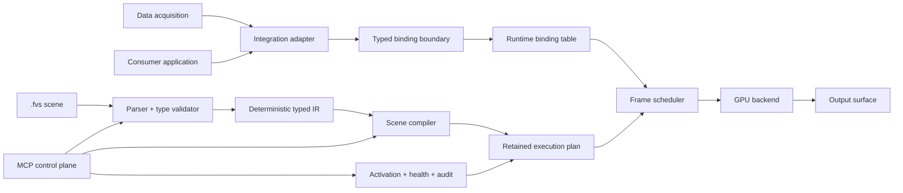

# Fluent Vision architecture and Fluent Scene specification

[日本語版](fluent_vision_architecture.ja.md)

## 1. Purpose and status

This document defines a project-neutral target architecture for Fluent Vision and the
Fluent Scene (`.fvs`) format. It is both an architectural decision record and an
implementation specification. It does not claim that every described component is
already present.

The following labels are normative throughout the document:

| Label | Meaning |
|---|---|
| **Decision** | Confirmed product direction; implementations must preserve it. |
| **Current fact** | Verified in this repository at the time of writing. |
| **Recommendation** | Proposed design awaiting implementation or measurement. |
| **Open decision** | A choice that must be resolved with evidence before compatibility is promised. |

Requirements using **must**, **must not**, **should**, and **may** have their usual
normative meanings. A recommendation becomes binding only after acceptance; the
confirmed product decisions below are already binding.

## 2. Confirmed product decisions

1. **Decision — reusable core.** Fluent Vision is a framework-neutral, retained GPU
   visual runtime. The core must not depend on ROS 2 or any learning framework.
2. **Decision — adapters at the boundary.** Robotics, learning-framework,
   physical-AI, and consumer-application integrations are adapters. An adapter may
   translate transport and data types, but must not own scene semantics or rendering.
3. **Decision — acquisition is separate.** Camera and sensor acquisition, decoding,
   synchronization, and transport are outside the renderer. They feed typed runtime
   bindings.
4. **Decision — retained execution.** GPU resources and an execution plan persist
   across frames. Structural edits validate and compile; normal frames update
   textures, buffers, and small parameter blocks. Shader recompilation must never be
   a per-frame operation.
5. **Decision — declarative scene language.** Fluent Scene is a YAML-like,
   declarative, typed visual dataflow format. It is not a general script language,
   macro system, command stream, or GPU assembly language.
6. **Decision — bounded behavior.** Runtime allocation, fan-out, iteration, feedback,
   and dynamic node counts are statically bounded. Overload behavior is deterministic.
7. **Decision — safe lifecycle.** Scene changes follow introspection, typed patching,
   validation, compilation, isolated preview, frame-boundary atomic activation,
   health observation, audit, and rollback.
8. **Decision — low-latency visual scope.** The runtime covers camera imagery,
   dynamic Japanese text and UI, 2D graphics, point clouds, 3D models,
   effects/shadows, and typed external data without forcing acquisition into the
   render loop.

## 3. Repository-verified current facts

These observations describe the current checkout, not the target runtime:

- **Current fact.** The repository is primarily a ROS 2 vision stack organized into
  sensor, AI, common, streaming, system, UI, and utility packages.
- **Current fact.** `pipelines/*.yaml` currently describes ROS 2 process/package
  launch configuration. It is not the Fluent Scene format defined here.
- **Current fact.** `fv_pipeline_editor` loads `config/node_manifest.yaml`, provides a
  browser editor and preview transport, saves pipeline YAML, and launches processes.
- **Current fact.** Current manifests describe a small port vocabulary including
  image, depth, camera information, point cloud, detections, audio, and `any`.
- **Current fact.** `fluent_lib` currently links ROS 2 and image/point-cloud
  dependencies; it is not yet the framework-neutral visual core described here.
- **Current fact.** The repository contains CPU image overlays, Japanese font support
  where available, point-cloud transport, preview/streaming, and typed ROS 2
  messages. These are useful integration evidence, not proof of a retained GPU scene
  runtime.
- **Current fact.** No `.fvs` parser, Fluent Scene typed IR, retained renderer, or
  Vulkan implementation is present in this checkout.
- **Current fact.** Existing pipeline files have no declared Fluent Scene schema or
  compatibility contract. They must not be silently reinterpreted as `.fvs`.

The architectural migration must therefore be additive: preserve current pipelines
and adapters while introducing a separately testable ROS-free core.

## 4. Goals and non-goals

### 4.1 Goals

- Render heterogeneous 2D and 3D visual data at predictable latency.
- Make scene structure inspectable, versionable, type-checkable, and safely mutable.
- Reuse GPU resources and compiled work across frames.
- Keep transport, middleware, acquisition, and learning runtimes replaceable.
- Preserve frame, timestamp, clock, calibration, depth, coordinate, and
  synchronization meaning end to end.
- Provide actionable diagnostics and deterministic fallbacks.
- Allow one scene to be embedded by a consumer application, a robotics adapter, a
  physical-AI integration, or a learning-framework adapter.

### 4.2 Non-goals

- General-purpose computation, shell execution, or orchestration.
- A package manager or native plugin loader embedded in `.fvs`.
- Device acquisition or network subscription inside render nodes.
- Unbounded scene-generated entities, loops, recursion, or memory growth.
- Implicit conversion between coordinate frames, clock domains, or calibration
  models.
- Automatic compatibility with the current ROS 2 pipeline YAML format.

## 5. System architecture



The architecture has three planes:

| Plane | Responsibility | Explicit exclusions |
|---|---|---|
| Data plane | Deliver typed values and metadata through runtime bindings. | Scene edits, shader source, lifecycle authority. |
| Render plane | Validate IR, retain resources, schedule work, and produce outputs. | Sensor ownership, middleware subscriptions, learning inference policy. |
| Control plane | Inspect, patch, preview, activate, monitor, audit, and roll back scenes. | Direct mutation of live GPU state or unscoped native execution. |

### 5.1 Component boundaries

| Component | Owns | Must not own |
|---|---|---|
| Acquisition | Devices, capture, decode, source timestamps. | Scene graph or GPU render plan. |
| Integration adapter | Transport subscription, conversion, binding, backpressure. | `.fvs` interpretation or visual policy. |
| Parser and validator | Syntax, schema, type checking, boundedness, diagnostics. | GPU handles or transport connections. |
| Scene compiler | Typed IR lowering, resource plan, pass graph, pipeline variants. | Live scene activation. |
| Runtime | Binding snapshots, scheduling, retained resources, output production. | External transport discovery. |
| GPU backend | Backend objects, synchronization, command submission, presentation. | Middleware-specific types. |
| MCP control plane | Scoped lifecycle operations and audit records. | Bypassing validation or frame-boundary activation. |

Dependencies point inward: adapters depend on stable core interfaces; the core never
imports an adapter. Backend-specific code implements a narrow GPU interface beneath
the compiler and runtime.

## 6. Typed data and binding contract

### 6.1 Named typed inputs

Every external value enters through a named input declared by the scene. A declaration
contains:

- a stable input name and value type;
- required/optional status and a fallback policy;
- update mode (`per_frame`, `on_change`, or `static`);
- freshness and queue limits;
- required metadata and synchronization group;
- optional shape, range, color-space, and capacity constraints.

Bindings are runtime objects, not YAML substitutions. A binding maps one external
source to one declared input, verifies the contract, converts only through an
explicit converter, and publishes immutable snapshots to the frame scheduler.

### 6.2 Core type families

| Family | Representative types | Required constraints |
|---|---|---|
| Scalar | `bool`, `i32`, `u32`, `f32`, `string` | Range, unit, encoding where applicable. |
| Math | `vec2f`, `vec3f`, `vec4f`, `mat3f`, `mat4f`, `quatf`, `transform3d` | Coordinate frame and unit. |
| Image | `image.r8`, `image.rgba8`, `image.rgba16f`, `image.depth32f` | Extent, color space, pixel origin, stride/import rules. |
| Geometry | `points2d`, `polyline2d`, `boxes2d`, `mesh3d`, `pointcloud3d` | Maximum count, coordinate frame, topology. |
| Visual | `material`, `font`, `texture`, `camera3d`, `light`, `layer` | Asset identity and compatibility. |
| Structured | user-declared `struct`, bounded `sequence<T, N>`, `optional<T>` | Closed fields, explicit capacity, no cyclic value types. |
| Metadata | `frame_meta`, `calibration`, `sync_state`, `diagnostic_set` | Schema version and provenance. |

`any` is not a valid Fluent Scene edge type. Adapter discovery may report an unknown
external type, but it must be converted to a declared type before binding.

### 6.3 Mandatory metadata semantics

| Metadata | Contract |
|---|---|
| `frame` | Coordinate-frame identifier; transformations require an explicit typed transform. |
| `timestamp` | Source event time plus declared unit and clock domain. Zero is data, never “unknown.” |
| `clock` | Stable clock-domain identifier and monotonicity contract. Cross-clock conversion is explicit. |
| `calibration` | Versioned intrinsic/extrinsic model with identity and validity interval. |
| `depth` | Unit, invalid-value representation, range, registration target, and calibration reference. |
| `coordinate` | Handedness, axis convention, origin, unit, and pixel-origin convention. |
| `synchronization` | Group, tolerance, matching policy, sequence identity, and completeness. |

Metadata follows the value through conversion. A node may preserve it, derive a new
record, or explicitly discard a field with a diagnostic; it may not silently invent
timestamps, transforms, or calibration.

### 6.4 Runtime binding behavior

At a frame boundary, the scheduler acquires one immutable binding snapshot. Inputs
within a synchronization group are selected by the declared policy. The snapshot
records source sequence, timestamp, conversion path, age, and validity. Mid-frame
arrivals are considered for the next frame.

Backpressure is bounded per input. Policies are `latest`, `fifo`, or `matched`, each
with a fixed capacity. Overflow produces a counter and follows the declared drop rule.
Blocking an acquisition callback on GPU completion is forbidden.

## 7. Fluent Scene (`.fvs`) language

### 7.1 Language character

Fluent Scene is a YAML-like serialization of a closed, typed graph. YAML syntax is a
transport convenience; the schema, not generic YAML behavior, defines meaning.
Aliases, custom tags, executable constructors, and implementation-dependent scalar
coercions are forbidden. Parsers must reject duplicate mapping keys.

A scene contains these top-level sections:

| Key | Purpose |
|---|---|
| `schema` | Format identity and compatibility version. |
| `kind` | Document kind; `Scene` for `.fvs`. |
| `metadata` | Stable name and non-executable descriptive data. |
| `params` | Typed, constrained scene parameters. |
| `types` | Closed user-defined structured types. |
| `inputs` | Named external input contracts. |
| `resources` | Fonts, textures, meshes, materials, and declared residency policy. |
| `nodes` | Typed graph instances and their connections. |
| `outputs` | Named products exposed by the runtime. |
| `budgets` | Static capacities and runtime limits. |
| `fallbacks` | Named, type-correct degraded behavior. |

Unknown required fields, unsupported major versions, duplicate IDs, and unresolved
references are errors. Unknown optional extensions are accepted only inside a
namespaced `extensions` mapping and must not alter core semantics.

### 7.2 Schema and versioning

The initial identity is `fluent.scene/v1alpha1`. Compatibility is based on parsed
schema identity, not filename. Before `v1`, minor alpha revisions may be breaking;
the validator must name the exact supported identities. After `v1`, a major version
changes incompatible meaning, while additive optional fields may retain the major
version.

The compiler emits a canonical typed IR with:

- resolved type IDs and references;
- normalized numeric values and units;
- topologically ordered pure regions;
- explicit control and feedback regions;
- resource keys and lifetime intervals;
- capacity, budget, and drop-policy annotations;
- deterministic source spans and diagnostic IDs;
- a canonical digest independent of YAML mapping order and comments.

### 7.3 Parameters, nodes, and outputs

Parameters are typed constants for one compiled scene version. A parameter marked
`runtime_mutable` may update a small parameter block after range/type validation; it
must not change topology, resource shape, shader variant, or capacity. Such structural
changes create a new compiled candidate.

Every node has a stable `id`, registered `type`, typed input connections, validated
parameters, optional bounds, and declared outputs. Connections use explicit
`$inputs`, `$params`, `$resources`, and `$nodes` references; runtime-provided
diagnostics use the reserved `$runtime` namespace. Node registration defines type
signatures and lowering behavior; a scene cannot provide native code.

Outputs name a node product and its type. Output-surface bindings are separate runtime
configuration so one compiled scene can target an embedded texture, offscreen image,
window, or stream adapter without embedding transport policy.

### 7.4 Node taxonomy

| Category | Examples | Semantic rule |
|---|---|---|
| Input normalization | format/color conversion, resize, depth normalization | Pure, typed conversion; metadata derivation explicit. |
| 2D visual | image, shape, path, sprite, boxes, plot | Bounded primitives and layer output. |
| Text/UI | dynamic text, glyph run, panel, layout, clipping | UTF-8, deterministic fallback glyphs, bounded text/glyph count. |
| 3D visual | point cloud, mesh, camera, light, grid | Explicit frame transforms, point/instance limits. |
| Composition | layer stack, mask, blend, tone map | Declared ordering, color space, and alpha convention. |
| Effects | blur, shadow, outline, color transform | Bounded kernels/passes and intermediate extent. |
| Synchronization | match, sample, hold, age gate | Explicit clock and stale-data behavior. |
| Control | condition, select, state, feedback | Typed graph semantics with bounded state and delay. |
| Diagnostic | marker, text summary, health overlay | Cannot suppress underlying errors or expand authority. |

### 7.5 Static expansion and bounded dynamics

Reusable static templates may expand during validation. Expansion must terminate,
produce stable IDs, and respect a configured expanded-node limit. It is not a macro
language and cannot inspect the host environment.

Dynamic instances are allowed only for nodes whose registry contract declares a
maximum count. The scene must specify capacity, memory/command budget, selection key,
and overflow rule. Valid overflow rules are deterministic, such as
`drop_lowest_score`, `drop_oldest`, or stable input-order truncation. Equal keys use a
documented stable tie-break.

The language has no unbounded loops, recursion, arbitrary native calls, filesystem
access, or network access. Bounded internal GPU loops are allowed inside a registered
node when their worst-case iteration count and resource access are part of the node
contract. They are not scene-level control flow.

Conditions use a typed `select` or `condition` node. Feedback uses an explicit
`feedback` node with an initial value, fixed delay of at least one frame, type, state
size, reset rule, and validity behavior. Combinational graph cycles are errors.

## 8. Retained GPU runtime

### 8.1 Compile and activation path

Structural change follows this sequence:

1. Parse source into a lossless syntax representation with source spans.
2. Validate schema, references, types, metadata, bounds, and capabilities.
3. Expand static templates and emit canonical typed IR.
4. Lower IR into a backend-neutral pass/resource graph.
5. Select registered node/backend implementations and compile pipeline variants.
6. Allocate candidate resources within budgets and warm required caches.
7. Render an isolated preview and run health gates.
8. Atomically activate the candidate at a frame boundary.

Failure leaves the active scene untouched. Candidate resources are isolated until
activation succeeds and retired only after in-flight GPU work completes.

### 8.2 Per-frame path

Normal frame execution is deliberately small:

1. Snapshot bound inputs and metadata.
2. Import or upload changed image/depth/geometry resources.
3. Update small parameter, transform, text, and instance buffers.
4. Record or reuse the retained execution plan with current resource handles.
5. Submit GPU work and signal the selected output surface.
6. Publish timing, freshness, drop, and resource diagnostics.

Unchanged meshes, font atlases, textures, descriptors, render-pass structure, and
pipeline objects remain retained. Text shaping/glyph-atlas updates occur only when
content or font state changes. No frame may invoke shader compilation because a
camera image, Japanese string, detection list, transform, or scalar changed.

### 8.3 Resource identity and lifetime

Resources use content-addressed or stable logical keys plus version. The plan records
ownership, size, format, residency, aliasing eligibility, and last-use synchronization.
Uploads use bounded staging pools. Cache misses and eviction are observable. A scene
cannot request an allocation outside its compiled budget.

### 8.4 Scheduling and latency

The scheduler prioritizes the newest complete snapshot consistent with the scene's
synchronization policy. CPU preparation and GPU execution may overlap across frames,
but the configured maximum frames in flight is fixed. Latency is measured from source
timestamp and from binding arrival, so acquisition delay is not confused with render
delay.

Performance numbers are not fixed by this specification. Each supported platform
profile must publish measured budgets for resolution, point/instance/glyph counts,
upload bandwidth, frames in flight, compile time, activation time, and percentile
frame latency.

## 9. Diagnostics, fallback, and health

Diagnostics have stable codes, severity, phase, source span or runtime object, human
message, and structured context. Phases are `parse`, `validate`, `compile`, `preview`,
`activate`, `bind`, and `frame`.

Required behavior includes:

- parse/type/capability errors prevent candidate compilation or activation;
- missing required input follows its declared fallback or makes the frame unhealthy;
- stale optional data may hold, hide, or use a typed default as declared;
- missing font glyph uses a deterministic replacement glyph and reports a counter;
- unsupported zero-copy import may use an explicitly enabled copy fallback;
- device loss marks the runtime unhealthy, stops presenting corrupt output, and
  attempts only bounded recovery;
- budget overflow applies the compiled deterministic drop rule;
- the last known healthy compiled scene remains eligible for rollback.

Fallbacks must be visible in health state and metrics. “Best effort” must never mean
inventing a transform, calibration, timestamp, or successfully applied scene.

Health is a state machine: `staged`, `previewing`, `ready`, `active`, `degraded`,
`unhealthy`, `rolled_back`, or `retired`. Thresholds and observation windows are
platform-profile inputs and remain open until measured.

## 10. MCP control-plane lifecycle

MCP exposes project-neutral scene lifecycle operations. Transport identity is not
scene identity, and possession of one capability does not imply another.

| Phase | Operation | Required result |
|---|---|---|
| Introspect | `scene.describe`, `schema.describe`, `node_types.list` | Versioned schemas, active digest, capabilities, limits. |
| Patch | `scene.patch_typed` | Typed changes against an expected base digest; no raw memory mutation. |
| Validate | `scene.validate` | Deterministic IR digest and complete structured diagnostics. |
| Compile | `scene.compile` | Isolated candidate ID, resource estimate, implementation selections. |
| Preview | `scene.preview` | Isolated output and health report with no live-scene side effects. |
| Activate | `scene.activate` | Frame-boundary atomic swap guarded by candidate and base digest. |
| Observe | `scene.health`, `scene.metrics` | Current state, timings, drops, fallbacks, and resource use. |
| Audit | `scene.audit` | Actor/tool identity, request digest, outcome, time, and correlation ID. |
| Rollback | `scene.rollback` | Atomic activation of an eligible prior healthy candidate. |

Each request carries scoped capabilities, identity, correlation ID, expected scene
digest, deadline, and dry-run status where meaningful. Recommended capability scopes
are `scene:read`, `scene:patch`, `scene:compile`, `scene:preview`, `scene:activate`,
`scene:rollback`, `health:read`, and `audit:read`.

Activation authority is separate from patch/compile authority. Node registrations,
native plugins, filesystem assets, and external bindings require distinct authority;
they cannot be smuggled through a scene patch. Every mutating result is idempotent or
has an idempotency key. Audit records are append-only from the control-plane point of
view and never contain secret binding credentials.

Automatic rollback may occur only under an accepted policy specifying health gates,
observation window, eligible target, retry limit, and authority. Otherwise MCP reports
the unhealthy state and awaits an authorized rollback.

## 11. Concrete Fluent Scene example

This reusable scene accepts camera imagery, optional depth, detections, calibration,
and dynamic Japanese text. It has no transport or acquisition policy.

```yaml
schema: fluent.scene/v1alpha1
kind: Scene
metadata:
  name: camera_detection_hud
params:
  accent_color:
    type: vec4f
    default: [0.1, 0.9, 0.7, 1.0]
    runtime_mutable: true
types:
  Detection2D:
    struct:
      bbox: vec4f
      score: f32
      label: string
inputs:
  camera:
    type: image.rgba8
    required: true
    update: per_frame
    metadata:
      frame: required
      timestamp: required
      clock: required
      calibration: camera_calibration
      synchronization_group: sensor_frame
    fallback: no_frame
  depth:
    type: image.depth32f
    required: false
    update: per_frame
    metadata:
      frame: required
      timestamp: required
      clock: required
      calibration: camera_calibration
      depth: required
      synchronization_group: sensor_frame
    fallback: hide_depth
  detections:
    type: sequence<Detection2D, 128>
    required: false
    update: per_frame
    metadata:
      frame: required
      timestamp: required
      clock: required
      synchronization_group: sensor_frame
    fallback: empty_detections
  status_text:
    type: string
    required: false
    update: on_change
    constraints:
      max_utf8_bytes: 256
    fallback: default_status
  camera_calibration:
    type: calibration
    required: true
    update: on_change
    fallback: no_frame
resources:
  ui_font:
    type: font
    uri: builtin://fonts/default-cjk
    glyph_capacity: 2048
nodes:
  - id: camera_layer
    type: visual.image2d
    inputs:
      image: $inputs.camera
    params:
      fit: contain
  - id: detection_layer
    type: visual.boxes2d
    inputs:
      detections: $inputs.detections
    params:
      color: $params.accent_color
      show_label: true
    bounds:
      max_instances: 128
      overflow: drop_lowest_score
  - id: status_layer
    type: text.dynamic
    inputs:
      text: $inputs.status_text
    params:
      font: $resources.ui_font
      position: [24.0, 24.0]
      color: [1.0, 1.0, 1.0, 1.0]
      shadow: true
      default_text: "映像を待っています"
    bounds:
      max_glyphs: 128
      overflow: truncate_end
  - id: composite
    type: composite.layers
    inputs:
      layers:
        - $nodes.camera_layer.layer
        - $nodes.detection_layer.layer
        - $nodes.status_layer.layer
    params:
      color_space: srgb
outputs:
  frame:
    type: image.rgba8
    source: $nodes.composite.image
  diagnostics:
    type: diagnostic_set
    source: $runtime.diagnostics
budgets:
  max_width: 1920
  max_height: 1080
  max_gpu_bytes: 268435456
  max_upload_bytes_per_frame: 33554432
  max_frames_in_flight: 2
fallbacks:
  no_frame:
    behavior: output_unavailable
  hide_depth:
    value: null
  empty_detections:
    value: []
  default_status:
    value: "映像を待っています"
```

The optional `depth` contract is present for depth-aware extensions and metadata
validation even though this scene version does not render it. A validator should
report an informational unused-input diagnostic, not remove the public binding.

## 12. Separate ROS 2 binding example

This adapter configuration binds the same scene without changing it. It is not part
of `.fvs`, and the core does not parse ROS 2 message types or QoS.

```yaml
schema: fluent.binding/v1alpha1
kind: Binding
metadata:
  name: camera_detection_hud_ros2
scene:
  name: camera_detection_hud
bindings:
  camera:
    source:
      adapter: ros2
      topic: /camera/color/image_raw
      message_type: sensor_msgs/msg/Image
      qos: sensor_data
    converter: ros_image_to_rgba8
    metadata:
      timestamp: header.stamp
      frame: header.frame_id
      clock: ros_time
      calibration: camera_calibration
  depth:
    source:
      adapter: ros2
      topic: /camera/depth/image_rect
      message_type: sensor_msgs/msg/Image
      qos: sensor_data
    converter: ros_depth_to_depth32f_meters
    metadata:
      timestamp: header.stamp
      frame: header.frame_id
      clock: ros_time
      calibration: camera_calibration
      depth:
        unit: meter
        invalid: nan
        registered_to: camera
  detections:
    source:
      adapter: ros2
      topic: /perception/detections
      message_type: vision_msgs/msg/Detection2DArray
      qos: sensor_data
    converter: ros_detections_to_Detection2D
    metadata:
      timestamp: header.stamp
      frame: header.frame_id
      clock: ros_time
  status_text:
    source:
      adapter: ros2
      topic: /ui/status_text
      message_type: std_msgs/msg/String
      qos: transient_local
    converter: ros_string_to_utf8
  camera_calibration:
    source:
      adapter: ros2
      topic: /camera/color/camera_info
      message_type: sensor_msgs/msg/CameraInfo
      qos: transient_local
    converter: ros_camera_info_to_calibration
synchronization:
  sensor_frame:
    policy: approximate
    tolerance_ms: 12
    queue_capacity: 4
    overflow: drop_oldest
outputs:
  frame:
    sink:
      adapter: ros2
      topic: /visualization/composite
      message_type: sensor_msgs/msg/Image
      qos: sensor_data
    converter: rgba8_to_ros_image
```

Adapter validation must fail before activation if a converter is absent, a message
type cannot provide required metadata, or two bound clock/frame contracts are
incompatible. Topic discovery may help author the binding but cannot modify the scene
contract.

## 13. Security and determinism

The parser accepts data, not code. It must use bounded input size, nesting depth,
expanded-node count, string length, and diagnostic count. Asset URIs are resolved by
an authorized asset provider against an allowlisted scheme; relative paths do not
grant filesystem traversal.

The compiler registry is constructed by the host under separate authority. Scene
content may select only registered node types and variants allowed by capability and
budget profiles. Network access, environment-variable expansion, process creation,
dynamic native-library loading, and arbitrary shader source are outside `.fvs`.

Given the same supported schema, registry version, source, static parameters, and
platform profile, validation must produce the same canonical IR digest and ordered
diagnostics. Floating-point pixels may vary within a backend's documented tolerance;
selection, truncation, activation, and diagnostic ordering must remain deterministic.

## 14. MVP, roadmap, and next executable slice

### 14.1 MVP boundary

The MVP proves the contracts before implementing a broad renderer:

1. ROS-free `.fvs` parser with duplicate-key rejection and source spans.
2. Schema and type validator for primitives, structs, bounded sequences, inputs,
   params, nodes, outputs, references, bounds, and budgets.
3. Deterministic typed IR and canonical digest.
4. Stable structured diagnostics with golden tests.
5. Small registry of declarative signatures for image, boxes, text, and composition;
   lowering may initially stop at IR.
6. CLI/library entry point that has no ROS 2 or GPU dependency.

### 14.2 Next executable slice

Implement items 1–4 as one vertical slice: parse the example in section 11, validate
it against an in-memory node registry, emit canonical JSON-like typed IR plus ordered
diagnostics, and prove determinism by repeating with reordered YAML mappings. Include
negative fixtures for duplicate keys, unknown references, type mismatch, graph cycle,
missing bounds, and capacity overflow. This slice must build and test without ROS 2.

Acceptance criteria:

- identical input and registry produce byte-identical canonical IR and diagnostics;
- comments and legal mapping order changes do not change the digest;
- every diagnostic has code, severity, phase, source span, and stable ordering;
- no parser input triggers native execution, file/network access, or unbounded work;
- the library dependency graph contains no ROS 2 or learning-framework dependency;
- both example YAML blocks in this bilingual specification parse successfully.

### 14.3 Roadmap after the slice

| Stage | Deliverable | Exit evidence |
|---|---|---|
| 1 | Backend-neutral resource/pass IR and lifetime planner. | Golden plans and budget rejection tests. |
| 2 | Minimal retained GPU backend for image, boxes, Japanese text, composite. | No per-frame compile; resource reuse counters; rendered fixtures. |
| 3 | Runtime bindings and snapshot scheduler. | Freshness/sync/drop/fallback tests without ROS 2. |
| 4 | ROS 2 adapter using the separate binding schema. | End-to-end camera/detection/text output and metadata diagnostics. |
| 5 | Point clouds, 3D models, lighting, shadows, and bounded effects. | Measured capacity and latency profiles. |
| 6 | MCP lifecycle, isolated preview, activation, audit, and rollback. | Capability, atomicity, failure, and recovery tests. |
| 7 | Additional consumer and learning-framework adapters. | Core remains dependency-free; adapter conformance suites pass. |

## 15. Open decisions and evidence required

| Area | Open decision | Evidence required before closure |
|---|---|---|
| OS/GPU/driver | Supported OS, GPU families, driver/API versions, and portability tier. | Build matrix, device-loss tests, feature probes, measured profiles. |
| Output surfaces | Embedded texture, offscreen image, native window, headless, and stream semantics. | Host integration prototypes and synchronization contracts. |
| Vulkan acceptance | Whether Vulkan is the first required backend and which feature baseline applies. | Minimal backend spike, portability results, shader/toolchain reproducibility. |
| Zero-copy | Supported external-memory handles, ownership, synchronization, and copy fallback. | Interop tests by platform plus latency and correctness measurements. |
| Budgets/health | Frame latency, compile/activate limits, memory/upload caps, drop and health thresholds. | Percentile measurements under declared scene profiles and overload tests. |
| Fonts/assets/signing | Font shaping/raster policy, asset packaging/cache, licensing metadata, hashes, and signing. | Japanese text corpus, missing-glyph tests, tamper and cache-invalidation tests. |
| Binding/shared schema | Ownership and evolution of metadata, converter, clock, calibration, and coordinate schemas. | Two independent adapter prototypes and compatibility fixtures. |
| MCP identity/audit | Actor/tool identity, credential boundary, retention, privacy, and audit export. | Threat model, operator workflow, and failure-injection review. |
| MCP activation | Approval policy, health gates, rollback window, idempotency, and concurrent edit rules. | Race tests, crash recovery, and operator acceptance scenarios. |
| Plugin authority | Who may register native nodes/backends/assets and how versions are trusted. | Signed registry design, allowlist policy, revocation and downgrade tests. |

Until resolved, these are configuration/profile questions, not hidden implementation
defaults. Implementations must report unsupported choices explicitly.

## 16. Conformance checklist

A conforming implementation or review must answer yes to all applicable items:

- The core builds without ROS 2 and learning frameworks.
- Acquisition and adapter code are outside the render runtime.
- `.fvs` is parsed as bounded declarative data with duplicate-key rejection.
- All edges, inputs, outputs, parameters, and metadata are typed.
- Frame/timestamp/clock/calibration/depth/coordinate/synchronization semantics remain
  explicit through bindings and nodes.
- Structural changes compile candidates; frame updates do not recompile shaders.
- Resources and execution plans are retained and measurable.
- Dynamic counts, loops, state, uploads, and GPU work have static bounds.
- Conditions and feedback use explicit typed graph nodes; combinational cycles fail.
- Diagnostics and fallbacks are structured, deterministic, and observable.
- Preview is isolated and activation is atomic at a frame boundary.
- MCP operations are identity-bound, capability-scoped, audited, and rollback-aware.
- Binding examples remain separate from reusable scene documents.
- Open platform and policy questions are not presented as implemented guarantees.
