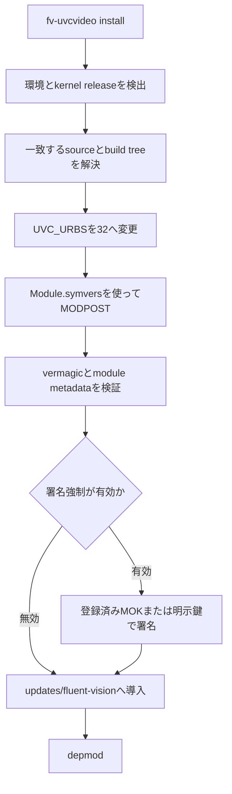
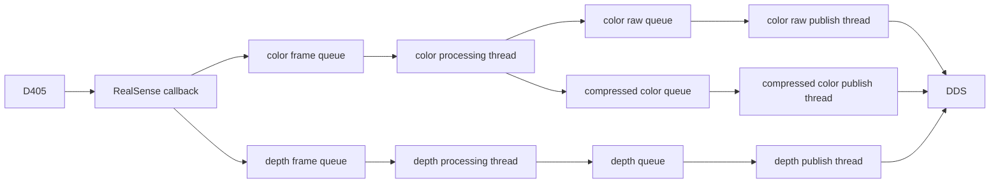

# D405ストリーム処理設計

## 対象

本文書は、`fv_realsense`がD405のcolorとdepthを同時に30 FPSで配信する構成を定義する。

安定した配信には、USB転送要求数の確保、ノード内部の処理分離、DDS送信バッファの確保が必要になる。

## UVC転送要求数

Linuxの`uvcvideo`は、カメラからのデータを受け取るUSB転送要求を複数本、先行して投入する。

同時に保持する要求数は、ドライバソースの`UVC_URBS`で決まる。

Linux標準ソースとJetson Linux R38.4のUVCソースは、`UVC_URBS`を5としている。

D405でcolorとdepthを同時に30 FPSで転送した実機では、この値でD405が付与した連続frame番号の一部がuserspaceへ届かず、欠番になった。

`fv-uvcvideo`は、実行中のカーネルと一致するソースから`UVC_URBS=32`のモジュールを対象マシン上でビルドする。



ツールは次の契約で動作する。

- **Jetson Linux R38.4**：NVIDIA公式ソースと対象releaseのprepared build treeを使用する。
- **通常のUbuntu**：実行中カーネルのUbuntuパッケージ情報から同一バージョンの`linux-headers`と`linux-source`をAPTで解決する。
- **未検証環境**：警告と`[y/N]`確認を表示し、`y`の場合だけ厳密な検証を続ける。
- **非対話実行**：`--allow-unsupported`を指定した場合だけ未検証環境で処理を開始する。
- **ビルド入力**：対象releaseの`.config`と`Module.symvers`を持つprepared build treeを使用する。
- **互換性検証**：生成モジュールのreleaseおよび完全な`vermagic`を、対象カーネルと標準モジュールに照合する。
- **既存override**：導入先に別モジュールがある場合は退避し、uninstall時に復元する。
- **署名**：署名強制時は登録済みUbuntu MOKまたは明示された鍵と証明書を使用する。
- **導入記録の先行書込**：`/var/lib/fv-uvcvideo/<release>/installed.env`をモジュール設置より先に書く。設置・`depmod`・選択確認のいずれかが失敗した場合は、退避したoverrideの復元、記録の削除、`depmod`の再実行で導入前の状態へ戻す。強制終了で記録だけが残った場合も`uninstall`で回収できる。
- **選択確認**：`depmod`後に`modinfo -k <release> -n uvcvideo`が設置先を指すことを確認する。`updates/dkms/`などの別overrideが探索順で優先される場合は成功と報告せず、巻き戻して終了する。
- **`--kernel-release`の検証**：値は`/lib/modules/<release>/`と`/var/lib/fv-uvcvideo/<release>/`へ埋め込むため、英数字で始まり`[A-Za-z0-9._+-]`のみからなる単一path componentに限定する（`..`や`/`を含む値は拒否）。
- **metadataの根拠**：`UVC_URBS`の置換後にヘッダを再読取りし、値が32であることを確認してから`MODULE_INFO(fv_uvc_urbs, "32")`を追記する。`modinfo -F fv_uvc_urbs`はビルド入力の証明になる。

通常Ubuntuでは、実行中カーネルのパッケージに対応する正確なsource versionを選び、別バージョンの`linux-source`を流用しない。

### 環境ごとのprofile

`detect_profile`が返すprofileと、その環境での動作は次のとおり。

| 環境 | profile | 動作 |
|---|---|---|
| Jetson Linux R38.4（`6.8.12-tegra*`, aarch64） | `jetson-linux-r38.4` | NVIDIA公式`public_sources.tbz2`をSHA256検証して取得し、自動でビルドする（実機検証済み） |
| Ubuntu 24.04 / 26.04の配布カーネル（`linux-generic`等、x86_64 / aarch64） | `ubuntu` | `linux-headers-<release>`と同一versionの`linux-source`をAPTで解決する |
| Ubuntuの派生カーネル（`-aws` / `-oem` / HWE等、`linux-source`のversionが一致しない） | `ubuntu` → 取得失敗 | `linux-source`のversion不一致を検出して停止する。`--kernel-source`で一致するsource treeを指定する |
| Jetson Linux R38.4以外のL4T（R38.2 / R39.x等） | `unsupported` | `[y/N]`確認（非対話では`--allow-unsupported`）の上、`--kernel-build`と`--kernel-source`で実行中kernelと一致するtreeを指定する。NVIDIA公式ソースの自動取得は行わない |
| その他（Debian等） | `unsupported` | 同上 |

`unsupported`環境でもvermagic、`Module.symvers`、kernel releaseの検証は同じ厳密さで行うため、一致するsourceを用意すれば導入できる。

ノード本体（`fv_realsense`）とDDS socket buffer設定はカーネルモジュールに依存せず、`fv-uvcvideo`を導入しない環境でも配布`uvcvideo`のまま動作する。

## ノード内部の処理

RealSense callbackは、受け取ったframeの所有権をストリーム別のqueueへ渡す。

color処理とdepth処理は別threadで実行するため、一方の画像変換が他方のframe取得を止めない。

color raw、compressed color、depthも別々の容量1 queueとpublish threadを使用する。



各publish queueは未送信frameを一つだけ保持する。

`publish()`が次のcamera tickまでに完了しない場合は、古いframeを新しいframeへ置き換え、置き換え件数をストリーム別に記録する。

各ストリームは個別のdevice timestamp状態を持つ。

この分離により、colorとdepthのcallback順序が入れ替わっても、一方のtimestampが他方の単調増加判定へ影響しない。

## DDS送信バッファ

color rawは640x480 BGR8で一枚921,600 bytesになる。

実測した8 reader構成では、CycloneDDSが一枚を約69個のUDP fragmentへ分割し、readerごとにunicastした。

`net.core.wmem_max = 212,992`の環境ではblocking `sendmsg()`が送信socketの空きを待ち、color raw `publish()`が33.3 ms周期を超えた。

ホストでは`setup_dds_send_buffer.sh`を実行して`wmem_max`を16 MiB以上にする。

CycloneDDSは`SocketSendBufferSize`で16 MiBを要求する。

`wmem_default`は変更しないため、他のprocessが作るsocketのdefault容量は増えない。

## 操作

導入と状態確認は次のコマンドで行う。

```bash
sudo "$(command -v setup_dds_receive_buffer.sh)"
sudo "$(command -v setup_dds_send_buffer.sh)"
sudo fv-uvcvideo install --reload
fv-uvcvideo status
```

DDS processはsocket buffer設定後に再起動する。

カメラプロセスがデバイスを使用中の場合、ツールはmodule reloadを実行せず、再起動が必要であることを警告する。

元の構成へ戻す場合は次のコマンドを使う。

```bash
sudo fv-uvcvideo uninstall --reload
```

## 実機検証

Jetson Linux R38.4、kernel `6.8.12-tegra-usbmon`、D405 firmware `5.17.0.10`で検証した。

colorはBGR8、depthはZ16を使用し、いずれも640x480、30 FPSで動作させた。

モジュール導入経路は、Ubuntu 24.04のarm64とx86_64についても、標準`6.8.0-138-generic`カーネルを使って検証した。

### UVC転送要求数

ノードの影響を除くため、`rs-data-collect`でD405を直接60秒動作させ、streamごとのframe番号を3回ずつ確認した。

| stream | `UVC_URBS=5` | `UVC_URBS=32` |
|---|---:|---:|
| color frame番号の欠番 | 11 / 8 / 7 frames | 0 / 0 / 0 frames |
| depth frame番号の欠番 | 12 / 9 / 8 frames | 0 / 0 / 0 frames |
| 1試行あたりの合計欠番 | 23 / 17 / 15 frames | 0 / 0 / 0 frames |
| 1試行あたりの平均欠番 | 18.3 frames | 0 frames |

`UVC_URBS=32`では、3試行ともcolorとdepthのframe番号が連続し、平均欠番は18.3 framesから0 framesへ減った。

転送要求を5本から32本へ増やすことで、host側の処理が一時的に遅れた場合も、D405から受け取るためのUSB requestを先行して確保できる。

### ノード内部の処理分離

USB側を`UVC_URBS=32`へ固定し、変更前後のノードを同じVLAbor構成で各60秒計測した。

| 計測項目 | 変更前 | 変更後 | 差 |
|---|---:|---:|---:|
| color callback | 1,799 frames | 1,799 frames | 0 frames |
| color raw publish | 1,769 frames | 1,797 frames | +28 frames |
| 計測窓内のcolor callback数 - raw publish数 | 30 frames | 2 frames | 28 frames減少 |
| depth callback | 1,799 frames | 1,799 frames | 0 frames |
| depth raw publish | 1,772 frames | 1,799 frames | +27 frames |
| 計測窓内のdepth callback数 - raw publish数 | 27 frames | 0 frames | 27 frames減少 |
| compressed color DDS受信レート | 29.956 FPS | 29.994 FPS | +0.038 FPS |

両計測とも`UVC_URBS=32`を使用し、RealSense callbackはcolorとdepthをそれぞれ1,799 frames受け取った。

変更前は、colorとdepthを1本のprocessing threadで処理し、生成したmessageを1本の容量1 `PublishBundle` queueへ入れていた。

publish threadがbundleを送り終える前にprocessing threadが次のbundleを生成すると、容量1 queue内の未送信bundleが置き換えられる。

この構成では、計測窓内のcallback数とpublish数にcolor 30 frames、depth 27 framesの差があった。

変更後は、colorとdepthのprocessing threadを分け、color raw、compressed color、depthに個別の容量1 queueとpublish threadを割り当てた。

同じ入力1,799 framesに対して、計測窓内の差はcolorが2 frames、depthが0 framesになった。

この差はqueue drop数そのものではない。

計測開始前のpending publishと計測終了時のin-flight frameが境界をまたぐためである。

変更後の同じ計測窓では、color raw publish queue counterが3件増え、compressed colorとdepthのcounterは増えなかった。

### DDS送信バッファ適用後

`wmem_max = 16 MiB`とCycloneDDSの16 MiB要求を適用し、FV recorderでD405 arm colorを3回、各60秒収録した。

| 計測項目 | Run 1 | Run 2 | Run 3 |
|---|---:|---:|---:|
| sidecar行数 | 1,801 | 1,800 | 1,800 |
| ROS timestamp実効FPS | 29.993069 FPS | 29.992501 FPS | 29.992489 FPS |
| ROS timestamp間隔最大 | 33.390381 ms | 33.351563 ms | 33.379883 ms |
| 40 ms超のtimestamp間隔 | 0件 | 0件 | 0件 |
| MP4実frame数 | 1,801 | 1,800 | 1,800 |
| recorder camera drop | 0件 | 0件 | 0件 |
| color raw publish queue drop | 0件 | 0件 | 0件 |
| compressed color publish queue drop | 0件 | 0件 | 0件 |

3回ともsidecar行数とMP4実frame数が一致した。

### compressed colorの受信レート

`ros2 topic hz`はcamera profileの設定値ではなく、DDS subscriber callbackのwall-clock到着間隔を測る。

`UVC_URBS=32`でD405を直接計測した3試行の平均は、colorのdevice timestampで29.996 FPS、host timestampで29.993 FPSだった。

ROS 2で観測した29.994 FPSはhost timestampの実測と一致し、compressed color publish queueの置き換えは0件だった。

30 FPSはcamera profileの公称値であり、有限時間の到着間隔はdevice clockとhost schedulingの微小な差を含む。

3回の直接計測ではcolor frame番号の欠番が0だったため、29.994 FPSという表示はframe欠損を意味しない。

## 検証項目

`test_fv_uvcvideo.sh`は次の契約を確認する。

- 対応環境の識別
- Ubuntu kernel packageとsource versionの対応
- kernel build releaseの読取り
- `UVC_URBS`変更の冪等性
- 複数の`UVC_URBS`定義の拒否
- 未検証環境の`y/N`確認

実機では次の順序で確認する。

1. `install`でモジュールをビルドして導入する。
2. `status`で選択モジュールと`UVC URBs: 32`を確認する。
3. D405を直接60秒間動作させ、streamのframe番号に欠番がないことを確認する。
4. USB側を`UVC_URBS=32`へ固定し、colorとdepthのcallback数とpublish数をノード変更前後で比較する。
5. `uninstall`で元のmodule selectionへ戻ることを確認する。
