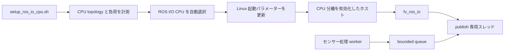
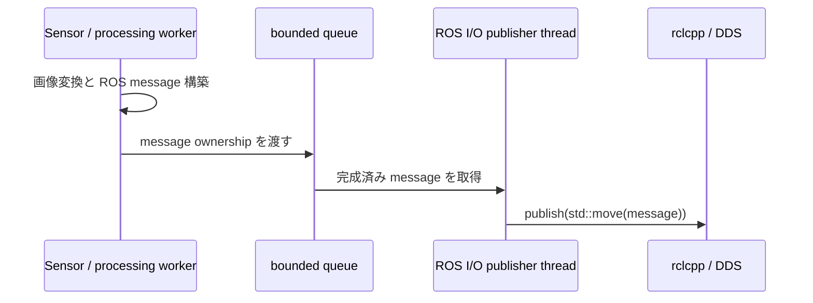
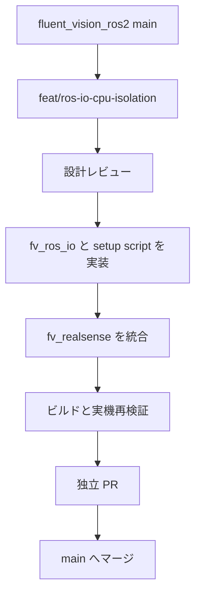

# FV ROS I/O CPU 分離設計

## 1. 文書の位置づけ

本文書は、ROS 2 の publish を安定した周期で実行するための CPU 分離機構を定義する。

設計の対象は、ホストのセットアップ、CPU 割り当ての実行時取得、C++ API、利用ノードのスレッド構成、導入順序、検証方法である。

実装は `fluent_vision_ros2` の独立パッケージ `fv_ros_io` として提供する。

設計ステータスは実装済み、AGX Thor で実機検証済みである。

## 2. 問いと決定

| 問い | 決定 |
|---|---|
| 何の実行周期を安定させるか | ROS 2 の publish を安定させる。 |
| CPU を誰が決めるか | `setup_ros_io_cpu.sh` がホストを計測して自動選択する。 |
| オペレーターは何を実行するか | `sudo setup_ros_io_cpu.sh` を実行する。 |
| CPU 割り当てをどこへ保存するか | Linux の起動パラメーターへ保存する。 |
| ノードは CPU をどう取得するか | `fv_ros_io` が `/proc/cmdline` の `fv_ros_io.cpu` を読む。 |
| スレッドをどう配置するか | publish 専用スレッド自身が `fv::ros_io::bind_current_thread()` を呼ぶ。 |
| 大容量 DDS message の受信バッファをどう確保するか | `setup_ros_io_cpu.sh` が `net.core.rmem_max` を 16 MiB に設定する。 |
| どの言語へ API を提供するか | 初版 API は C++ で提供する。 |
| 他リポジトリはどう利用するか | ROS 2 パッケージ依存として `fv_ros_io` をリンクする。 |

## 3. システム構成



ROS I/O CPU には、DDS へメッセージを渡す publish 処理を配置する。

画像変換、JPEG 圧縮、depth 変換、ROS message の構築は housekeeping CPU 上の worker で実行する。

スレッド間では、完成した ROS message の ownership を bounded queue で受け渡す。

## 4. ホストセットアップ

### 4.1 操作契約

オペレーターが実行するコマンドは次の一つである。

```bash
sudo setup_ros_io_cpu.sh
```

ワークスペースへインストールしたスクリプトを使う場合は、ワークスペースを source して得た絶対パスを `sudo` へ渡す。

```bash
source <workspace>/install/setup.bash
sudo "$(command -v setup_ros_io_cpu.sh)"
```

スクリプトは CPU の選択、起動設定の保存、DDS 受信バッファ上限の設定、設定内容の検証を一続きで実行する。

設定は次回のホスト起動から有効になる。

同じコマンドを再実行した場合は、現在の割り当てが online CPU と最大 CPU capacity の条件を満たすか検証する。

条件を満たす割り当ては再利用し、CPU 構成が変化した場合は新しい割り当てを計算する。

新しい割り当てを計算した場合は、旧 `fv_ros_io.cpu` が所有していた physical core を分離集合から外し、新しい physical core へ置き換える。

### 4.2 CPU の自動選択

スクリプトは `/sys/devices/system/cpu/online` から online CPU を取得する。

スクリプトは `/sys/devices/system/cpu/cpu*/topology/` から CPU topology を取得する。

CPU 0 は housekeeping CPU の基点として扱う。

スクリプトは最大 CPU capacity を持つ physical core を候補集合とする。

SMT を持つ physical core では sibling CPU を同じ core の構成要素として扱う。

スクリプトは候補ごとの CPU busy time と IRQ 発生数を 2 秒間計測する。

スクリプトは IRQ 発生数が少ない順、CPU busy time が短い順、CPU index が大きい順に core を選択する。

選択結果のうち一つの logical CPU を ROS I/O スレッドの実行 CPU とする。

同じ physical core の sibling CPU は分離集合へ含める。

### 4.3 Linux 起動契約

スクリプトは選択結果を次の起動パラメーターへ反映する。

```text
fv_ros_io.cpu=<ROS I/O logical CPU>
isolcpus=domain,managed_irq,<ROS I/O physical core の logical CPU 集合>
irqaffinity=<housekeeping CPU 集合>
kthread_cpus=<housekeeping CPU 集合>
```

14 CPU のホストで CPU 13 を選択した場合は、次の値になる。

```text
fv_ros_io.cpu=13
isolcpus=domain,managed_irq,13
irqaffinity=0-12
kthread_cpus=0-12
```

既存の CPU 分離設定がある場合は、FV が所有していた旧 physical core を除いた分離集合と、新しい ROS I/O physical core の和集合を `isolcpus` へ保存する。

housekeeping CPU 集合は online CPU 集合から分離集合を引いて作成する。

スクリプトはホストの bootloader を検出し、対応する起動エントリーをバックアップしてから更新する。

Jetson Linux では `/boot/extlinux/extlinux.conf` の既定エントリーを更新する。

既定エントリーの `${cbootargs}` と既存の起動引数は保持し、FV が管理する四つの引数だけを置き換える。

GRUB を使用する Linux では `/etc/default/grub` を更新し、GRUB 設定を再生成する。

### 4.4 DDS 受信バッファ

`setup_ros_io_cpu.sh` は次の設定を `/etc/sysctl.d/90-fv-ros-io.conf` へ保存する。

```text
net.core.rmem_max = 16777216
```

スクリプトは同じ値を `/proc/sys/net/core/rmem_max` へ書き込み、現在の Linux network namespace に即時反映する。

CycloneDDS は既定で 1 MiB の socket receive buffer を要求する。

Linux の上限が要求値より小さい場合、CycloneDDS は取得できた小さいバッファで起動を継続するため、大容量 message の UDP fragment が受信 socket で破棄される。

16 MiB の上限は、CycloneDDS の既定要求と複数の画像 topic を受ける participant の受信バッファ設定を許容する。

設定変更後に起動した DDS process は新しい上限で socket を作成する。

実行中の DDS process は再起動して socket を作り直す。

ホスト起動時は systemd-sysctl が保存済み設定を反映してから ROS 2 process を起動する。

### 4.5 実行時の CPU 取得

`fv_ros_io` は `/proc/cmdline` から `fv_ros_io.cpu=<N>` を取得する。

`/proc/cmdline` はホスト実行と Docker の private cgroup namespace の双方で同じホスト起動契約を公開する。

`fv_ros_io` は次の順序で割り当てを検証する。

1. `fv_ros_io.cpu` が一つの CPU index を示していることを確認する。
2. `/sys/devices/system/cpu/online` に対象 CPU が含まれることを確認する。
3. `/sys/devices/system/cpu/isolated` に対象 CPU が含まれることを確認する。
4. 現在のプロセスの cpuset に対象 CPU が含まれることを確認する。

検証済み CPU を `pthread_setaffinity_np()` へ渡し、`pthread_getaffinity_np()` で設定結果を確認する。

## 5. `fv_ros_io` パッケージ

### 5.1 配置

```text
src/system/fv_ros_io/
├── CMakeLists.txt
├── package.xml
├── include/fv_ros_io/
│   └── thread_affinity.hpp
├── src/
│   ├── cpu_contract.hpp
│   ├── cpu_contract.cpp
│   └── thread_affinity.cpp
└── test/
    ├── test_cpu_contract.cpp
    ├── test_setup_ros_io_cpu.sh
    └── test_thread_affinity.cpp

scripts/
└── setup_ros_io_cpu.sh
```

パッケージは共有ライブラリ、公開ヘッダー、CMake target `fv_ros_io::fv_ros_io` を `ament` から export する。

### 5.2 公開 API

```cpp
#include <fv_ros_io/thread_affinity.hpp>

fv::ros_io::bind_current_thread();
```

`bind_current_thread()` は呼び出したスレッドへ ROS I/O CPU affinity を設定する。

API は設定完了時に復帰する。

CPU 契約の読取り、online CPU の検証、隔離状態の検証、affinity の設定、設定結果の検証は関数内部で完結する。

検証エラーは、検証項目と取得値を含む `std::runtime_error` として送出する。

### 5.3 呼び出し位置

`bind_current_thread()` は専用スレッドの entry function の先頭で呼ぶ。

```cpp
void PublisherWorker::run()
{
  fv::ros_io::bind_current_thread();
  ready_.set_value();

  while (running_) {
    publish(queue_.pop());
  }
}
```

スレッドを所有するノードは、affinity 設定後の ready 通知を受けてからメッセージ供給を開始する。

## 6. publish の実行モデル



publish 専用スレッドは、queue の待機、message の取得、`publish()`、送信カウンターの更新を担当する。

センサー処理 worker は、画像変換、overlay、JPEG 圧縮、depth 変換、ROS message の構築を担当する。

一つの sensor tick から作られた message 群は一つの frame bundle として queue へ渡す。

`fv_realsense` の publish queue は 1 tick 分を保持する。

次の tick が到着した時点で未送信の bundle が残っている場合は、古い bundle を破棄して新しい bundle を保持する。

この契約により、publish 側の一時停止をフレーム遅延として蓄積せず、常に最新の camera tick を DDS へ渡す。

破棄数は `dropped_publish_bundles` として診断ログへ出力する。

`fv_realsense` は初回の利用ノードとして、この実行モデルへ移行する。

## 7. 他リポジトリからの利用

利用側の `package.xml` は `fv_ros_io` を依存関係として宣言する。

```xml
<depend>fv_ros_io</depend>
```

利用側の `CMakeLists.txt` は export 済み target をリンクする。

```cmake
find_package(fv_ros_io REQUIRED)

target_link_libraries(aspa_node
  fv_ros_io::fv_ros_io
)
```

aspa-navigation の C++ ノードは、publish 専用スレッドの entry function から同じ API を呼ぶ。

これにより、FV 内部ノードと利用プロジェクトの C++ ノードが同じホスト設定と同じ affinity 契約を共有する。

## 8. 導入順序



CPU 分離基盤は `origin/main` から作成した `feat/ros-io-cpu-isolation` で実装する。

## 9. 検証

### 9.1 単体検証

- Linux CPU list の単一値、範囲、複合集合を解析する。
- `fv_ros_io.cpu` を kernel command line から取得する。
- online CPU、isolated CPU、process cpuset の整合性を検証する。
- 呼び出しスレッドの affinity 設定と読戻しを検証する。
- CPU 自動選択を固定した `/proc/stat`、`/proc/interrupts`、CPU topology fixture で検証する。
- bootloader 更新を extlinux fixture と GRUB fixture で検証する。
- setup script の再実行で同じ起動設定が得られることを検証する。
- CPU 構成変更時に旧 FV 管理 core が新しい core へ置き換わることを検証する。
- 大きな累積 CPU カウンターを整数として差分計算できることを検証する。
- `${cbootargs}` と既存の起動引数が extlinux 更新後も保持されることを検証する。
- DDS 受信バッファ設定を sysctl.d と runtime sysctl の双方へ同じ値で反映することを検証する。
- DDS 受信バッファ設定を再実行して同じ結果が得られることを検証する。

### 9.2 実機検証

AGX Thor でセットアップ前後の同一負荷を再現し、次の値を取得する。

| 対象 | 計測値 |
|---|---|
| publish | wall-clock latency の p50、p95、p99、最大値 |
| publish thread | thread CPU time |
| scheduler | runqueue wait time |
| camera | color と depth の実効 FPS |
| reserved CPU | 実行 task と IRQ の内訳 |

検証は `fv_realsense` の color と depth を同時に publish し、FV 利用時と同等の CPU 負荷を加えて 60 秒間実行する。

再検証では、過去の一時的な CPU 分離実験で確認した次の値を比較基準として使用する。

| 計測値 | 分離前 | 一時分離時 |
|---|---:|---:|
| scheduler runqueue wait | 15.13 秒 / 32 秒 | 1.95 秒 / 32 秒 |
| color publish p99 | 38〜62 ms | 約 9 ms |
| depth publish p99 | 54〜89 ms | 15〜17 ms |
| camera 実効 FPS | 20〜25 FPS | 約 29.5 FPS |

実装の受入条件は、ROS I/O CPU 上の対象スレッドを確認できること、camera callback と publish 呼出しが 29 FPS 以上であること、publish p99 が一時分離時の計測範囲を再現することである。

### 9.3 AGX Thor での再検証結果

セットアップスクリプトは CPU 13 を選択し、再起動後のカーネルは次の契約を公開した。

```text
online=0-13
isolated=13
fv_ros_io.cpu=13
irqaffinity=0-12
kthread_cpus=0-12
```

計測用コードを組み込んだ `fv_realsense` で color と depth を同時に送信し、60 秒窓を計測した。

| 計測値 | 結果 |
|---|---:|
| camera callback | color 1795、depth 1793 |
| publish 呼出し | color 1796、depth 1791 |
| color publish wall time | p50 6.115 ms、p95 7.948 ms、p99 9.493 ms、最大 23.356 ms |
| depth publish wall time | p50 9.942 ms、p95 14.814 ms、p99 17.578 ms、最大 37.206 ms |
| publish thread CPU time | color p99 5.721 ms、depth p99 6.944 ms |
| runqueue wait | 165.938 ms / 65.984 s |

`fv_rs_pub` の processor ID を 10 秒間に 100 回取得した結果は、すべて CPU 13 だった。

同じ期間に CPU 13 で観測した userspace thread は `fv_rs_pub` だけだった。

CPU 13 で増加した割り込みは、ARM local timer、function-call IPI、IRQ work IPI だった。

CPU 13 へ割り当てられていた NVMe hardware IRQ のカウンターは増加しなかった。

計測用の publish 時間収集コードを削除して再ビルドした最終バイナリでも、`fv_rs_pub` は 200 回の取得すべてで CPU 13 を実行し、runqueue wait は 51.414 ms / 22.954 s だった。

最終バイナリへ `ros2 topic hz` を 1 本ずつ接続した観測値は、color 29.250 FPS、depth 29.306 FPS だった。

`net.core.rmem_max` が 212,992 bytes の状態で color probe を接続すると、probe の DDS 受信 socket は 15 秒で 771 UDP datagram を破棄し、受信値は 28.170 FPS だった。

上限を 16 MiB へ変更して新しい probe process を起動すると、同じ socket の UDP 破棄は 0 件になり、受信値は 29.440 FPS になった。

VLAbor の全 DDS process を新しい上限で再起動し、color と depth へ `ros2 topic hz` を同時接続した結果は、color 29.570 FPS、depth 29.730 FPS だった。

同時計測中の `UdpRcvbufErrors` と `UdpSndbufErrors` は 0 件だった。

受信バッファの追試は、CPU 分離用バイナリの検証後に通常運用バイナリへ戻した状態で実施した。

CPU 配置、内部 publish 周期、publish p99 は受入条件を満たした。

計測用の publish 時間収集コードは最終実装に含めない。

## 10. 参照資料

- [Linux kernel: CPU Isolation](https://docs.kernel.org/admin-guide/cpu-isolation.html)
- [Linux kernel: Kernel parameters](https://docs.kernel.org/admin-guide/kernel-parameters.html)
- [Linux kernel: Housekeeping](https://docs.kernel.org/core-api/housekeeping.html)
- [NVIDIA Jetson Linux: Real-Time Kernel](https://docs.nvidia.com/jetson/archives/r38.2/DeveloperGuide/SD/Kernel/RealTimeKernel.html)
- [CycloneDDS: Configuration File Reference](https://github.com/eclipse-cyclonedds/cyclonedds/blob/master/docs/manual/options.md)
