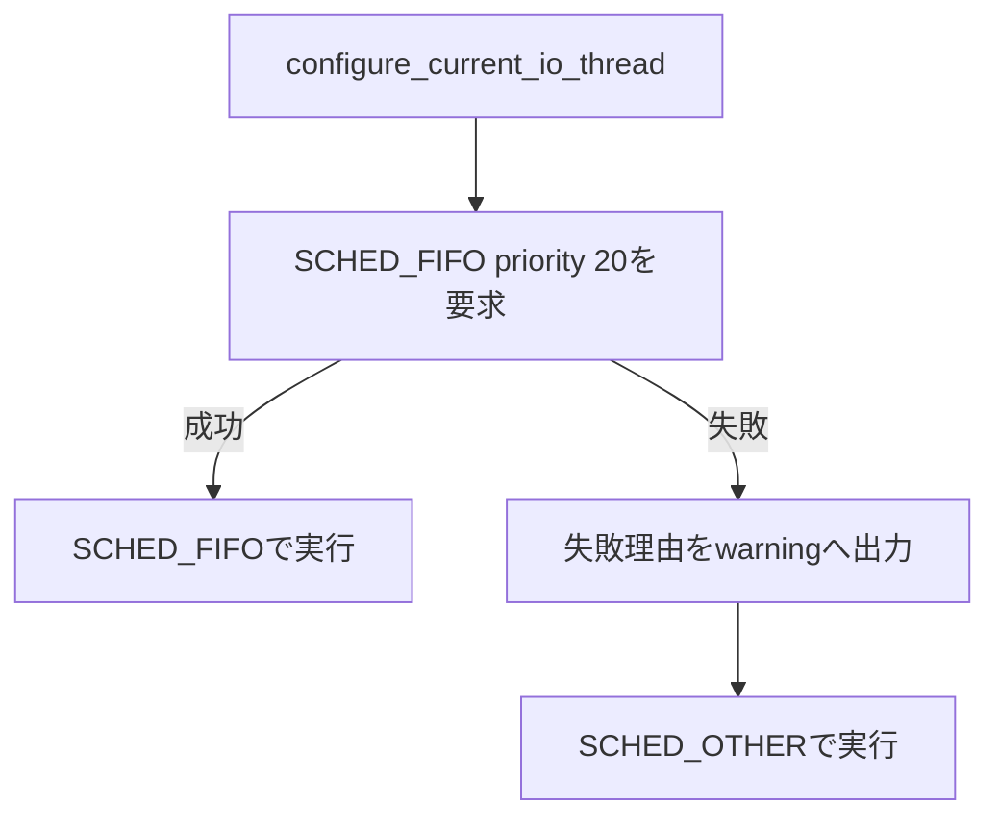

# ROS I/O thread schedulingとDDS受信バッファ

## 1. 対象

本文書は、ROS 2の大容量messageを安定した周期でpublishするためのthread構成、Linux scheduler設定、DDS受信バッファ設定を定義する。

共通のthread scheduling APIは `fluent_lib` が提供する。

初期適用先は `fv_realsense` のcolorおよびdepth publish経路である。

## 2. publish処理の構成

画像変換とROS message構築を行うprocessing threadから `publish()` を分離する。

processing threadは完成したmessage群を容量1 tickのbounded queueへ渡す。

publish専用threadはqueueの取得と `publish()` を担当する。


queueに未送信のbundleが残っている状態で次のtickが到着した場合は、古いbundleを新しいbundleへ置き換える。

この動作により、publishの遅れを古いframeとして蓄積せず、最新のcamera tickをDDSへ渡す。

置き換えた件数は `dropped_publish_bundles` として診断ログへ出力する。

## 3. thread scheduling

publish専用threadはentry functionの先頭で `SCHED_FIFO`、priority 20を要求する。

設定に成功したthreadは通常priorityのthreadより先に実行される。

設定権限がない場合は理由をwarningへ出し、`SCHED_OTHER`、priority 0で起動を継続する。



publish専用threadはcondition variableでqueueを待機し、bundleを受け取った時間だけ実行する。

## 4. `fluent_lib` API

公開APIは `fluent_lib/ros/io_thread.hpp` に置く。

```cpp
#include <fluent_lib/ros/io_thread.hpp>

fluent_lib::ros::configure_current_io_thread();
```

publish専用threadはentry functionの先頭でAPIを呼ぶ。

```cpp
void PublisherWorker::run()
{
  fluent_lib::ros::configure_current_io_thread();
  ready_.set_value();

  while (running_) {
    publish(queue_.pop());
  }
}
```

APIは適用したschedulerとpriorityを `IoThreadConfiguration` として返す。

## 5. 起動ログ

設定に成功した場合は次のログを出力する。

```text
ROS I/O thread scheduler=SCHED_FIFO priority=20
```

設定権限がない場合は失敗理由と適用結果を出力する。

```text
SCHED_FIFO unavailable: pthread_setschedparam(SCHED_FIFO, priority=20) failed: Operation not permitted
ROS I/O thread scheduler=SCHED_OTHER priority=0
```

## 6. `SCHED_FIFO`の権限

コンテナでは `CAP_SYS_NICE` を付与する。

systemd serviceでは `LimitRTPRIO=20` 以上を設定する。

priority 20は実行時に `sched_get_priority_min()` と `sched_get_priority_max()` で取得した範囲内であることを検証する。

## 7. DDS受信バッファ

`net.core.rmem_max` が212,992 bytesの環境では、CycloneDDSが大容量画像messageに必要なsocket receive bufferを確保できなかった。

UDP fragmentが受信socketで破棄され、購読側の実効FPSが低下した。

`fluent_lib` はDDS受信バッファ専用の設定スクリプトをinstallする。

```bash
source <workspace>/install/setup.bash
sudo "$(command -v setup_dds_receive_buffer.sh)"
```

スクリプトは`net.core.rmem_max`の下限を16 MiBとして、`/etc/sysctl.d/90-fluent-vision-dds.conf`へ保存し、現在のnetwork namespaceにも反映する。

現在値が16 MiBを超える場合は、その値を維持して永続化する。

したがって、既存の大きい受信バッファ上限を16 MiBへ下げることはない。

書き込む値は次の式で決める。

```text
effective_bytes = max(current_bytes, 16777216)
```

既に起動しているDDS processのsocketには新しい上限が反映されないため、設定後にDDS processを再起動する。

同じkeyを複数のsysctl設定ファイルで管理する場合は、辞書順で後に読み込まれる値が有効になるため、すべての定義をスクリプトが表示した適用値へ統一する。

## 8. 実測結果

同一のD405とFV recorderを使い、CPU分離の有無とschedulerの組み合わせを各60秒間計測した。

| 計測項目 | 分離なし + OTHER | 分離あり + OTHER | 分離なし + FIFO:20 | 分離あり + FIFO:20 |
|---|---:|---:|---:|---:|
| thread CPU実行時間 | 16,202.319 ms | 16,621.415 ms | 15,913.587 ms | 15,898.492 ms |
| scheduler待機時間 | 5,026.847 ms | 134.958 ms | 10.572 ms | 0.418 ms |
| scheduler待機比率 | 23.679 % | 0.805 % | 0.066 % | 0.003 % |
| color raw `publish()` p95 | 9.930 ms | 7.756 ms | 7.623 ms | 8.159 ms |
| color raw `publish()` p99 | 15.003 ms | 10.510 ms | 10.493 ms | 10.345 ms |
| depth `publish()` p95 | 17.438 ms | 15.399 ms | 15.837 ms | 14.935 ms |
| depth `publish()` p99 | 26.635 ms | 20.384 ms | 21.635 ms | 19.279 ms |
| publish bundle破棄 | 43 件 | 9 件 | 4 件 | 4 件 |
| color DDS受信レート | 29.239 FPS | 29.582 FPS | 29.552 FPS | 29.657 FPS |
| depth DDS受信レート | 29.491 FPS | 29.532 FPS | 29.537 FPS | 29.597 FPS |
| arm color録画レート | 28.838 FPS | 29.153 FPS | 29.154 FPS | 29.235 FPS |
| arm color 30 FPS grid carry | 71 行 | 51 行 | 51 行 | 47 行 |
| arm color同一source最大連続使用（raw episode） | 14 行 | 14 行 | 13 行 | 14 行 |
| arm color最近傍距離 max | 277.361 ms | 267.558 ms | 274.874 ms | 320.590 ms |

CPU分離なしの`SCHED_OTHER`と比べると、CPU分離なしの`SCHED_FIFO:20`はscheduler待機時間を99.790%減らし、publish bundle破棄を43件から4件へ減らした。

CPU分離と`SCHED_FIFO:20`の同時適用はscheduler待機時間を0.418 msまで減らした。

ただし、CPU分離なしの`SCHED_FIFO:20`に対する録画品質の優位性は確認できなかった。

4条件すべてで、arm colorの先頭9枚の後に約300から667 msの起動時間隔が2回連続した。

その直後のarm color source index 10をプレロール終了点とし、top cameraとarm colorの有効区間を再集計した。

このbenchmarkはFV recorder開始直後から60秒を測って停止したため、プレロール除外後の解析区間は59.481から59.715秒である。

| 計測項目 | 分離なし + OTHER | 分離あり + OTHER | 分離なし + FIFO:20 | 分離あり + FIFO:20 |
|---|---:|---:|---:|---:|
| プレロール長 | 1,166.963 ms | 1,200.173 ms | 1,133.604 ms | 1,233.514 ms |
| arm color有効区間実効レート | 29.236 FPS | 29.573 FPS | 29.540 FPS | 29.673 FPS |
| arm color ROS timestamp max | 100.001 ms | 100.036 ms | 66.698 ms | 66.899 ms |
| arm color carry | 46 行 | 25 行 | 27 行 | 20 行 |
| arm color同一source最大連続使用 | 2 行 | 2 行 | 2 行 | 2 行 |
| arm color最近傍距離 max | 47.300 ms | 36.410 ms | 33.249 ms | 25.810 ms |
| top camera有効区間実効レート | 14.990 FPS | 14.989 FPS | 14.989 FPS | 14.971 FPS |
| top camera ROS timestamp max | 92.364 ms | 97.180 ms | 90.572 ms | 127.292 ms |
| top camera同一source最大連続使用 | 3 行 | 3 行 | 3 行 | 3 行 |
| top camera最近傍距離 max | 36.547 ms | 37.925 ms | 41.637 ms | 49.877 ms |

プレロール除外後の30 FPS整列は、全条件で同一source最大連続使用3行以下、最近傍距離100 ms以下だった。

top cameraとarm colorのROS timestamp間隔がともに100 ms以下だった条件は、分離なし + FIFO:20だけだった。

DDS受信バッファの実測結果は次のとおりである。

| 計測項目 | `rmem_max = 212,992 B` | `rmem_max = 16 MiB` |
|---|---:|---:|
| color DDS受信レート | 28.170 FPS | 29.440 FPS |
| 15秒間の受信socket UDP drop数 | 771件 | 0件 |

## 9. 検証項目

単体テストは次の契約を確認する。

- 不正な`SCHED_FIFO` priorityの拒否
- `SCHED_FIFO`の適用と読戻し
- 権限不足時の`SCHED_OTHER`適用と読戻し
- DDS受信バッファ設定の保存、即時反映、再実行時の冪等性

実機検証はpublish latency、scheduler待機時間、実効FPS、drop件数、起動ログを確認する。
