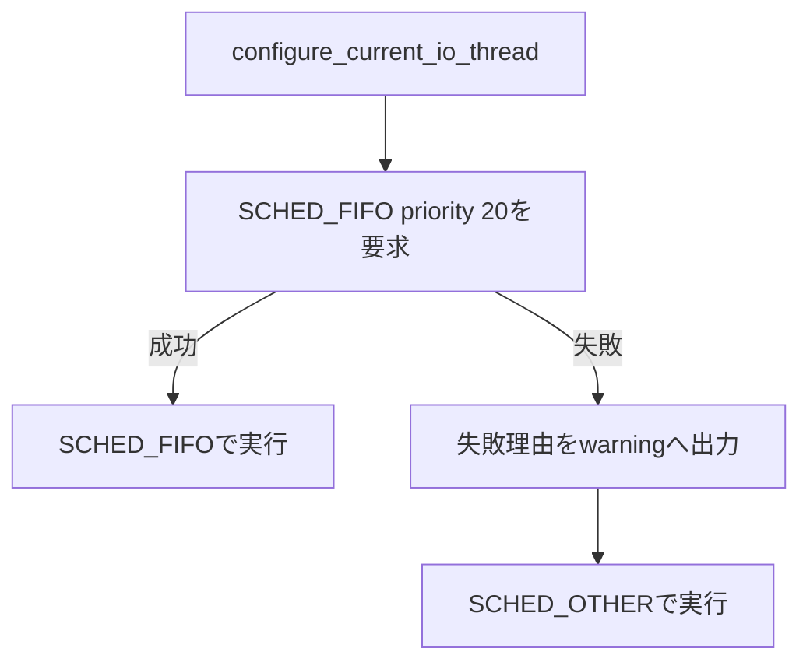

# ROS I/O thread schedulingとDDS受信バッファ

## 1. 対象

本文書は、ROS 2の大容量messageを安定した周期でpublishするためのthread構成、Linux scheduler設定、DDS受信バッファ設定を定義する。

共通のthread scheduling APIは `fluent_lib` が提供する。

初期適用先は `fv_realsense` のcolorおよびdepth publish経路である。

## 2. publish処理の構成

画像変換とROS message構築を行うprocessing threadから `publish()` を分離する。

processing threadは完成したmessage群を容量1 tickのbounded queueへ渡す。

publish専用threadはqueueの取得と `publish()` を担当する。


queueに未送信のbundleが残っている状態で次のtickが到着した場合は、古いbundleを新しいbundleへ置き換える。

この動作により、publishの遅れを古いframeとして蓄積せず、最新のcamera tickをDDSへ渡す。

置き換えた件数は `dropped_publish_bundles` として診断ログへ出力する。

## 3. thread scheduling

publish専用threadはentry functionの先頭で `SCHED_FIFO`、priority 20を要求する。

設定に成功したthreadは通常priorityのthreadより先に実行される。

設定権限がない場合は理由をwarningへ出し、`SCHED_OTHER`、priority 0で起動を継続する。



publish専用threadはcondition variableでqueueを待機し、bundleを受け取った時間だけ実行する。

## 4. `fluent_lib` API

公開APIは `fluent_lib/ros/io_thread.hpp` に置く。

```cpp
#include <fluent_lib/ros/io_thread.hpp>

fluent_lib::ros::configure_current_io_thread();
```

publish専用threadはentry functionの先頭でAPIを呼ぶ。

```cpp
void PublisherWorker::run()
{
  fluent_lib::ros::configure_current_io_thread();
  ready_.set_value();

  while (running_) {
    publish(queue_.pop());
  }
}
```

APIは適用したschedulerとpriorityを `IoThreadConfiguration` として返す。

## 5. 起動ログ

設定に成功した場合は次のログを出力する。

```text
ROS I/O thread scheduler=SCHED_FIFO priority=20
```

設定権限がない場合は失敗理由と適用結果を出力する。

```text
SCHED_FIFO unavailable: pthread_setschedparam(SCHED_FIFO, priority=20) failed: Operation not permitted
ROS I/O thread scheduler=SCHED_OTHER priority=0
```

## 6. `SCHED_FIFO`の権限

コンテナでは `CAP_SYS_NICE` を付与する。

systemd serviceでは `LimitRTPRIO=20` 以上を設定する。

priority 20は実行時に `sched_get_priority_min()` と `sched_get_priority_max()` で取得した範囲内であることを検証する。

## 7. DDS受信バッファ

`net.core.rmem_max` が212,992 bytesの環境では、CycloneDDSが大容量画像messageに必要なsocket receive bufferを確保できなかった。

UDP fragmentが受信socketで破棄され、購読側の実効FPSが低下した。

`fluent_lib` はDDS受信バッファ専用の設定スクリプトをinstallする。

```bash
source <workspace>/install/setup.bash
sudo "$(command -v setup_dds_receive_buffer.sh)"
```

スクリプトは次の設定を `/etc/sysctl.d/90-fluent-vision-dds.conf` へ保存し、現在のnetwork namespaceにも反映する。

```text
net.core.rmem_max = 16777216
```

既に起動しているDDS processのsocketには新しい上限が反映されないため、設定後にDDS processを再起動する。

## 8. 実測結果

publish専用threadを同じ実行環境へ配置し、schedulerだけを変更して60秒間計測した。

| 計測値 | `SCHED_OTHER` | `SCHED_FIFO:20` |
|---|---:|---:|
| thread実行時間 | 16.280秒 | 15.881秒 |
| scheduler待機時間 | 3.921秒 | 0.015秒 |
| 実行時間と待機時間に占める待機比率 | 19.411% | 0.094% |
| color publish p95 | 11.627 ms | 9.857 ms |
| depth publish p95 | 20.921 ms | 18.047 ms |
| dropped publish bundles | 65 | 20 |
| color実効FPS | 29.12 | 29.32 |
| depth実効FPS | 28.85 | 29.18 |

`SCHED_FIFO`はscheduler待機時間を99.6%削減した。

DDS受信バッファの実測結果は次のとおりである。

| 計測値 | 212,992 bytes | 16 MiB |
|---|---:|---:|
| color受信FPS | 28.170 FPS | 29.440 FPS |
| 15秒間の受信socket UDP drop | 771件 | 0件 |

## 9. 検証項目

単体テストは次の契約を確認する。

- 不正な`SCHED_FIFO` priorityの拒否
- `SCHED_FIFO`の適用と読戻し
- 権限不足時の`SCHED_OTHER`適用と読戻し
- DDS受信バッファ設定の保存、即時反映、再実行時の冪等性

実機検証はpublish latency、scheduler待機時間、実効FPS、drop件数、起動ログを確認する。
