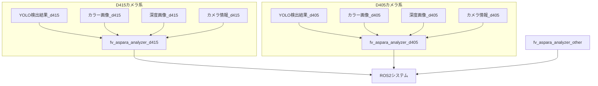
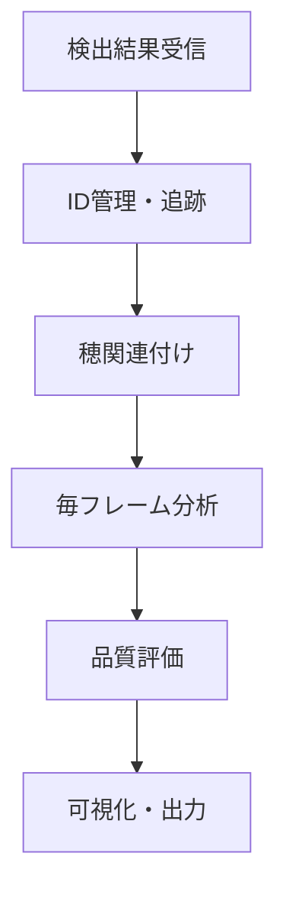

# fv_aspara_analyzer システム設計書

**プロジェクト**: FluentVision ROS2  
**ノード名**: `fv_aspara_analyzer_node`  
**作成日**: 2025年8月8日  
**最終更新**: 2025年8月8日 11:50  

## 目次

1. [概要](#概要)
2. [システム全体アーキテクチャ](#システム全体アーキテクチャ)
3. [フレーム毎分析処理](#フレーム毎分析処理)
4. [ID管理とトラッキング](#id管理とトラッキング)
5. [穂の密集度対応処理](#穂の密集度対応処理)
6. [ビジュアル表示仕様](#ビジュアル表示仕様)
7. [エラーハンドリング](#エラーハンドリング)
8. [設定パラメータ](#設定パラメータ)
9. [実装履歴](#実装履歴)

---

## 概要

**目的**: アスパラガス検出・追跡・品質分析の統合システム  
**アーキテクチャ**: 1つのソースコードから複数ノードインスタンス、起動時引数で設定切り替え  
**特徴**: フレーム毎分析、リアルタイム処理、複数アスパラID管理、マルチカメラ対応

### 主要機能
- 3D点群ベースの品質分析（長さ・太さ・真直度）
- アスパラガス本体と穂の関連付け
- スムーズアニメーション表示
- 非同期処理によるリアルタイム性確保

---

## システム全体アーキテクチャ

### ノード構成


### 起動方法
```bash
# 複数ノードインスタンスを同時起動
ros2 run fv_aspara_analyzer fv_aspara_analyzer_node --ros-args --params-file d415.yaml &
ros2 run fv_aspara_analyzer fv_aspara_analyzer_node --ros-args --params-file d405.yaml &
```

### 処理フロー


### データ構造

#### AsparagusPart構造体（部位情報）
```cpp
struct AsparagusPart {
    int class_id = -1;                         ///< クラスID（0=本体、1=穂）
    cv::Rect bounding_box_2d;                  ///< 2Dバウンディングボックス
    float confidence = 0.0f;                   ///< 検出信頼度
    bool is_valid = false;                     ///< 有効フラグ
};
```

**用途**: アスパラガス本体と穂の部位情報を統一管理
- **class_id**: 0=本体（緑色表示）、1=穂（黄色表示）
- **confidence**: YOLO検出の信頼度、密集度ペナルティ適用済み
- **is_valid**: 空間的関連性チェック通過フラグ

#### SkeletonPoint構造体（骨格ポイント）
```cpp
struct SkeletonPoint {
    cv::Point2f image_point;                   ///< 2D画像座標
    geometry_msgs::msg::Point world_point;     ///< 3D世界座標
    float distance_from_base = 0.0f;           ///< 根元からの距離（メートル）
    float radius_at_point = 0.0f;              ///< その点での半径（メートル）
};
```

**用途**: アスパラガス骨格の5-10点抽出、長さ・曲がり度の詳細分析
- **ピンク色表示**: 骨格ラインと◯マーカー
- **3D座標保存**: ロボット制御・品質分析用
- **設定可能点数**: 5点または10点（設定ファイルで切り替え）

#### AsparaInfo構造体（メイン情報）
```cpp
struct AsparaInfo {
    int id;                                    ///< 一意識別ID
    float confidence;                          ///< 検出信頼度
    cv::Rect bounding_box_2d;                  ///< バウンディングボックス
    
    // 穂情報統合
    AsparagusPart body_part;                   ///< 本体情報（クラスID 0）
    std::vector<AsparagusPart> spike_parts;    ///< 穂情報（クラスID 1）
    
    // 3D分析結果
    sensor_msgs::msg::PointCloud2 filtered_pointcloud;  ///< フィルタリング済み3D点群
    sensor_msgs::msg::PointCloud2 asparagus_pointcloud; ///< ROI抽出後の生点群（フィルター前）
    geometry_msgs::msg::Point root_position_3d;         ///< 根元の3D座標
    float length;                              ///< アスパラガス長さ（メートル）
    float straightness;                        ///< 真っ直ぐ度（0.0-1.0）
    bool is_harvestable;                       ///< 収穫可能フラグ
    AsparaguGrade grade;                       ///< 品質グレード
    
    // 処理時間記録
    ProcessingTimes processing_times;          ///< 各処理ステップの時間
    
    // アニメーション
    cv::Rect smooth_bbox;                      ///< スムージング矩形
    float animation_alpha;                     ///< 透明度
    bool is_new;                               ///< 新規検出フラグ
    int frame_count;                           ///< フレームカウント
    
    // 追跡用フィールド  
    int detection_count;                       ///< 検出回数
    float overlap_ratio;                       ///< 前フレームとの重複度
    rclcpp::Time first_detected_time;          ///< 初回検出時刻
    rclcpp::Time last_update_time;             ///< 最後の更新時刻
};
```

#### SelectedAsparaInfo構造体（選択中アスパラ詳細情報）
```cpp
struct SelectedAsparaInfo {
    int asparagus_id = -1;                     ///< 選択中ID（-1=未選択）
    bool is_selected = false;                  ///< 選択状態
    
    // 2D検出情報（本体・穂）
    AsparagusPart body_part;                   ///< 本体情報（クラスID 0）
    std::vector<AsparagusPart> spike_parts;    ///< 穂情報リスト（クラスID 1）
    
    // 品質情報（全てメートル単位）
    float length = 0.0f;                       ///< 長さ（メートル）
    float distance_from_camera = 0.0f;         ///< カメラからの距離（メートル）
    float curvature = 0.0f;                    ///< 曲がり度（メートル）
    float diameter = 0.0f;                     ///< 太さ（メートル）
    AsparaguGrade grade = AsparaguGrade::UNKNOWN; ///< 品質グレード
    
    // 切断情報
    bool is_cutting_target = false;            ///< 切断対象フラグ
    cv::Point2f cut_point_pixel;               ///< 切断ポイント画像座標（ピクセル）
    geometry_msgs::msg::Point cut_point_world; ///< 切断ポイント3D座標（メートル）
    
    // 骨格ポイント配列（設計書通り5-10点）
    std::vector<SkeletonPoint> skeleton_points; ///< 骨格ポイント配列（頂点から根元まで）
    
    // メタ情報
    float confidence = 0.0f;                   ///< 信頼度（0.0-1.0）
    rclcpp::Time timestamp;                    ///< タイムスタンプ
};
```

**用途**: 選択中アスパラガスの詳細分析結果とロボット制御情報
- **切断ポイント**: 2D画像座標と3D世界座標の両方を保持
- **骨格ポイント**: 5-10点の詳細骨格情報（ピンク色表示）
- **品質評価**: 長さ・太さ・曲がり度・グレード判定

---

## 点群処理の詳細

### 点群データの流れ

1. **ROI抽出（filtered_cloud）**
   - 深度画像からバウンディングボックス内の点群を抽出
   - フィルター前の生データ
   - `asparagus_pointcloud`として公開（選択中のアスパラのみ）

2. **ノイズ除去（denoised_cloud）**
   - ボクセルグリッドフィルタでダウンサンプリング
   - 統計的外れ値除去フィルタでノイズ除去
   - `filtered_pointcloud`として公開

### 公開トピック

- **`/fv/d415/aspara_analysis/filtered_points`**: フィルタリング済み点群（全アスパラ）
- **`/fv/d415/aspara_analysis/selected_points`**: 選択中アスパラの生点群（フィルター前）

### AsparaInfo構造体の点群フィールド

```cpp
// 3D分析結果
sensor_msgs::msg::PointCloud2 filtered_pointcloud;  ///< フィルタリング済み3D点群
sensor_msgs::msg::PointCloud2 asparagus_pointcloud; ///< ROI抽出後の生点群（フィルター前）
```

**重要な違い**:
- `asparagus_pointcloud`: ROI抽出直後の生データ、ノイズを含む高密度点群
- `filtered_pointcloud`: ノイズ除去・ダウンサンプリング済み、分析用の清浄な点群

---

## フレーム毎分析処理

### 重要な設計方針変更

**問題**: 同じ指摘を繰り返し受けることを防ぐため、処理タイミングを明確化

#### 処理タイミングの分離
- **検出処理**: 低FPS（5-10fps）- YOLOなどの重い処理
- **分析処理**: 高FPS（30fps）- 既存データを使った毎フレーム処理

### 実装アーキテクチャ

#### detectionCallback（検出情報更新のみ）
```cpp
void FvAsparaAnalyzerNode::detectionCallback(...) {
    // アスパラガス情報の更新のみ
    updateAsparagusList(...);
    
    // 検出情報更新時は点群処理はスキップ（imageCallbackで毎フレーム実行）
    // processAsparagus(selected_aspara_info_); ← この処理は削除済み
}
```

#### imageCallback（毎フレーム分析処理）
```cpp
void FvAsparaAnalyzerNode::imageCallback(...) {
    // 既存の画像処理...
    
    // 選択中のアスパラの点群処理を毎フレーム実行
    if (selected_aspara_id_ != -1 && enable_pointcloud_processing_ && !aspara_list_.empty()) {
        for (auto& aspara : aspara_list_) {
            if (aspara.id == selected_aspara_id_) {
                try {
                    // 分析時間計測開始
                    auto start_time = std::chrono::high_resolution_clock::now();
                    
                    processAsparagus(aspara);
                    
                    // 分析時間計測終了・記録
                    auto end_time = std::chrono::high_resolution_clock::now();
                    auto duration = std::chrono::duration_cast<std::chrono::milliseconds>(end_time - start_time);
                    aspara.processing_times.total_ms = duration.count();
                    
                } catch (const std::exception& e) {
                    RCLCPP_ERROR(this->get_logger(), "Exception in asparagus analysis: %s", e.what());
                    aspara.processing_times.total_ms = 0.0;
                }
                break;
            }
        }
    }
}
```

### 必須要件
1. **分析時間表示**: 選択中アスパラの処理時間を必ず画面表示
2. **設定フラグ**: `enable_pointcloud_processing_`で処理制御
3. **毎フレーム処理**: imageCallbackで既存データを使って高FPS分析
4. **リアルタイム性**: 検出は遅くても分析はスムーズに表示

---

## ID管理とトラッキング

### AsparaSelection統合
- **IoU閾値**: 70%で同一オブジェクト判定
- **スムーズアニメーション**: fluent_lib使用
- **最適候補選定**: 距離優先（矩形サイズ）、信頼度次点

### 追跡アルゴリズム
```cpp
std::vector<AsparaInfo> updateAsparaList(
    const std::vector<std::pair<cv::Rect, float>>& new_detections,
    const std::vector<AsparaInfo>& existing_aspara_list) {
    
    // 1. 新検出と既存アスパラのマッチング（IoU 70%）
    // 2. マッチした場合：スムーズアニメーション更新
    // 3. 新規の場合：新しいID割り当て
    // 4. 消失した場合：タイムアウト管理
}
```

---

## 穂の密集度対応処理

### 問題
複数のアスパラガス矩形が重なっている場合、穂の所属判定が困難

### 解決方法
```cpp
// 穂がどの矩形に含まれるかチェック（複数の場合は密集度を考慮）
std::vector<int> overlapping_aspara_indices;

// 全アスパラガスとの重複をチェック
for (size_t i = 0; i < aspara_list_.size(); ++i) {
    float overlap = aspara_selection_.calculateOverlap(bbox, aspara_list_[i].bounding_box_2d);
    if (overlap > 0.3f) {  // 30%以上重複
        overlapping_aspara_indices.push_back(i);
    }
}

// 密集度による信頼度調整
if (overlapping_aspara_indices.size() > 1) {
    // 複数のアスパラと重複している場合は「そのアスパラの頭部として判断する信頼度」を下げる
    float density_penalty = 1.0f / overlapping_aspara_indices.size();
    spike_part.confidence = confidence * density_penalty;
}
```

**重要**: この信頼度調整は「穂の検出信頼度」ではなく、「そのアスパラの頭部として判断する信頼度」を下げている。密集した場所では、どのアスパラの頭なのか判断が曖昧になるため。

---

## ビジュアル表示仕様

### 基本表示ルール
- **アスパラガス本体**: 緑色
- **穂**: 黄色
- **選択中**: 80%透明度背景、2pxライン
- **非選択**: 40%透明度背景、1pxライン

### 矩形内情報表示

#### 選択中アスパラ（フル情報）
```
┌─────────────────┐
│ ID: #1 [選択中]   │ ← 基本情報
│ 信頼: 85%        │
│ 距離: 1.2m       │ ← カメラからの距離
│ 点群: 1,234点    │ ← ポイントクラウド点数
│ 分析: 12.3ms     │ ← 分析処理時間（必須）
│ ─────────────── │
│ 長さ: 28.5cm     │ ← 分析結果
│ 太さ: 15mm       │
│ 真直: 85%        │
│ グレード: A級     │
│ 穂: 2個          │ ← 穂情報
└─────────────────┘
```

#### 非選択アスパラ（基本情報のみ）
```
┌─────────────┐
│ ID: #2       │
│ 信頼: 72%    │
│ 距離: 1.8m   │
└─────────────┘
```

### グレード別色分け
- **A級**: 緑色矩形・テキスト
- **B級**: 黄色矩形・テキスト  
- **C級**: オレンジ矩形・テキスト
- **規格外/エラー**: 赤色矩形・テキスト
- **分析中**: 青色矩形・テキスト

### 動的表示制御
```cpp
if (aspara.processing_times.total_ms > 0) {
    // 分析完了 → フル情報表示
} else if (analysis_in_progress) {
    // 分析中 → "分析中..."表示
} else {
    // 未分析 → 基本情報のみ
}
```

---

## エラーハンドリング

### 分析処理エラー対策
- try-catchでエラーをキャッチ
- システムクラッシュを防止
- エラー時は分析時間を0に設定
- 処理継続を保証

### ログ出力
```cpp
try {
    RCLCPP_DEBUG(this->get_logger(), "Starting analysis for asparagus ID %d", aspara.id);
    processAsparagus(aspara);
    RCLCPP_DEBUG(this->get_logger(), "Analysis completed: %.1fms", processing_time);
} catch (const std::exception& e) {
    RCLCPP_ERROR(this->get_logger(), "Exception in analysis: %s", e.what());
} catch (...) {
    RCLCPP_ERROR(this->get_logger(), "Unknown exception in analysis");
}
```

---

## 設定パラメータ

### 重要パラメータ
```yaml
# ポイントクラウド処理制御
enable_pointcloud_processing: true     # 有効/無効切り替え

# ID管理・追跡
object_tracking_overlap_threshold: 0.7  # IoU閾値（70%）
object_tracking_timeout_ms: 5000       # 追跡タイムアウト

# 表示設定
selected_asparagus_opacity: 0.8        # 選択中透明度
selected_asparagus_thickness: 2        # 選択中線の太さ
unselected_asparagus_opacity: 0.4      # 非選択透明度
unselected_asparagus_thickness: 1      # 非選択線の太さ

# 穂関連付け
spike_overlap_threshold: 0.3           # 穂の重複判定（30%）
```

---

## 実装履歴

### 2025-08-08 実装完了項目
1. **11:33**: 穂密集度対応とID管理統合実装完了
2. **11:40**: フレーム毎分析処理方針をドキュメント化  
3. **11:45**: 分析処理エラーハンドリング追加
4. **11:50**: 矩形内情報表示仕様を設計書に統合

### 現在の実装状況
- ✅ フレーム毎分析処理アーキテクチャ
- ✅ ID管理とスムーズアニメーション
- ✅ 穂の密集度対応処理
- ✅ エラーハンドリングとログ
- 🔄 矩形内詳細情報表示（実装中）

### 次の実装予定
1. 矩形内詳細情報表示実装
2. グレード別色分け実装
3. システム全体テスト

---

## 関連ファイル

### コア実装
- `src/fv_aspara_analyzer_node.cpp`: メイン実装
- `include/fv_aspara_analyzer/fv_aspara_analyzer_node.hpp`: ヘッダー
- `src/aspara_selection.cpp`: ID管理・選択機能
- `include/fv_aspara_analyzer/aspara_selection.hpp`: 選択管理ヘッダー

### 設定・起動
- `launch/fv_aspara_analyzer_d415.yaml`: D415カメラ用設定（引数として渡される）
- `launch/fv_aspara_analyzer_d405.yaml`: D405カメラ用設定（引数として渡される）
- `launch/high_fps_aspara_analyzer_d405.yaml`: 高FPS設定
- `launch/start_fv.sh`: 起動スクリプト（複数カメラ対応）

### ドキュメント
- `doc/system_design.md`: 本設計書
- `doc/display_specification.md`: 表示仕様詳細書