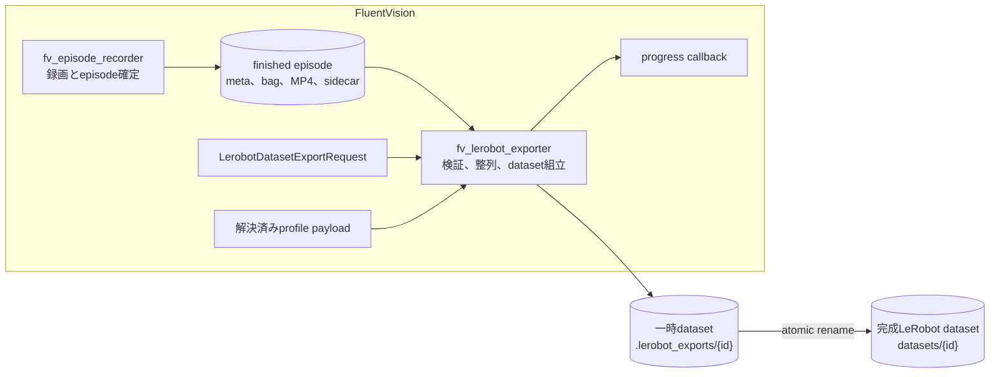
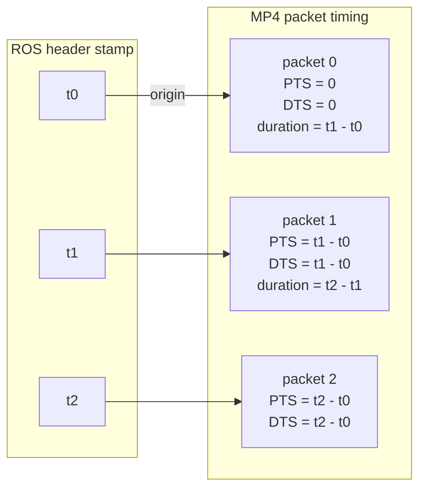
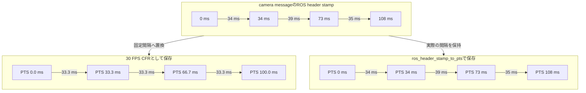
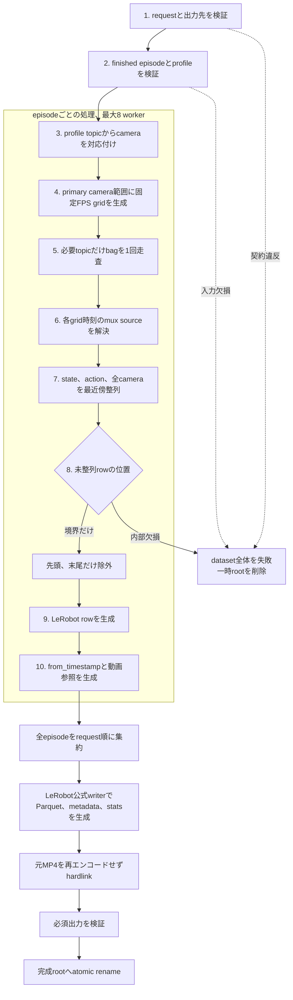
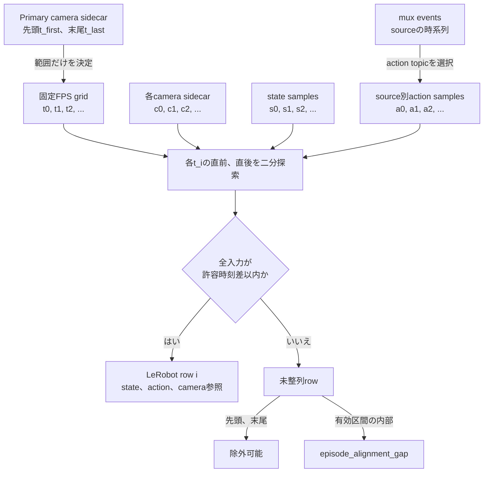
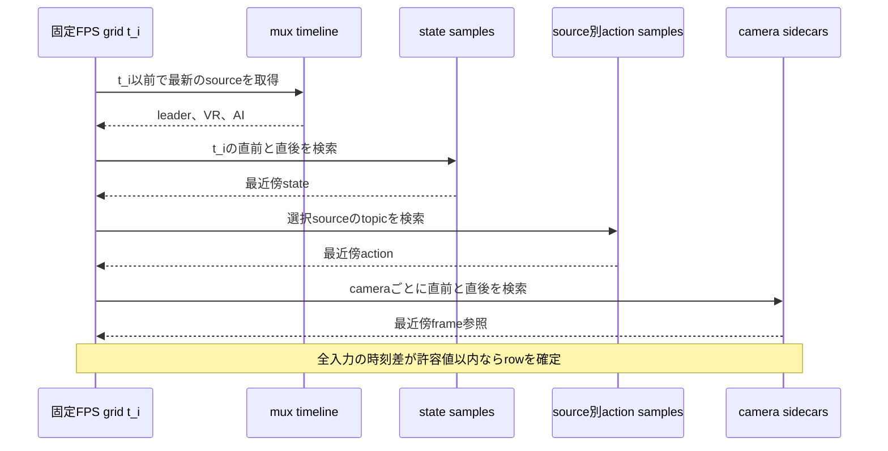
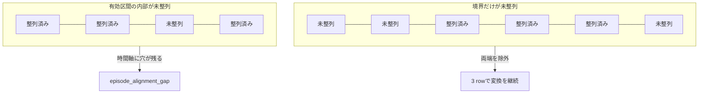
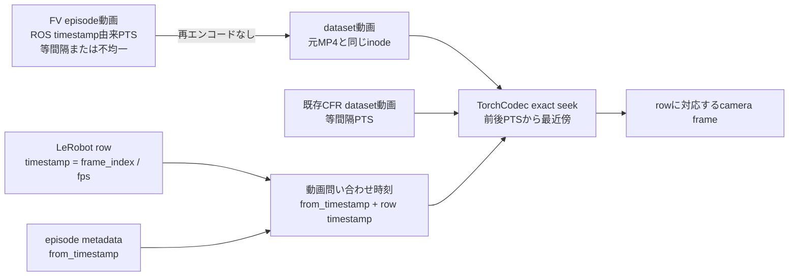

# FV EpisodeからLeRobot Datasetへの変換仕様

## 文書の位置付け

この文書は、FluentVision episodeをLeRobot v3 datasetへ変換するロジックの正本である。

変換実装はFluentVision repositoryの`fv_lerobot_exporter` packageが所有する。

FV episode recorderは収録とepisode正本の確定を担当する。

FV LeRobot exporterは確定済みepisodeの検証、時刻整列、dataset組立、atomic finalizeを担当する。

この二つは別packageとし、録画nodeへLeRobot変換依存を組み込まない。

変換coreはHTTP APIや外部storage同期を所有しないpure Python packageとする。

## 全体像



録画データの正本はFV episodeであり、変換中も元episodeを変更しない。

完成datasetはLeRobot v3のfile構造だけを持ち、外部service固有の状態を含めない。

## 目的

変換処理は、選択された複数のFV episodeから一つのLeRobot v3 datasetを生成する。

変換時にcamera画像を再エンコードせず、収録時のROS timestampと動画PTSの対応を保持する。

必要な入力が欠けるepisodeを飛ばして成功扱いにせず、dataset全体の作成を失敗させる。

同じ入力と設定からは、episode順、row時刻、feature順が同じdatasetを生成する。

## 対象外

この文書は録画開始、録画停止、episode選択UI、外部storage転送、学習用PNG prepared datasetを定義しない。

作成済みdatasetを学習時にどうdecodeするかは読込契約として必要な範囲だけを定義する。

## 入力契約

変換requestは次の値を持つ。

| 値 | 契約 |
| --- | --- |
| `dataset_id` | 出力先を一意に決める相対ID |
| `dataset_name` | datasetの表示名 |
| `episode_ids` | 一件以上の順序付きepisode ID列 |
| `fps` | LeRobot rowの基準FPS、1以上120以下 |
| `max_alignment_error_s` | camera、state、actionの最大許容時刻差 |
| `max_mux_status_age_s` | mux sourceを有効とみなす最大経過時間 |

現行変換core単体は重複を検証しない。

同じepisode IDを複数回指定した場合は、その出現順のまま複数episodeとして出力する。

`max_alignment_error_s`は次の上限以下にする。

```text
max_alignment_error_s <= min(0.1, 3 / fps)
```

省略時も`min(0.1, 3 / fps)`を使う。

現在の`max_mux_status_age_s`既定値は2.5秒である。

変換coreは、引数として渡された解決済みprofile payloadを型検証して受け取る。

変換core自身はprofile名からprofile payloadを解決しない。

FV episode metadataは現在profile名だけを保持するため、録画後にprofileが変更された場合の再現性は保証されない。

録画時profile snapshotの固定は変換アルゴリズムとは別のepisode metadata契約として解消する。

profileの`lerobot`セクションだけをLeRobot featureの意味と順序の正本にする。

## FV episode契約

入力episodeは次の状態を満たす必要がある。

- `state == "finished"`
- `outcome == "success"`
- `started_at`が確定している
- 全episodeの`profile`名が一致する
- `meta.json`、`bag/`、対象cameraのMP4、`frames.parquet`が存在する

現行実装は`stopped_at`欠損を空文字列、`duration_s`欠損を0としてprovenanceへ出力する。

`trim_start_s`と`trim_end_s`の意味は現行FV episode契約で確定していない。

現行変換coreは両fieldを参照しない。

episodeの概略構造は次のとおりである。

```text
episodes/{profile}/{date}/{episode}/
  meta.json
  bag/
  videos/{camera}/
    0000.mp4
    frames.parquet
```

`recorded_topics[*].stamp_source`は、各joint topicの時刻源を明示する。

許可する値は`message_header`と`rosbag_recv`であり、未指定時に別の時刻源を推測しない。

`message_header`を宣言したtopicのheader stampが0の場合は変換を失敗させる。

## Profileからのfeature解決

### Camera

camera feature keyは次の形式にする。

```text
observation.images.{profile.lerobot.cameras[*].name}
```

profile上のcamera topicとepisode camera metadataのtopicを一致させる。

recorder内部のcamera名をLeRobot feature名の正本にしない。

`enabled == true`のprofile cameraがepisodeに存在しない場合は変換を失敗させる。

episodeに存在しない任意cameraは出力featureへ含めない。

一致したcameraが一件もない場合は変換を失敗させる。

現在の変換対象は、一つのMP4 segmentを持つcolor cameraである。

複数segment、depth PNG列、bag内depth画像は対象外であり、暗黙に変換しない。

### State

`observation.state`は、各`profile.lerobot.arm_streams[*].rx.joint_state.topic`の`JointState`から生成する。

joint値は`profile.lerobot.arm_streams`の順、その中では`joints`の順で連結する。

feature名は次の形式にする。

```text
{namespaceまたはstream key}_{joint name}
```

`JointState.name`にprofile指定jointが存在しない場合は変換を失敗させる。

### Action

`action`はrow時刻で有効なmux sourceに対応するjoint command topicから生成する。

source別topicがprofileにある場合は、`joint_command.leader`、`joint_command.vr`、`joint_command.ai`を使う。

source別topicがない場合は`joint_command.topic`を使う。

PiPERのVR収録では`pos_cmd`と`gripper_cmd`を直接合成せず、PiPER内部IK後の`joint_ctrl`をactionとして使う。

## Camera動画時刻契約

FV episode recorderは、camera frameのROS timestampをMP4 packetのPTS、DTS、durationへ反映する。

動画のtime baseは、そのcameraで最初に記録したROS timestampを0秒とする。

camera metadataは次の値を持つ。

```json
{
  "video_timing_mode": "ros_header_stamp_to_pts",
  "video_pts_origin_ros_ns": 1234567890000000000
}
```

**PTS（Presentation Timestamp）**は、動画frameを表示する時刻である。

**DTS（Decoding Timestamp）**は、動画packetをdecodeする時刻である。

FV recorderはB-frameを無効にしているため、各packetのDTSをPTSと同じ値にする。



**video timing mode**は、camera frameの時刻を動画packetのPTSへ写す規則を表す。

`ros_header_stamp_to_pts`は、ROS messageの`header.stamp`を先頭frameからの相対時刻へ変換し、動画packetのPTSへ設定したことを表す。

変換coreは`video_timing_mode == "ros_header_stamp_to_pts"`を要求する。

`frames.parquet`の先頭`ros_stamp_ns`は`video_pts_origin_ros_ns`と一致しなければならない。

sidecar rowはROS timestampの狭義単調増加でなければならない。

sidecarのrow順、`segment_file`、`segment_local_frame`はMP4 packetと一対一で対応しなければならない。

古いraw episodeについてCFRを仮定したり、sidecarだけから動画PTSを再構成したりしない。

## CFRとVFR

**CFR**は、隣接する動画frameのPTS間隔が一定である動画である。

**VFR**は、隣接する動画frameのPTS間隔が変化する動画である。

次の図は、不均一なROS timestampを30 FPSのCFRへ押し込んだ場合と、ROS timestamp由来のPTSを保持した場合を比較する。



`ros_header_stamp_to_pts`の出力が常にVFRになるわけではない。

ROS timestampが等間隔ならPTSも等間隔になり、結果はCFRと同じ時刻配置になる。

したがって、契約名はVFRかCFRかではなく、PTSをどの時刻から生成したかを表す。

## 変換処理



変換は、episode内の時刻整列を先に完了してから、dataset全体を一括で組み立てる。

動画frameを順番にdecodeしてLeRobotへ積み直す処理は行わない。

### 1. Requestと出力先を検証する

`episode_ids`の順序を出力episode順として保持する。

出力dataset rootと一時rootが既に存在する場合は上書きしない。

一時rootと完成rootは同じfilesystem上に置く。

現在の配置は次のとおりである。

```text
/data/datasets/.lerobot_exports/{dataset_id}/
/data/datasets/{dataset_id}/
```

### 2. Episodeとprofileを検証する

各episode IDから`meta.json`を一件だけ解決する。

episode状態、outcome、profile一致を検証する。

profileのcamera、arm stream、joint、topic定義を型検証する。

### 3. Camera mappingを作る

profile順にepisode cameraをtopicで対応付ける。

一致したcameraごとにMP4、sidecar、解像度、video originを検証する。

先頭の一致cameraをprimary cameraとする。

primary cameraは固定FPS gridの有効範囲を決めるために使い、各rowの画像payloadを直接決めるmasterにはしない。

### 4. 固定FPS gridを作る

primary cameraの先頭ROS timestampを`t_first`、末尾を`t_last`とする。

gridのrow数`N`は次の式で決める。

```text
N = floor((t_last - t_first) * fps / 1e9) + 1
```

gridの各絶対ROS timestampは次の式で決める。

```text
t_i = t_first + round(i * 1e9 / fps)
0 <= i < N
```

source cameraの各frame timestampをそのままLeRobot rowにはしない。

### 5. Bagを一回読む

必要topicだけをrosbagから読み、topicごとの時刻昇順sample列を作る。

必要topicは全arm streamのstate topic、base action topic、定義済みsource別action topic、mux status topicである。

stateとaction topicは`JointState`、mux status topicはJSON文字列を持つ`std_msgs/String`でなければならない。

joint sample、camera sidecar、mux eventごとにtimestamp配列を一度だけ構築する。

### 6. Gridごとにmux sourceを解決する

各`t_i`以前で最新のmux eventを二分探索する。

録画開始直後だけは、latched statusが最初のcamera rowより後にbagへ入ることがある。

その場合に限り、最初のmux eventが`max_mux_status_age_s`以内ならそのsourceを使う。

source eventが古すぎる場合、sourceが`stop`の場合、JSONからsourceを解決できない場合は変換を失敗させる。

### 7. Gridごとにstate、action、cameraを整列する



primary cameraの各frameをLeRobot rowとして採用するわけではない。

primary cameraは固定FPS gridの開始と終了だけを決め、全入力は各grid時刻へ個別に整列する。

一つのgrid時刻に対する問い合わせは次の順序で進む。



各sample列について`t_i`の直前と直後だけを候補にし、時刻差が小さいsampleを選ぶ。

時刻差が等しい場合、現行変換coreは直後sampleを選ぶ。

選択sampleと`t_i`の差は`max_alignment_error_s`以下でなければならない。

stateとactionはprofile指定joint順にvector化する。

全cameraについてもsidecar timestampの最近傍が許容差内にあることを確認する。

camera問い合わせ時刻がsidecarの先頭より前、または末尾より後の場合は未整列とする。

sample欠損または許容差超過のgrid rowは未整列rowとして記録する。

未知のtopic型、joint名欠損、mux異常のような契約違反は未整列rowにせず、その時点で変換を失敗させる。

### 8. 共通有効区間を確定する



最初の整列済みrowより前と、最後の整列済みrowより後にある未整列rowは除外できる。

最初と最後の整列済みrowの間に未整列rowが一件でもある場合は`episode_alignment_gap`として変換を失敗させる。

全rowが未整列の場合は`episode_joint_alignment_empty`として変換を失敗させる。

この規則により、欠損値、zero、前回値でrowを補完しない。

### 9. Episode rowを作る

trim後のrowを0から連番し直す。

episode内rowは次の値を持つ。

```text
observation.state
action
timestamp = frame_index / fps
frame_index
```

絶対ROS timestampはLeRobotの`timestamp`列へ書かない。

dataset組立時に`episode_index`、dataset全体の`index`、`task_index`を追加する。

### 10. 動画参照を作る

trim後の先頭絶対ROS timestampを`t_valid_first`とする。

cameraごとの`from_timestamp`は次の式で求める。

```text
from_timestamp
  = (t_valid_first - video_pts_origin_ros_ns) / 1e9
```

`from_timestamp`が負になる場合は変換を失敗させる。

episode metadataの`to_timestamp`は次の式で求める。

```text
to_timestamp = from_timestamp + episode row count / fps
```

元MP4をdecodeまたは再エンコードせず、LeRobot video pathへhardlinkする。

hardlink失敗時に物理copyへfallbackしない。

## Dataset組立

選択episode間でcamera feature集合とcamera解像度が一致しなければならない。

LeRobot metadataとParquetはLeRobot公式のmetadata classとwriterを使って生成する。

独自実装でLeRobot schemaを複製しない。

出力featureは`observation.state`、`action`、一致したcamera feature、LeRobot標準index列で構成する。

taskは`task_description`の初出順に`task_index`を割り当てる。

episode metadataはtask、length、data位置、video位置、`from_timestamp`、`to_timestamp`を持つ。

`meta/info.json`の`fps`と各video featureの`video.fps`はrow gridの基準FPSを表す。

VFR動画の平均入力FPSとして解釈しない。

`meta/info.json`へ`video_timestamp_tolerance_s`を書き、読込側と変換側で同じ許容差を使う。

statsは`observation.state`と`action`だけを対象に、min、max、mean、std、count、q01、q10、q50、q90、q99を計算する。

dataset作成時に動画をdecodeして画像statsを計算しない。

## 出力構造

出力はLeRobot v3形式にする。

```text
meta/info.json
meta/tasks.parquet
meta/episodes/chunk-000/file-000.parquet
meta/stats.json
data/chunk-000/file-000.parquet
videos/{feature_key}/chunk-000/file-{episode_index:03d}.mp4
```

変換元episodeのprovenance payloadには次の値を残す。

- dataset ID
- dataset名
- export完了時刻
- exporter識別子
- source episode ID
- task description
- episode開始時刻と終了時刻
- raw episode duration
- source tags

FV実装は`meta/fv_episode_export.json`へ保存する。

## Atomic finalize

全fileを一時rootへ生成する。

必須metadata、data、statsと全hardlinkの生成成功を確認してからprovenanceを保存する。

現行実装は、`info.json`、tasks、episodes、data、statsの必須5 fileが存在することを検証する。

完成rootへ同一filesystem内のrenameで配置する。

変換失敗時は、その実行が作った一時rootを削除する。

実行開始前から存在する一時rootは自動削除せず、`export_tmp_exists`として停止する。

同一filesystem上のrenameが保証するのは、完成dataset名の公開がatomicであることまでである。

現行実装は全fileとdirectoryへの`fsync`による電源断耐性を保証しない。

現行実装はfinalize前に全camera rowをdecodeして検査しない。

## LeRobot読込契約



LeRobot rowに対応する動画問い合わせ時刻は次の値である。

```text
query timestamp = from_timestamp + row timestamp
```

TorchCodecは`seek_mode="exact"`を使う。

VFR datasetのcamera読込はTorchCodec経路を必須にする。

PyAV fallbackが同じPTS最近傍契約を実装していない限り、VFR datasetをPyAVへ暗黙にfallbackしない。

問い合わせ時刻を表示区間に含む直前frameと、その次のframeをPTSで比較し、近いframeを返す。

距離が等しい場合は直前frameを返す。

`average_fps * timestamp`からframe indexを推定しない。

最近傍PTSとの差が`video_timestamp_tolerance_s`を超える場合は読込を失敗させる。

既存のCFR LeRobot datasetも同じPTS最近傍経路で読む。

CFRはPTS間隔が一定な場合であり、VFRと分ける形式判定を持たない。

既存datasetに`video_timestamp_tolerance_s`がない場合は`min(0.1, 3 / fps)`を使う。

この既定値は動画PTS検索だけに使い、delta timestamp検証の既定値`1e-4`を緩めない。

このCFR契約は作成済みLeRobot datasetの読込互換であり、`ros_header_stamp_to_pts`を宣言しない古いraw FV episodeの変換互換ではない。

## Package構成

変換coreは、FluentVision repository内のsibling Python package `fv_lerobot_exporter`へ置く。

`fv_episode_recorder`は収録、episode finalize、episode metadataの所有に限定する。

`fv_lerobot_exporter`は確定済みepisodeの検証、時刻整列、LeRobot dataset組立、atomic finalizeを所有する。

`export_lerobot_dataset()`はrequest、profile payload、dataset root、任意のprogress callbackを受け取る。

実行processとUIへの進捗表示は変換coreの外側で選択する。

`fv_lerobot_exporter`はLeRobot、Datasets、rosbags、PyArrowなどを直接依存として宣言する。

実行runtimeのlockfileでそのversionを固定する。

これらを`fv_episode_recorder`のPython環境へ追加しない。

別process化が必要になった場合も、変換coreを変更せずtransport wrapperから呼び出す。

## 並列化と性能契約

episode変換はepisode単位でprocess並列化できる。

現在の既定上限は8 workerで、設定可能範囲は1以上32以下である。

workerは一つのepisodeについてbag読込、deserialize、時刻index構築、row整列を完結させる。

workerの完了順に関係なく、出力episode順はrequestの`episode_ids`順を維持する。

dataset作成時の動画decode、frame seek、動画再エンコードを禁止する。

動画statsのためのdecodeも禁止する。

timestamp配列をrow検索ごとに再構築せず、episode内で再利用する。

22 episode、37,579 rowの実データ変換は7.089秒だった。

88 logical episode、150,316 rowの負荷試験は13.663秒だった。

88 episode試験は22個の実bagを4回使ったwarm-cache寄りの試験であり、88個の異なるbagをcold cacheで処理した値ではない。

これらの時間はFV episodeの読込からlocal dataset完成までを測定した。

## 失敗分類

変換は次の分類でfail closedにする。

| 分類 | 代表的なerror code |
| --- | --- |
| Requestと出力先 | `invalid_dataset_id`, `dataset_exists`, `export_tmp_exists`, `export_workers_invalid` |
| Episode | `episode_store_missing`, `episode_not_found`, `episode_meta_invalid`, `episode_not_finished`, `episode_not_success`, `profile_mismatch` |
| Profile | `profile_invalid`, `camera_mapping_empty`, `mux_topic_not_configured`, `action_topic_not_configured` |
| Bag | `bag_missing`, `bag_topic_missing`, `joint_topic_type_mismatch`, `mux_status_type_mismatch` |
| Timestamp | `stamp_source_missing`, `message_header_stamp_missing`, `camera_timestamps_invalid` |
| Mux | `mux_status_missing`, `mux_status_invalid`, `mux_status_before_frame_missing`, `mux_status_stale`, `mux_source_stop` |
| Joint | `joint_names_missing`, `joint_position_missing`, `joint_name_mismatch`, `joint_vector_mismatch`, `samples_missing`, `sample_alignment_error` |
| Camera | `camera_missing`, `camera_segments_unsupported`, `camera_video_timing_contract_missing`, `frames_sidecar_missing`, `camera_sidecar_empty`, `camera_sidecar_video_mismatch`, `camera_video_pts_origin_mismatch`, `camera_video_missing`, `camera_resolution_mismatch` |
| Alignment | `camera_alignment_error`, `camera_frame_missing`, `episode_joint_alignment_empty`, `episode_alignment_gap` |
| Output | `video_hardlink_failed`, `video_path_missing`, `lerobot_export_incomplete` |

例外を空dataset、欠損row、zero vector、推測値へ変換しない。

## 受け入れ基準

1. 不規則なcamera timestampから指定FPSのrow gridが決定どおり生成される。
2. state、action、全cameraが許容差内の最近傍sampleへ整列される。
3. 先頭と末尾の未整列rowだけがtrimされ、内部欠損は失敗する。
4. mux sourceに対応したaction topicとprofile joint順が守られる。
5. dataset動画とsource動画のinodeが一致する。
6. 出力をLeRobotDatasetで開き、先頭、中間、末尾rowのcameraを読める。
7. VFRとCFRの両方でPTS最近傍frameが一致する。
8. `video_timestamp_tolerance_s`がdataset分割、feature変更、結合後も維持される。
9. 変換失敗後に完成rootが残らない。
10. 同じ入力の並列実行でもepisode順とtask indexが変わらない。

## 既知の仕様課題

現行変換coreの最近傍sample選択は、時刻差が等しい場合に直後sampleを選ぶ。

TorchCodec読込経路は等距離時に直前frameを選ぶため、tie規則は別の正しさ変更で統一する必要がある。

FV episode metadataは録画時のprofile snapshotを保持していない。

録画時profile snapshotの固定をepisode metadata契約の残課題として扱う。

現行変換coreは`trim_start_s`と`trim_end_s`を参照しない。

trimの意味と拒否条件は別のepisode metadata契約で決定する。

現行変換coreはepisode IDの重複を検証しない。

重複を拒否するか維持するかは、公開core APIの別変更として決定する。

現行変換coreは`stopped_at`と`duration_s`の欠損をprovenance上の空文字列と0へ変換する。

必須metadata化は別のepisode metadata契約で決定する。

現行LeRobot読込経路にはTorchCodecからPyAVへのfallbackがある。

VFR datasetについて意味の異なるfallbackを無効にする必要がある。

`robot_type="vlabor"`は、FV episodeがVLAbor robot収録を表す現行契約として継続する。

現行exporterのfinalize検証は必須fileの存在確認が中心であり、全rowのcamera decodeと電源断耐性までは検証していない。

この保証範囲をatomic renameの保証と混同しない。
