# FV EpisodeからLeRobot Datasetへの変換仕様

## 文書の位置付け

この文書は、FluentVision episodeをLeRobot v3 datasetへ変換するロジックの正本である。

変換実装はFluentVision repositoryの`fv_lerobot_exporter` packageが所有する。

FV episode recorderは収録とepisode正本の確定を担当する。

FV LeRobot exporterは確定済みepisodeの検証、時刻整列、dataset組立、atomic finalizeを担当する。

この二つは別packageとし、録画nodeへLeRobot変換依存を組み込まない。

変換coreはHTTP APIや外部storage同期を所有しないpure Python packageとする。

## 全体像

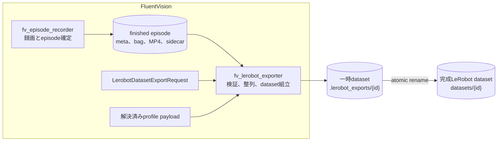

録画データの正本はFV episodeであり、変換中も元episodeを変更しない。

完成datasetはLeRobot v3のfile構造だけを持ち、外部service固有の状態を含めない。

## 目的

変換処理は、選択された複数のFV episodeから一つのLeRobot v3 datasetを生成する。

変換時にcamera画像を再エンコードせず、収録時に確定したROS timestamp、量子化後の動画PTS、MP4 packetの対応を保持する。

必要な入力が欠けるepisodeを飛ばして成功扱いにせず、dataset全体の作成を失敗させる。

同じ入力と設定からは、episode順、row時刻、feature順が同じdatasetを生成する。

## 対象外

この文書は録画開始、録画停止、episode選択UI、外部storage転送、学習用PNG prepared datasetを定義しない。

作成済みdatasetを学習時にどうdecodeするかは読込契約として必要な範囲だけを定義する。

## 入力契約

変換requestは次の値を持つ。

| 値 | 契約 |
| --- | --- |
| `dataset_id` | 出力先を一意に決める相対ID |
| `dataset_name` | datasetの表示名 |
| `episode_ids` | 一件以上の重複しない順序付きepisode ID列 |
| `fps` | LeRobot rowの基準FPS、1以上120以下 |
| `max_alignment_error_s` | camera、state、actionの最大許容時刻差 |
| `max_mux_status_age_s` | mux sourceを有効とみなす最大経過時間 |

同じepisode IDを複数回指定したrequestは入力境界で拒否する。

`max_alignment_error_s`は次の上限以下にする。

```text
max_alignment_error_s <= min(0.1, 3 / fps)
```

省略時も`min(0.1, 3 / fps)`を使う。

現在の`max_mux_status_age_s`既定値は2.5秒である。

変換coreは、引数として渡された解決済みprofile payloadを型検証して受け取る。

変換core自身はprofile名からprofile payloadを解決しない。

FV episode metadataは現在profile名だけを保持するため、録画後にprofileが変更された場合の再現性は保証されない。

録画時profile snapshotの固定は変換アルゴリズムとは別のepisode metadata契約として解消する。

profileの`lerobot`セクションだけをLeRobot featureの意味と順序の正本にする。

## FV episode契約

入力episodeは次の状態を満たす必要がある。

- `state == "finished"`
- `outcome == "success"`
- `started_at`が確定している
- `timeline_start_ros_ns`と`timeline_end_ros_ns`が確定している
- 両方の値が0より大きい
- `timeline_start_ros_ns < timeline_end_ros_ns`である
- 全episodeの`profile`名が一致する
- `meta.json`、`bag/`、対象cameraのMP4、`frames.parquet`が存在する

`stopped_at`と`duration_s`は時刻整列に使わない補助的なsource provenanceである。

値が存在する場合はそのまま記録し、存在しない場合は`null`を記録する。

空文字列や0を生成して既知の値に見せない。

episodeの概略構造は次のとおりである。

```text
episodes/{profile}/{date}/{episode}/
  meta.json
  bag/
  videos/{camera}/
    0000.mp4
    frames.parquet
```

`recorded_topics[*].stamp_source`は、各joint topicの時刻源を明示する。

許可する値は`message_header`と`rosbag_recv`であり、未指定時に別の時刻源を推測しない。

`message_header`を宣言したtopicのheader stampが0の場合は変換を失敗させる。

## Profileからのfeature解決

### Camera

camera feature keyは次の形式にする。

```text
observation.images.{profile.lerobot.cameras[*].name}
```

profile上のcamera topicとepisode camera metadataのtopicを一致させる。

recorder内部のcamera名をLeRobot feature名の正本にしない。

`enabled == true`のprofile cameraがepisodeに存在しない場合は変換を失敗させる。

episodeに存在しない任意cameraは出力featureへ含めない。

一致したcameraが一件もない場合は変換を失敗させる。

現在の変換対象は、一つのMP4 segmentを持つcolor cameraである。

複数segment、depth PNG列、bag内depth画像は対象外であり、暗黙に変換しない。

### State

`observation.state`は、各`profile.lerobot.arm_streams[*].rx.joint_state.topic`の`JointState`から生成する。

joint値は`profile.lerobot.arm_streams`の順、その中では`joints`の順で連結する。

ROS `JointState.position`はwire値であり、そのままdataset値として保存しない。

各jointのdataset単位は`joint_units`で指定する。

`joint_units`を省略したjointは`degrees`として扱う。

| `joint_units` | ROS wire値 | LeRobot dataset値 |
| --- | --- | --- |
| `degrees` | radian | `degrees(wire_value)` |
| `percent` | 0以上1以下の比率 | `wire_value * 100` |

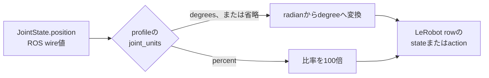

feature名は次の形式にする。

```text
{namespaceまたはstream key}_{joint name}
```

`JointState.name`にprofile指定jointが存在しない場合は変換を失敗させる。

### Action

`action`はrow時刻で有効なmux sourceに対応するjoint command topicから生成する。

`leader`、`vr`、`ai`は、それぞれ`joint_command.leader`、`joint_command.vr`、`joint_command.ai`へ一対一に対応させる。

有効なsourceに対応する明示topicがない場合は、base `joint_command.topic`へfallbackせず変換を失敗させる。

`replay`と未知のsourceは変換対象外であり、別sourceのtopicへ読み替えない。

PiPERのVR収録では`pos_cmd`と`gripper_cmd`を直接合成せず、PiPER内部IK後の`joint_ctrl`をactionとして使う。

## Camera動画時刻契約

FV episode recorderは、camera frameのROS timestampを`1/90000`秒単位の整数PTSへ量子化する。

**time base**は、PTSの整数1 tickが何秒を表すかを定める単位である。

FV動画のtime baseは`1/90000`秒であり、camera metadataでは分子を`video_time_base_num`、分母を`video_time_base_den`へ保存する。

**PTS origin**は、PTS 0に対応するROS絶対時刻である。

FV動画のPTS originは最初に記録したcamera frameのROS timestampであり、`video_pts_origin_ros_ns`へ保存する。

time baseはtickの単位を定め、PTS originは動画内相対時刻とROS絶対時刻の対応点を定めるため、両者は別の値である。

camera metadataは次の値を持つ。

```json
{
  "video_timing_mode": "ros_header_stamp_to_pts",
  "video_pts_origin_ros_ns": 1234567890000000000,
  "video_time_base_num": 1,
  "video_time_base_den": 90000
}
```

各camera frameのPTSは次の式で求める。

```text
video_pts
  = round((ros_stamp_ns - video_pts_origin_ros_ns) * 90000 / 1e9)

video timestamp in seconds
  = video_pts * video_time_base_num / video_time_base_den
```

`frames.parquet`は、各frameについて量子化後の整数`video_pts`と量子化前の`ros_stamp_ns`を持つ。

```text
frame_index
segment_file
segment_local_frame
video_pts
ros_stamp_ns
recv_stamp_ns
...
```

Recorderはsidecarへ保存した`video_pts`と同じ整数をMP4 packetのPTSへ書く。

**PTS（Presentation Timestamp）**は、動画frameを表示する時刻である。

**DTS（Decoding Timestamp）**は、動画packetをdecodeする時刻である。

FV recorderはB-frameを無効にしているため、各packetのDTSをPTSと同じ値にする。

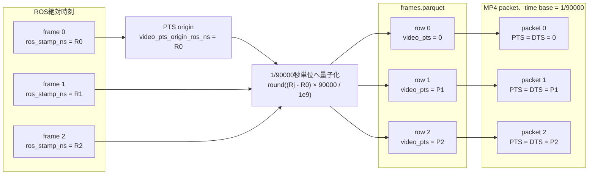

**video timing mode**は、camera frameの時刻を動画packetのPTSへ写す規則を表す。

`ros_header_stamp_to_pts`は、ROS messageの`header.stamp`を先頭frameからの相対時刻へ変換し、`1/90000`秒単位へ量子化して動画packetのPTSへ設定したことを表す。

変換coreは`video_timing_mode == "ros_header_stamp_to_pts"`を要求する。

変換coreは`video_time_base_num == 1`かつ`video_time_base_den == 90000`を要求し、宣言値からPTS秒を計算する。

現在のFV recorderが生成する宣言値は`1/90000`であり、変換coreはtime baseを推測しない。

`frames.parquet`の先頭`ros_stamp_ns`は`video_pts_origin_ros_ns`と一致しなければならない。

sidecar rowはROS timestampの狭義単調増加でなければならない。

sidecarの先頭`video_pts`は0でなければならず、後続`video_pts`は狭義単調増加でなければならない。

このPTS契約に違反したepisodeは`camera_video_pts_invalid`として変換を失敗させる。

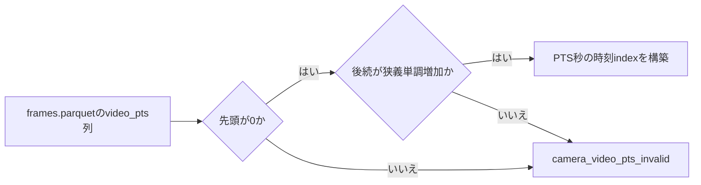

sidecarのrow順、`segment_file`、`segment_local_frame`、`video_pts`はMP4 packetと一対一で対応しなければならない。

`ros_stamp_ns`は収録元時刻のprovenanceとorigin検証に使い、camera frameの最近傍整列には使わない。

camera frameの最近傍整列では、MP4へ実際に書いた量子化後の`video_pts`だけを時刻indexに使う。

古いraw episodeについてCFRを仮定したり、`ros_stamp_ns`から動画PTSを再構成したりしない。

## CFRとVFR

**CFR**は、隣接する動画frameのPTS間隔が一定である動画である。

**VFR**は、隣接する動画frameのPTS間隔が変化する動画である。

次の図は、不均一なROS timestampを30 FPSのCFRへ置き換えた場合と、ROS timestampを`1/90000`秒単位のPTSへ量子化した場合を比較する。

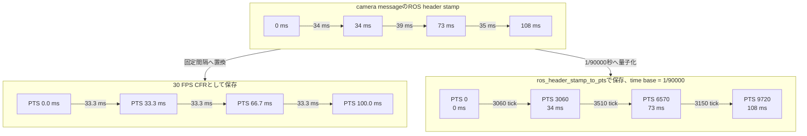

`ros_header_stamp_to_pts`の出力が常にVFRになるわけではない。

ROS timestampがtime base上で等間隔ならPTSも等間隔になり、結果はCFRと同じ時刻配置になる。

したがって、契約名はVFRかCFRかではなく、PTSをどの時刻から生成したかを表す。

## 変換処理

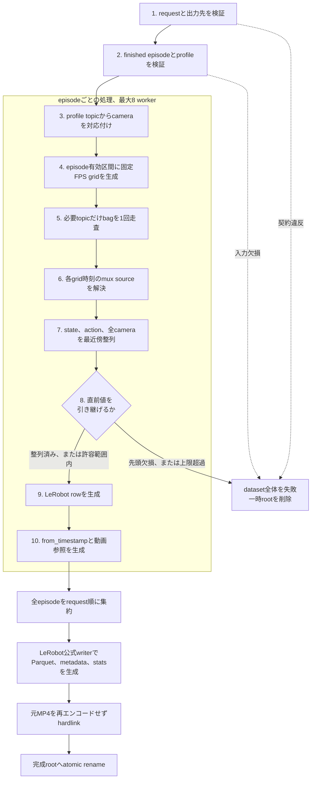

変換は、episode内の時刻整列を先に完了してから、dataset全体を一括で組み立てる。

動画frameを順番にdecodeしてLeRobotへ積み直す処理は行わない。

### 1. Requestと出力先を検証する

`episode_ids`の順序を出力episode順として保持する。

出力dataset rootと一時rootが既に存在する場合は上書きしない。

一時rootと完成rootは同じfilesystem上に置く。

現在の配置は次のとおりである。

```text
/data/datasets/.lerobot_exports/{dataset_id}/
/data/datasets/{dataset_id}/
```

### 2. Episodeとprofileを検証する

各episode IDから`meta.json`を一件だけ解決する。

episode状態、outcome、profile一致を検証する。

profileのcamera、arm stream、joint、topic定義を型検証する。

### 3. Camera mappingを作る

profile順にepisode cameraをtopicで対応付ける。

一致したcameraごとにMP4、sidecar、解像度、PTS origin、time base、`video_pts`列を検証する。

camera mappingにはprimary cameraを設けない。

全camera、state、actionは独立した入力として同じ固定FPS gridへ整列する。

### 4. 固定FPS gridを作る

episode metadataの`timeline_start_ros_ns`を`T0`、`timeline_end_ros_ns`を`T1`とする。

有効区間は`[T0, T1)`の半開区間である。

gridの各絶対ROS timestampは次の式で決める。

```text
t_i = T0 + round(i * 1e9 / fps)
i = 0, 1, 2, ...
```

`t_i < T1`を満たす時刻だけをgridに含め、その件数をrow数`N`とする。

camera timestampはgridの開始、終了、row数を決めない。

### 5. Bagを一回読む

必要topicだけをrosbagから読み、topicごとの時刻昇順sample列を作る。

bag接続として静的に必須なのは、全arm streamのstate topicとmux status topicである。

profileに定義されたsource別action topicはoptional読込対象とし、bag接続が存在するtopicだけを同じ一回の走査で読む。

episodeで一度も選ばれなかったsourceのaction topicは、bag接続もsampleも要求しない。

各gridでmuxが実際に選んだsourceのaction sampleが存在しない場合は、別sourceへfallbackせず整列を失敗させる。

stateとaction topicは`JointState`、mux status topicはJSON文字列を持つ`std_msgs/String`でなければならない。

joint sample、camera sidecar、mux eventごとにtimestamp配列を一度だけ構築する。

### 6. Gridごとにmux sourceを解決する

各`t_i`以前で最新のmux eventを二分探索する。

録画開始直後だけは、latched statusが最初のcamera rowより後にbagへ入ることがある。

その場合に限り、最初のmux eventが`max_mux_status_age_s`以内ならそのsourceを使う。

source eventが古すぎる場合、sourceが`stop`の場合、JSONからsourceを解決できない場合は変換を失敗させる。

### 7. Gridごとにstate、action、cameraを整列する

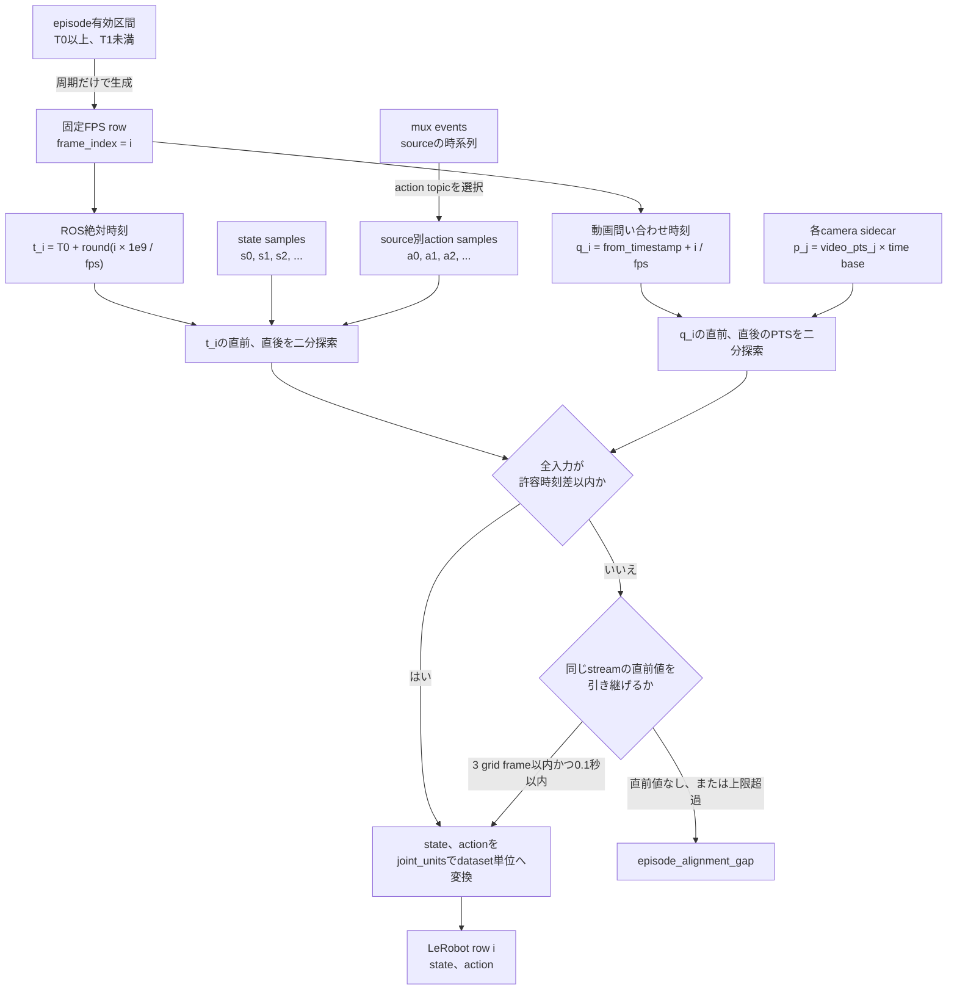

固定FPS gridはcameraと独立している。

state、action、muxは各gridのROS絶対時刻`t_i`へ整列する。

cameraは各gridの動画問い合わせ時刻`q_i`へ整列する。

cameraごとの問い合わせ時刻は次の式で決める。

```text
q_i = from_timestamp + i / fps

from_timestamp
  = (timeline_start_ros_ns - video_pts_origin_ros_ns) / 1e9
```

camera側の候補時刻は、sidecarの整数`video_pts`をtime baseで秒へ変換した値である。

```text
p_j = video_pts_j * video_time_base_num / video_time_base_den
```

したがって、camera整列は`q_i`と`p_j`を比較し、量子化前の`ros_stamp_ns`とは比較しない。

一つのgrid時刻に対する問い合わせは次の順序で進む。

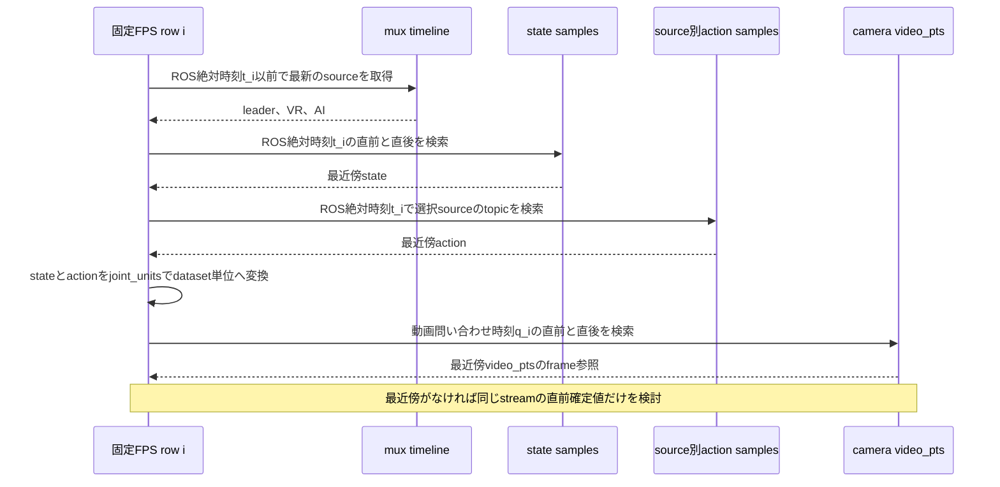

stateとactionは`t_i`の直前と直後だけを候補にし、時刻差が小さいsampleを選ぶ。

cameraは`q_i`の直前と直後にある`p_j`だけを候補にし、時刻差が小さいframeを選ぶ。

時刻差が等しい場合、stateとactionは直後sampleを選び、cameraはreaderと同じ直前frameを選ぶ。

stateとactionはLeRobotの動画readerで再選択されないため、cameraだけreaderのtie規則と一致させる。

選択sampleと`t_i`の差は`max_alignment_error_s`以下でなければならない。

stateとactionはprofile指定joint順にvector化する。

全cameraについても量子化後PTSの最近傍が許容差内にあることを確認する。

camera問い合わせ時刻がsidecarの先頭PTSより前、または末尾PTSより後の場合は最近傍なしとする。

最近傍sampleまたはframeがない場合は、同じstreamで直前に確定した値だけを引き継げる。

引き継ぎは最大3 grid frameかつ最大`max_alignment_error_s`までとし、どちらか一方でも超えた場合は変換を失敗させる。

同じsource sampleまたはcamera frameが複数のgridで最近傍になった場合も引き継ぎとして数える。

そのsourceを最初に採用したgrid indexを起点とし、同じsourceが再選択されても起点を更新しない。

異なるsourceを選択した場合だけ起点を現在のgrid indexへ更新する。

30 FPSでは3 grid frameが0.1秒に相当する。

低いFPSでは0.1秒上限が先に適用される。

先頭gridに直前値はないため、先頭欠損は変換を失敗させる。

未来のsampleやframeを引き継ぎ値として使用しない。

未知のtopic型、joint名欠損、mux異常のような契約違反は引き継ぎの対象にせず、その時点で変換を失敗させる。

### 8. 欠損時の引き継ぎを判定する

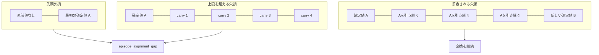

引き継ぎはstreamごとに判定する。

state、action、各cameraのどれか一つでも引き継げなければ、episode全体を`episode_alignment_gap`として失敗させる。

mux sourceはこの引き継ぎの対象にせず、`max_mux_status_age_s`で鮮度を判定する。

### 9. Episode rowを作る

固定FPS gridのrowを0から連番する。

episode内rowは次の値を持つ。

```text
observation.state
action
timestamp = frame_index / fps
frame_index
```

絶対ROS timestampはLeRobotの`timestamp`列へ書かない。

dataset組立時に`episode_index`、dataset全体の`index`、`task_index`を追加する。

### 10. 動画参照を作る

先頭絶対ROS timestampは`timeline_start_ros_ns`である。

cameraごとの`from_timestamp`は次の式で求める。

```text
from_timestamp
  = (timeline_start_ros_ns - video_pts_origin_ros_ns) / 1e9
```

`from_timestamp`が負になる場合は変換を失敗させる。

episode metadataの`to_timestamp`は次の式で求める。

```text
to_timestamp = from_timestamp + episode row count / fps
```

元MP4をdecodeまたは再エンコードせず、LeRobot video pathへhardlinkする。

hardlink失敗時に物理copyへfallbackしない。

finished/success episodeの動画とframes sidecarは、Recorder側が書き込みbitを除去した後にexport対象となる。

Exporterは動画とsidecarのread-onlyを検証し、mutableな入力を自動chmodせずfail closedにする。

Recorder起動時に、旧episodeのうちfinished/successのものだけに同じread-only契約を冪等に適用する。

## Dataset組立

選択episode間でcamera feature集合とcamera解像度が一致しなければならない。

LeRobot metadataとParquetはLeRobot公式のmetadata classとwriterを使って生成する。

独自実装でLeRobot schemaを複製しない。

各writerとhardlinkが例外なく完了した後、一時rootを完成rootへatomic renameする。

生成直後に同じfileの存在を再走査するruntime検証は行わず、生成物の構造は自動テストで検証する。

出力featureは`observation.state`、`action`、一致したcamera feature、LeRobot標準index列で構成する。

taskは`task_description`の初出順に`task_index`を割り当てる。

episode metadataはtask、length、data位置、video位置、`from_timestamp`、`to_timestamp`を持つ。

`meta/info.json`の`fps`と各video featureの`video.fps`はrow gridの基準FPSを表す。

VFR動画の平均入力FPSとして解釈しない。

`meta/info.json`へ`video_timestamp_tolerance_s`を書き、読込側と変換側で同じ許容差を使う。

FV exporterは`meta/info.json`へ次の読込契約も書く。

```json
{
  "video_query_timestamp_source": "frame_index_over_fps"
}
```

この値は、動画問い合わせ時刻のepisode内成分を`frame_index / fps`から計算するdatasetであることを示す。

他の値は受け入れず、未知の読込規則で動画frameを選ばない。

statsは`observation.state`と`action`だけを対象に、min、max、mean、std、count、q01、q10、q50、q90、q99を計算する。

dataset作成時に動画をdecodeして画像statsを計算しない。

## 出力構造

出力はLeRobot v3形式にする。

```text
meta/info.json
meta/tasks.parquet
meta/episodes/chunk-000/file-000.parquet
meta/stats.json
data/chunk-000/file-000.parquet
videos/{feature_key}/chunk-000/file-{episode_index:03d}.mp4
```

変換元episodeのprovenance payloadには次の値を残す。

- dataset ID
- dataset名
- export完了時刻
- exporter識別子
- source episode ID
- task description
- episode開始時刻と終了時刻
- raw episode duration
- source tags

FV実装は`meta/fv_episode_export.json`へ保存する。

## Atomic finalize

全fileを一時rootへ生成する。

metadata、data、statsのwriterと全hardlinkが例外なく完了してからprovenanceを保存する。

完成rootへ同一filesystem内のrenameで配置する。

変換失敗時は、その実行が作った一時rootを削除する。

実行開始前から存在する一時rootは自動削除せず、`export_tmp_exists`として停止する。

同一filesystem上のrenameが保証するのは、完成dataset名の公開がatomicであることまでである。

現行実装は全fileとdirectoryへの`fsync`による電源断耐性を保証しない。

現行実装はfinalize前に全camera rowをdecodeして検査しない。

## LeRobot読込契約

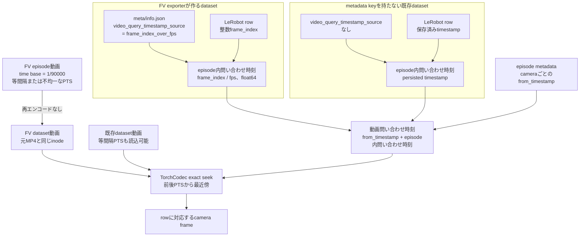

FV exporterが作るdatasetでは、LeRobot rowに対応する動画問い合わせ時刻を次の式で求める。

```text
query_timestamp_i = from_timestamp + frame_index_i / fps
```

FV exporterは`video_query_timestamp_source == "frame_index_over_fps"`を`meta/info.json`へ書く。

このmetadataを持つdatasetだけは、動画readerが整数の`frame_index`とdatasetの`fps`からepisode内問い合わせ時刻をfloat64で再構成する。

`timestamp`はLeRobot標準schemaではfloat32であり、長時間episodeでは量子化誤差がVFR frameの最近傍判定を変える可能性がある。

そのため、FV datasetの動画問い合わせにはParquetのfloat32 `timestamp`を使わない。

一方、`video_query_timestamp_source`を持たない既存datasetでは、従来どおりParquetに保存された`timestamp`をepisode内問い合わせ時刻に使う。

既存datasetには`timestamp`と`frame_index / fps`が同じとは限らないものがあるため、metadataがないdatasetをFVの規則へ暗黙に切り替えない。

`video_query_timestamp_source`が存在して値が`frame_index_over_fps`以外の場合は、未知の規則でframeを選ばず読込を失敗させる。

Exporterとreaderが同じcamera frameを選ぶ関係は次の図で表せる。

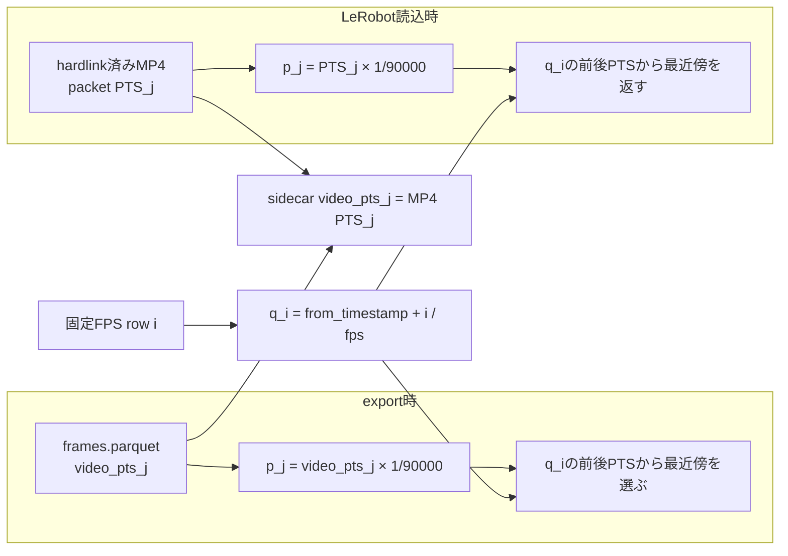

exporterはsidecarから選んだcamera frame indexをLeRobot rowへ保存しない。

exporterはsidecarの`video_pts`をtime baseで秒へ変換し、`query_timestamp_i`に最も近いframeを検証する。

readerはMP4 packetのPTSを同じtime baseで秒へ変換し、同じ`query_timestamp_i`に最も近いframeを返す。

Recorderがsidecarの`video_pts`とMP4 packetのPTSを同じ整数として確定するため、exporterとreaderの候補時刻列は一致する。

したがって、exporterが検証したsource frameとreaderが返すframeは、等距離の場合を含めて一致する。

TorchCodecは`seek_mode="exact"`を使う。

PyAV経路も、問い合わせ範囲のframeをPTSで列挙して最近傍を選ぶ。

利用可能な場合はTorchCodecを既定とし、利用できない環境では同じPTS最近傍契約を持つPyAVを使う。

問い合わせ時刻を表示区間に含む直前frameと、その次のframeをPTSで比較し、近いframeを返す。

距離が等しい場合は直前frameを返す。

Exporterの時刻合わせも同じ規則で直前frameを選ぶため、完全な中点でもreaderと一致する。

`average_fps * timestamp`からframe indexを推定しない。

最近傍PTSとの差が`video_timestamp_tolerance_s`を超える場合は読込を失敗させる。

既存のCFR LeRobot datasetも同じPTS最近傍decoderで読む。

CFRはPTS間隔が一定な場合であり、VFRと分ける形式判定を持たない。

metadataを持たない既存datasetでは、CFRかVFRかに関係なく保存済み`timestamp`を問い合わせに使う。

既存datasetに`video_timestamp_tolerance_s`がない場合は`min(0.1, 3 / fps)`を使う。

この既定値は動画PTS検索だけに使い、delta timestamp検証の既定値`1e-4`を緩めない。

この読込契約は作成済みLeRobot datasetとの互換であり、`ros_header_stamp_to_pts`と明示的なPTSを持たない古いraw FV episodeの変換互換ではない。

## Package構成

変換coreは、FluentVision repository内のsibling Python package `fv_lerobot_exporter`へ置く。

`fv_episode_recorder`は収録、episode finalize、episode metadataの所有に限定する。

`fv_lerobot_exporter`は確定済みepisodeの検証、時刻整列、LeRobot dataset組立、atomic finalizeを所有する。

`export_lerobot_dataset()`はrequest、profile payload、dataset rootを受け取る。

実行processとUIへの進捗表示は変換coreの外側で選択する。

`fv_lerobot_exporter`はLeRobot、Datasets、rosbags、PyArrowなどを直接依存として宣言する。

実行runtimeのlockfileでそのversionを固定する。

これらを`fv_episode_recorder`のPython環境へ追加しない。

別process化が必要になった場合も、変換coreを変更せずtransport wrapperから呼び出す。

## 並列化と性能契約

episode変換はepisode単位でprocess並列化できる。

現在の既定上限は8 workerで、設定可能範囲は1以上32以下である。

alignment executorはprocess内で一つだけ生成し、同時に始まったdataset作成jobも同じworker poolを共有する。

初期化はlockで直列化し、同時初回呼出しでも複数のworker poolを生成しない。

workerは一つのepisodeについてbag読込、deserialize、時刻index構築、row整列を完結させる。

workerの完了順に関係なく、出力episode順はrequestの`episode_ids`順を維持する。

workerへの投入は同時実行上限までに制限し、全episodeを先行投入しない。

episode変換、worker投入、結果回収のいずれかが失敗した場合は、未開始futureをcancelする。

実行中futureの終了を待ってから、cleanup例外へ置き換えず元の失敗を返す。

これにより、失敗したexportのworkerが後続exportとCPU、memory、disk I/Oを競合し続けることを防ぐ。

dataset作成時の動画decode、frame seek、動画再エンコードを禁止する。

動画statsのためのdecodeも禁止する。

timestamp配列をrow検索ごとに再構築せず、episode内で再利用する。

22 episode、37,579 rowの実データ変換は7.089秒だった。

88 logical episode、150,316 rowの負荷試験は13.663秒だった。

88 episode試験は22個の実bagを4回使ったwarm-cache寄りの試験であり、88個の異なるbagをcold cacheで処理した値ではない。

これらの時間はFV episodeの読込からlocal dataset完成までを測定した。

## 失敗分類

変換は次の分類でfail closedにする。

| 分類 | 代表的なerror code |
| --- | --- |
| Requestと出力先 | `invalid_dataset_id`, `dataset_exists`, `export_tmp_exists`, `export_workers_invalid` |
| Episode | `episode_store_missing`, `episode_not_found`, `episode_id_ambiguous`, `episode_meta_invalid`, `episode_not_finished`, `episode_not_success`, `profile_mismatch` |
| Profile | `profile_invalid`, `camera_mapping_empty`, `mux_topic_not_configured`, `action_topic_not_configured`, `action_source_unsupported` |
| Bag | `bag_missing`, `bag_topic_missing`, `joint_topic_type_mismatch`, `mux_status_type_mismatch` |
| Timestamp | `stamp_source_missing`, `message_header_stamp_missing`, `camera_timestamps_invalid` |
| Mux | `mux_status_missing`, `mux_status_invalid`, `mux_status_before_frame_missing`, `mux_status_stale`, `mux_source_stop` |
| Joint | `joint_names_missing`, `joint_position_missing`, `joint_name_mismatch`, `joint_vector_mismatch`, `samples_missing`, `sample_alignment_error` |
| Camera | `camera_missing`, `camera_segments_unsupported`, `camera_video_timing_contract_missing`, `camera_video_time_base_invalid`, `frames_sidecar_missing`, `frames_sidecar_mutable`, `camera_sidecar_empty`, `camera_sidecar_video_mismatch`, `camera_video_pts_origin_mismatch`, `camera_video_pts_invalid`, `camera_video_query_before_origin`, `camera_video_missing`, `video_source_mutable`, `camera_resolution_mismatch` |
| Alignment | `camera_alignment_error`, `camera_frame_missing`, `episode_alignment_gap` |
| Output | `video_hardlink_failed`, `video_path_missing` |

例外を空dataset、欠損row、zero vector、推測値へ変換しない。

## 受け入れ基準

1. canonical episode有効区間から指定FPSのrow gridが決定どおり生成される。
2. stateとactionはROS絶対時刻、全cameraは量子化後PTSを使って、許容差内の最近傍sampleへ整列される。
3. 欠損は直前値を最大3 grid frameかつ0.1秒まで引き継ぎ、先頭欠損と上限超過は失敗する。
4. mux sourceに対応する明示action topicだけを使い、選択sourceのsample欠損、未設定source、非対応sourceは失敗する。
5. episodeで未使用のsource別action topicはbag接続がなくても変換できる。
6. stateとactionをprofile joint順に並べ、`joint_units`どおりのdataset単位へ変換する。
7. dataset動画とsource動画のinodeが一致する。
8. 出力をLeRobotDatasetで開き、先頭、中間、末尾rowのcameraを読める。
9. sidecarの`video_pts`とMP4 packetのPTSが`1/90000`秒のtime base上で一致する。
10. FV datasetは`frame_index_over_fps`で、metadataを持たない既存datasetは保存済み`timestamp`で動画を問い合わせる。
11. VFRとCFRの両方でPTS最近傍frameが一致する。
12. `video_timestamp_tolerance_s`がdataset分割、feature変更、結合後も維持される。
13. 変換失敗後に完成rootが残らない。
14. 同じ入力の並列実行でもepisode順とtask indexが変わらない。
15. worker投入、変換、結果回収のどこで失敗しても未完了futureが残らない。
16. 同時初回呼出しでもalignment worker poolは一つだけ生成される。

## 既知の仕様課題

profile snapshotとtrimの未決事項は`pending_episode_metadata_contract.md`へ分離する。

TorchCodecとPyAVの両経路がPTS最近傍を実装している。

`robot_type="vlabor"`は、FV episodeがVLAbor robot収録を表す現行契約として継続する。

現行exporterはfinalize前に全rowのcamera decodeと電源断耐性を検証しない。

この保証範囲をatomic renameの保証と混同しない。
